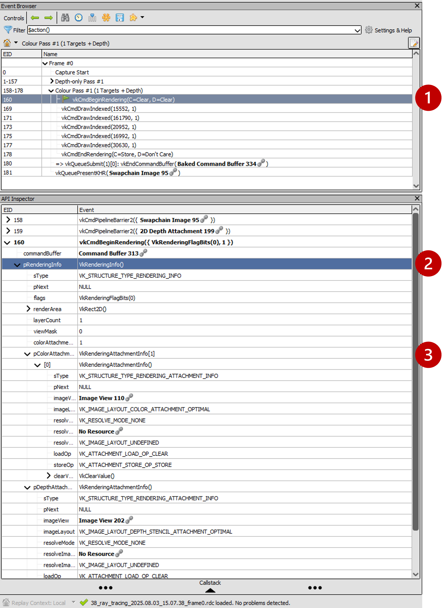
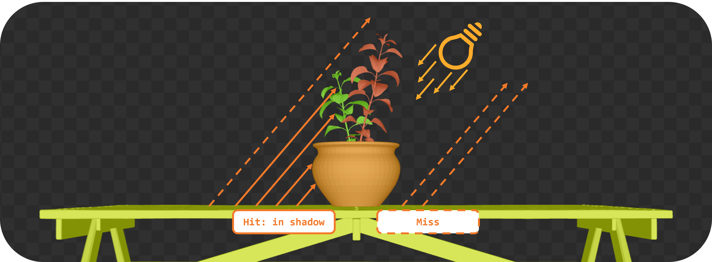
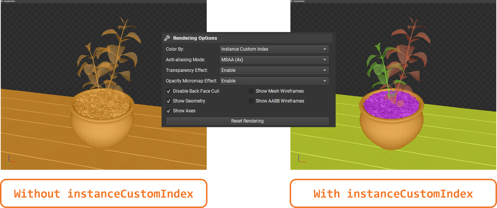

:pp: {plus}{plus}

== SIGGRAPH 2025: Hands-on Vulkan Ray Tracing with Dynamic Rendering

== Introduction

Welcome! In this lab, we will enhance a Vulkan renderer with ray tracing features to implement real-time pixel-perfect shadows (with and without transparency) and a bonus reflection effect. You will work with provided scaffolded code (based on the Vulkan Tutorial) and fill in key shader functions following step-by-step instructions.

== Overview

By the end, you'll learn how to:

- Use Vulkan *dynamic rendering* (no pre-defined render passes) and verify it with *RenderDoc*.
- Create bottom-level and top-level *Acceleration Structures* (BLAS and TLAS) for ray tracing.
- Implement ray query based *shadow rays* (first with all-opaque geometry, then with alpha-test *transparency*).
- Debug/inspect the acceleration structures in *Nsight Graphics*.
- (Bonus) Implement ray query based *reflections*.

*Prerequisites*:
This lab targets intermediate Vulkan programmers. We assume you have completed the basic Vulkan Tutorial (graphics pipeline, descriptor sets, etc.). If not, you can still follow along conceptually. A Windows machine with up-to-date Vulkan SDK (1.4.311), a GPU supporting ray tracing (Vulkan Ray Query), plus RenderDoc and Nsight Graphics is provided.

*Mobile Best-Practice Notes*:
We focus on desktop for the lab, but we'll highlight mobile-oriented tips:

- We use `VK_KHR_dynamic_rendering` (core in Vulkan 1.3) instead of traditional render passes. This not only simplifies the API but also, with the `VK_KHR_dynamic_rendering_local_read` extension, enables tile-local storage reads similar to subpasses, a big deal for mobile tile-based GPUs to save bandwidth.
- We use Ray Queries (from `VK_KHR_ray_query`) within fragment shaders instead of a separate ray tracing pipeline. On mobile, ray queries are far more widely supported and often (depending on the use case) more efficient than the full ray tracing pipeline. Ray queries integrate nicely into fragment shading, benefiting from on-chip compression and avoiding context switches.

*Provided Code*:
The provided code is a Vulkan renderer that already implements a basic graphics pipeline with dynamic rendering. It is based on the Vulkan Tutorial (we will soon integrate this lab there as new chapters) and it is self-contained in a single C++ source file and a Slang shader file:

- link:../attachments/38_ray_tracing.cpp[38_ray_tracing.cpp]
- link:../attachments/38_ray_tracing.slang[38_ray_tracing.slang]

The source code is structured to guide you through the steps, with hints and boilerplate provided. It also sets up all the required extensions and features, including `VK_KHR_acceleration_structure` and `VK_KHR_ray_query`.
You will find sections of code marked with `// TASKxx` which we will be referencing on this guide.
At the top of the C++ file, note the following variable:

[,c{pp}]
----
#define LAB_TASK_LEVEL 1
----

At certain intervals, you will be instructed to update this variable and re-build to verify the effect of key changes, no need to write new code. Look out for instructions like these:

.Re-build and Run!
****
Use
[,c{pp}]
----
#define LAB_TASK_LEVEL 1
----
****

To build, you may use Visual Studio (set `38_ray_tracing` as start-up project) or the following commands:

[,shell]
----
 cmake --build build --target 38_ray_tracing --parallel && start .\build\38_ray_tracing\Debug\38_ray_tracing.exe -wo .\build\38_ray_tracing\
----

The Slang shader does require you to fill in the gaps, but if you get stuck, you can refer to the provided reference solution:

- link:../attachments/38_ray_tracing.slang[38_ray_tracing_complete.slang]

With that context in mind, let's dive into the lab steps.

== Dynamic Rendering

*Objective*: Ensure the base project uses *dynamic rendering* and understand how to verify it using RenderDoc.

In dynamic rendering, we no longer create a VkRenderPass or VkFrameBuffer; instead we begin rendering with `vkCmdBeginRenderingKHR`, specifying attachments on-the-fly. This makes our code more flexible (no need to predeclare subpasses) and is now the "modern" way to render in Vulkan.

=== Task 1: Check the setup for dynamic rendering

In the provided code base, locate the initialization of the graphics pipeline:

[,c{pp}]
----
/* TASK01: Check the setup for dynamic rendering
 *
 * This new struct replaces what previously was the render pass in the pipeline creation.
 * Note how this structure is now linked in .pNext below, and .renderPass is not used.
 */
vk::PipelineRenderingCreateInfo pipelineRenderingCreateInfo{
    .colorAttachmentCount = 1,
    .pColorAttachmentFormats = &swapChainImageFormat,
    .depthAttachmentFormat = depthFormat
};

vk::GraphicsPipelineCreateInfo pipelineInfo{
    .pNext = &pipelineRenderingCreateInfo,
    .stageCount = 2,
    .pStages = shaderStages,
    .pVertexInputState = &vertexInputInfo,
    .pInputAssemblyState = &inputAssembly,
    .pViewportState = &viewportState,
    .pRasterizationState = &rasterizer,
    .pMultisampleState = &multisampling,
    .pDepthStencilState = &depthStencil,
    .pColorBlendState = &colorBlending,
    .pDynamicState = &dynamicState,
    .layout = pipelineLayout,
    .renderPass = nullptr
};

graphicsPipeline = vk::raii::Pipeline(device, nullptr, pipelineInfo);
----

And later on, the command buffer recording where we begin rendering:

[,c{pp}]
----
/* TASK01: Check the setup for dynamic rendering
 *
 * With dynamic rendering, we specify the image view and load/store operations directly
 * in the vk::RenderingAttachmentInfo structure.
 * This approach eliminates the need for explicit render pass and framebuffer objects,
 * simplifying the code and providing flexibility to change attachments at runtime.
 */

vk::RenderingAttachmentInfo colorAttachmentInfo = {
    .imageView = swapChainImageViews[imageIndex],
    .imageLayout = vk::ImageLayout::eColorAttachmentOptimal,
    .loadOp = vk::AttachmentLoadOp::eClear,
    .storeOp = vk::AttachmentStoreOp::eStore,
    .clearValue = clearColor
};

vk::RenderingAttachmentInfo depthAttachmentInfo = {
    .imageView = depthImageView,
    .imageLayout = vk::ImageLayout::eDepthStencilAttachmentOptimal,
    .loadOp = vk::AttachmentLoadOp::eClear,
    .storeOp = vk::AttachmentStoreOp::eDontCare,
    .clearValue = clearDepth
};

// The vk::RenderingInfo structure combines these attachments with other rendering parameters.
vk::RenderingInfo renderingInfo = {
    .renderArea = { .offset = { 0, 0 }, .extent = swapChainExtent },
    .layerCount = 1,
    .colorAttachmentCount = 1,
    .pColorAttachments = &colorAttachmentInfo,
    .pDepthAttachment = &depthAttachmentInfo
};

// Note: .beginRendering replaces the previous .beginRenderPass call.
commandBuffers[currentFrame].beginRendering(renderingInfo);
----

Use RenderDoc to launch the application and capture a frame:

. Specify executable path: `C:\Users\nvidia\S2025_LABS\gensubcur_105\Vulkan-Tutorial\attachments\build\38_ray_tracing\Debug\38_ray_tracing.exe`.
. Specify working directory: `C:\Users\nvidia\S2025_LABS\gensubcur_105\Vulkan-Tutorial\attachments\build\38_ray_tracing`.
. Launch the application.

image::../images/38_TASK01_renderdoc_launch.png[]

In the Event Browser, you should see the calls that confirm that dynamic rendering is set up correctly:

. `vkCmdBeginRenderingKHR` and `vkCmdEndRenderingKHR`.
. `VkRenderingInfoKHR` which replaces the fixed framebuffer object.
. Color attachment.

In RenderDoc's Texture Viewer, you can inspect the color and depth attachments at various points:

image::../images/38_TASK01_renderdoc_color.gif[]

NOTE: Dynamic rendering reduces CPU overhead and, with the `VK_KHR_dynamic_rendering_local_read` extension, lets you do subpass-style tile-local reads without full render passes. This is great for techniques like deferred shading on tilers, where reading from a previous pass's attachment can be done on-tile without extra memory bandwidth. While we won't implement a deferred renderer here, be aware of this benefit for mobile.

After this step, you should be comfortable that dynamic rendering is set up correctly. We can now move on to ray tracing features.

== Building the Acceleration Structures (BLAS/TLAS)

*Objective*: Create a *Bottom-Level Acceleration Structure* (BLAS) for the model's geometry, and a *Top-Level Acceleration Structure* (TLAS) to instance that geometry. This will allow us to cast rays against the scene.

When casting a ray in a scene, we need an optimized structure that quickly identifies which triangle the ray hits. GPUs use acceleration structures that group geometry into bounding boxes, allowing large parts of the scene to be skipped. The ray traversal proceeds down a tree, efficiently narrowing down to the intersected triangle. The exact implementation is GPU-dependent and opaque to the user.

image::../images/38_bounding_boxes.png[]

Our scene is a simple 3D model (a plant on a table) loaded from an OBJ file. The provided code already loads the model's vertices, indices, normals, and textures into buffers. It separates the model into submeshes, each with its own material (e.g. table, pot, leaves each with their own texture). We need to build acceleration structures from this geometry.

A BLAS holds the geometry (triangles) for one mesh or object. A TLAS holds instances of BLASes (with transforms) to form the full scene. We'll create one BLAS per distinct mesh/material and one TLAS that references them. The ray query will use the TLAS. In Vulkan, building an AS involves a few steps: describe geometry, query build sizes, allocate buffers, create the AS handle, then issue a build command.

=== Task 2: Create a BLAS for each submesh

Go to the definition of `createAccelerationStructures`. Here we will first create the BLASes for each submesh in the model. The code already has a loop iterating over `submeshes`, which contains the geometry data.

First, we need to describe the geometry of the BLAS. The `vk::AccelerationStructureGeometryKHR` struct is used for this purpose:

[,c{pp}]
----
// Prepare the geometry data
auto trianglesData = vk::AccelerationStructureGeometryTrianglesDataKHR{
    .vertexFormat = vk::Format::eR32G32B32Sfloat,
    .vertexData = vertexAddr,
    .vertexStride = sizeof(Vertex),
    .maxVertex = submesh.maxVertex,
    .indexType = vk::IndexType::eUint32,
    .indexData = indexAddr + submesh.indexOffset * sizeof(uint32_t)
};

vk::AccelerationStructureGeometryDataKHR geometryData(trianglesData);

vk::AccelerationStructureGeometryKHR blasGeometry{
    .geometryType = vk::GeometryTypeKHR::eTriangles,
    .geometry = geometryData,
    .flags = vk::GeometryFlagBitsKHR::eOpaque
};
----

This is then recorded in the build info structure:

[,c{pp}]
----
vk::AccelerationStructureBuildGeometryInfoKHR blasBuildGeometryInfo{
    .type = vk::AccelerationStructureTypeKHR::eBottomLevel,
    .mode = vk::BuildAccelerationStructureModeKHR::eBuild,
    .geometryCount = 1,
    .pGeometries = &blasGeometry,
};
----

Next, we need to query the memory requirements for the BLAS:

[,c{pp}]
----
// TASK02: Query the memory sizes that will be needed for this BLAS
vk::AccelerationStructureBuildSizesInfoKHR blasBuildSizes =
    device.getAccelerationStructureBuildSizesKHR(
        vk::AccelerationStructureBuildTypeKHR::eDevice,
        blasBuildGeometryInfo,
        { primitiveCount }
);
----

This helper function uses `vkGetAccelerationStructureBuildSizesKHR()` and returns the memory sizes needed for the BLAS. We need to allocate:

. A buffer for the BLAS itself.
. Another buffer for the scratch space used during the build process.

We can then create these buffers and store them in persistent arrays as they will be needed later.

We also need to create the BLAS handle itself, which is done with `vk::AccelerationStructureCreateInfoKHR` and this device function helper that uses `vkCreateAccelerationStructureKHR()`. The handle is stored in a vector for later use (remember that we need one for each submesh):

[,c{pp}]
----
// TASK02: Create and store the BLAS handle
vk::AccelerationStructureCreateInfoKHR blasCreateInfo{
    .buffer = blasBuffers[i],
    .offset = 0,
    .size = blasBuildSizes.accelerationStructureSize,
    .type = vk::AccelerationStructureTypeKHR::eBottomLevel,
};

blasHandles.emplace_back(device.createAccelerationStructureKHR(blasCreateInfo));

// Save the BLAS handle in the build info structure
blasBuildGeometryInfo.dstAccelerationStructure = blasHandles[i];
----

The following diagram summarizes all the structures and buffers we have created so far:

image::../images/38_TASK02_blas_structures.png[]

To put it all together, we need to submit a command buffer to build the BLAS on the GPU. This is done with `vkCmdBuildAccelerationStructuresKHR()`, which takes the build info and a range. The range adds flexibility to build multiple geometries in one go, but here we only have one geometry per BLAS so it is kept simple:

[,c{pp}]
----
// TASK02: Prepare the build range for the BLAS
vk::AccelerationStructureBuildRangeInfoKHR blasRangeInfo{
    .primitiveCount = primitiveCount,
    .primitiveOffset = 0,
    .firstVertex = firstVertex,
    .transformOffset = 0
};
----

Finally, prepare and submit a command buffer, which saves a valid handle for the bottom level acceleration structure:

[,c{pp}]
----
// TASK02: Build the BLAS
auto cmd = beginSingleTimeCommands();
cmd->buildAccelerationStructuresKHR({ blasBuildGeometryInfo }, { &blasRangeInfo });
endSingleTimeCommands(*cmd);
----

image::../images/38_TASK02_blas_build.png[]

Now you have a BLAS for each model in the scene. Next we need to put them all together into a single TLAS which will then be consumed by our fragment shader.

=== Task 3: Create a TLAS with instances of the BLASes

Now that we have the BLASes, we need to create a TLAS that references them. The TLAS will hold instances of the BLASes, allowing us to place them in the scene with transformations (position, rotation, scale).

We can create an instance in the same submesh loop where we created the BLASes. For each submesh, we will create an instance that references the corresponding BLAS handle. The `vk::AccelerationStructureInstanceKHR` struct is used for this purpose:

[,c{pp}]
----
// TASK03: Create a BLAS instance for the TLAS
vk::AccelerationStructureDeviceAddressInfoKHR addrInfo{
    .accelerationStructure = *blasHandles[i]
};
vk::DeviceAddress blasDeviceAddr = device.getAccelerationStructureAddressKHR(addrInfo);

vk::AccelerationStructureInstanceKHR instance{
    .transform = tm,
    .mask = 0xFF,
    .accelerationStructureReference = blasDeviceAddr
};

instances.push_back(instance);
----

Note how we needed to get the device address of the BLAS using `vkGetAccelerationStructureDeviceAddressKHR()`. We also set the transform matrix as the identity matrix for now, we will revisit this later in the lab.

Now that all instances are stored in a vector, we need to prepare the instance data for the TLAS. This involves creating a buffer that holds the instance data.

Using a very similar approach as for the BLAS, we need to prepare the data for the TLAS build, query buffer sizes, allocate buffers, create the TLAS handle, and issue a build command. The diagram below highlights the main changes needed for the TLAS:

image::../images/38_TASK03_tlas_structures.png[]

To prepare the geometry data for the TLAS we will use `vk::GeometryTypeKHR::eInstances` to indicate that we are building a TLAS from instances of BLASes:

[,c{pp}]
----
// TASK03: Prepare the geometry (instance) data
auto instancesData = vk::AccelerationStructureGeometryInstancesDataKHR{
    .arrayOfPointers = vk::False,
    .data = instanceAddr
};

vk::AccelerationStructureGeometryDataKHR geometryData(instancesData);

vk::AccelerationStructureGeometryKHR tlasGeometry{
    .geometryType = vk::GeometryTypeKHR::eInstances,
    .geometry = geometryData
};
----

This is then recorded in the build info structure:

[,c{pp}]
----
vk::AccelerationStructureBuildGeometryInfoKHR tlasBuildGeometryInfo{
    .type = vk::AccelerationStructureTypeKHR::eTopLevel,
    .mode = vk::BuildAccelerationStructureModeKHR::eBuild,
    .geometryCount = 1,
    .pGeometries = &tlasGeometry
};
----

Next, we need to query the memory requirements for the TLAS:

[,c{pp}]
----
// TASK03: Query the memory sizes that will be needed for this TLAS
vk::AccelerationStructureBuildSizesInfoKHR tlasBuildSizes =
    device.getAccelerationStructureBuildSizesKHR(
        vk::AccelerationStructureBuildTypeKHR::eDevice,
        tlasBuildGeometryInfo,
        { primitiveCount }
);
----

And again we create the necessary buffers.

To create the TLAS handle, we use `vkCreateAccelerationStructureKHR()` as before:

[,c{pp}]
----
// TASK03: Create and store the TLAS handle
vk::AccelerationStructureCreateInfoKHR tlasCreateInfo{
    .buffer = tlasBuffer,
    .offset = 0,
    .size = tlasBuildSizes.accelerationStructureSize,
    .type = vk::AccelerationStructureTypeKHR::eTopLevel,
};

tlas = device.createAccelerationStructureKHR(tlasCreateInfo);

// Save the TLAS handle in the build info structure
tlasBuildGeometryInfo.dstAccelerationStructure = tlas;
----

And one more time, we need to prepare the build range for the TLAS. This is similar to the BLAS, but now we use the instance count. Then we can submit the command buffer to build the TLAS:

[,c{pp}]
----
 // TASK03: Prepare the build range for the TLAS
 vk::AccelerationStructureBuildRangeInfoKHR tlasRangeInfo{
     .primitiveCount = primitiveCount,
     .primitiveOffset = 0,
     .firstVertex = 0,
     .transformOffset = 0
 };

// TASK03: Build the TLAS
auto cmd = beginSingleTimeCommands();
cmd->buildAccelerationStructuresKHR({ tlasBuildGeometryInfo }, { &tlasRangeInfo });
endSingleTimeCommands(*cmd);
----

Done! You have now created a TLAS that references all the BLASes for the submeshes in the model. The TLAS is ready to be used in ray queries in the fragment shader.

=== Task 4: Bind the acceleration structure to the shader

To make the acceleration structure available in the shader, we need to add a descriptor set binding for the TLAS. This is done in the `createDescriptorSetLayout()` function (you may ignore the higher bindings for now):

[,c{pp}]
----
// TASK05: The acceleration structure uses binding 1
std::array global_bindings = {
    vk::DescriptorSetLayoutBinding( 0, vk::DescriptorType::eUniformBuffer, 1, vk::ShaderStageFlagBits::eVertex | vk::ShaderStageFlagBits::eFragment, nullptr),
    vk::DescriptorSetLayoutBinding( 1, vk::DescriptorType::eAccelerationStructureKHR, 1, vk::ShaderStageFlagBits::eFragment, nullptr),
    vk::DescriptorSetLayoutBinding( 2, vk::DescriptorType::eStorageBuffer, 1, vk::ShaderStageFlagBits::eFragment, nullptr),
    vk::DescriptorSetLayoutBinding( 3, vk::DescriptorType::eStorageBuffer, 1, vk::ShaderStageFlagBits::eFragment, nullptr),
    vk::DescriptorSetLayoutBinding( 4, vk::DescriptorType::eStorageBuffer, 1, vk::ShaderStageFlagBits::eFragment, nullptr)
};
----

Next, we need to update the descriptor set to bind the TLAS. This is done in the `updateDescriptorSets()` function:

[,c{pp}]
----
vk::WriteDescriptorSetAccelerationStructureKHR asInfo{
    .accelerationStructureCount = 1,
    .pAccelerationStructures = {&*tlas}
};

vk::WriteDescriptorSet asWrite{
    .pNext = &asInfo,
    .dstSet = globalDescriptorSets[i],
    .dstBinding = 1,
    .dstArrayElement = 0,
    .descriptorCount = 1,
    .descriptorType = vk::DescriptorType::eAccelerationStructureKHR
};
----

And later on call `vkUpdateDescriptorSets()` with the TLAS included in the list:

[,c{pp}]
----
std::array<vk::WriteDescriptorSet, 4> descriptorWrites{bufferWrite, asWrite, indexBufferWrite, uvBufferWrite};

device.updateDescriptorSets(descriptorWrites, {});
----

Finally, add the corresponding attribute to the shader:

[,slang]
----
// TASK04: Acceleration structure binding
[[vk::binding(1,0)]]
RaytracingAccelerationStructure accelerationStructure;
----

.Re-build and Run!
****
Use
[,c{pp}]
----
#define LAB_TASK_LEVEL 4
----
****

You will see no visual difference, but rest assured, your Acceleration Structures are now set up and ready to be used in the fragment shader.

== Implementing Ray Query Shadows (Opaque Geometry)

*Objective*: Add a simple shadow test in the fragment shader using a ray query. We will cast a ray from each fragment point toward the light and darken the fragment if something is hit i.e., a basic hard shadow.

Congratulations: you have a valid TLAS/BLAS for the scene! Now, let's use it to cast some rays.

=== Task 5: Implement ray query shadows

In the fragment shader, we will use a ray query to cast a shadow ray from the fragment position towards the light source. If the ray hits any geometry before reaching the light, we will darken the fragment color:

[,slang]
----
// TASK05: Implement ray query shadows
bool in_shadow(float3 P)
{
    bool hit = false;

    return hit;
}

[shader("fragment")]
float4 fragMain(VSOutput vertIn) : SV_TARGET {
   float4 baseColor = textures[pc.materialIndex].Sample(textureSampler, vertIn.fragTexCoord);

   float3 P = vertIn.worldPos;

   bool inShadow = in_shadow(P);

   // Darken if in shadow
   if (inShadow) {
       baseColor.rgb *= 0.2;
   }

   return baseColor;
}
----

For this, you will implement a helper `in_shadow()` function that performs the ray query. Start by defining a ray description and initializing it with the fragment position and light direction:

[,slang]
----
bool in_shadow(float3 P)
{
    // Build the shadow ray from the world position toward the light
    RayDesc shadowRayDesc;
    shadowRayDesc.Origin = P;
    shadowRayDesc.Direction = normalize(lightDir);
    shadowRayDesc.TMin = EPSILON;
    shadowRayDesc.TMax = 1e4;
----

`TMin` and `TMax` define the minimum and maximum distance the ray will travel from its origin. `EPSILON` is a small value to avoid self-intersection, and `1e4` is a large value to ensure we can hit distant objects.

Next, we will initialize a `RayQuery` object which will be used to perform the ray traversal. Note the choice of flags that we use to make it faster:

- `RAY_FLAG_SKIP_PROCEDURAL_PRIMITIVES` since this is a simple scene with triangles only.
- `RAY_FLAG_ACCEPT_FIRST_HIT_AND_END_SEARCH` to end the traversal as soon as the first opaque interesection is found, which is sufficient for shadow testing since we only need to know if anything blocks the light.

[,slang]
----
    // Initialize a ray query for shadows
    RayQuery<RAY_FLAG_SKIP_PROCEDURAL_PRIMITIVES |
             RAY_FLAG_ACCEPT_FIRST_HIT_AND_END_SEARCH> sq;
    let rayFlags = RAY_FLAG_SKIP_PROCEDURAL_PRIMITIVES |
             RAY_FLAG_ACCEPT_FIRST_HIT_AND_END_SEARCH;
----

Then we will start the ray tracing operation which combines our ray description, `RayQuery` object, and acceleration structure:

[,slang]
----
    sq.TraceRayInline(accelerationStructure, rayFlags, 0xFF, shadowRayDesc);

    sq.Proceed();
----

`Proceed()` advances the state of the `RayQuery` object to the next intersection "candidate" along the ray. Each call to `Proceed()` checks if there is another intesection to process. If so, it updates the query's internal state so that you may access information about the current candidate intersection. This allows you to implmement custom logic for handling intersections, such as skipping transparent surfaces (which we will revisit later in this lab) or stopping at the first opaque hit. It is typically called within a loop to iterate through all potential intersections, but for shadows we only need the first hit:

[,slang]
----
    // If the shadow ray intersects an opaque triangle, we consider the pixel in shadow
    bool hit = (sq.CommittedStatus() == COMMITTED_TRIANGLE_HIT);

    return hit;
}
----

That's it! You have implemented a basic shadow test using ray queries. The `in_shadow()` function will return `true` if the ray hits any geometry before reaching the light, indicating that the fragment is in shadow.

.Re-build and Run!
****
Use
[,c{pp}]
----
#define LAB_TASK_LEVEL 5
----
****

However you will notice that something is off:

image::../images/38_TASK06_shadows_static.gif[]

The object is rotating, but the shadows are static. This is because we have not yet updated the TLAS to account for the object's animation. The TLAS needs to be rebuilt whenever the object moves or animates, so let's implement that next.

=== Task 6: Update the TLAS for animations

To account for the object's animation, we need to update the TLAS whenever the object moves or changes. This involves updating the instance transforms and rebuilding the TLAS. We will do this in the `updateTopLevelAS()` function, which is called every frame with the current model matrix.

First we need to update the instance transforms with the current model matrix. This is done by iterating over the `instances` vector and setting the transform for each instance, then update the instances buffer.

Next, we need to prepare the geometry data for the TLAS build. This is similar to what we did when creating the TLAS, but now we will use the updated instance buffer. We also need to change the build `mode` to `eUpdate`, and define a source TLAS as well as a destination TLAS. This instructs the implementation to update the existing TLAS in-place instead of creating a new one. This is more efficient when only minor changes (like transforms) have occured:

[,c{pp}]
----
        // Prepare the geometry (instance) data
        auto instancesData = vk::AccelerationStructureGeometryInstancesDataKHR{
            .arrayOfPointers = vk::False,
            .data = instanceAddr
        };

        vk::AccelerationStructureGeometryDataKHR geometryData(instancesData);

        vk::AccelerationStructureGeometryKHR tlasGeometry{
            .geometryType = vk::GeometryTypeKHR::eInstances,
            .geometry = geometryData
        };

        // TASK06: Note the new parameters to re-build the TLAS in-place
        vk::AccelerationStructureBuildGeometryInfoKHR tlasBuildGeometryInfo{
            .type = vk::AccelerationStructureTypeKHR::eTopLevel,
            .flags = vk::BuildAccelerationStructureFlagBitsKHR::eAllowUpdate,
            .mode = vk::BuildAccelerationStructureModeKHR::eUpdate,
            .srcAccelerationStructure = tlas,
            .dstAccelerationStructure = tlas,
            .geometryCount = 1,
            .pGeometries = &tlasGeometry
        };

        vk::BufferDeviceAddressInfo scratchAddressInfo{ .buffer = *tlasScratchBuffer };
        vk::DeviceAddress scratchAddr = device.getBufferAddressKHR(scratchAddressInfo);
        tlasBuildGeometryInfo.scratchData.deviceAddress = scratchAddr;
----

We may keep re-using the same scratch buffer. Note that another implementation hint is needed, in the form of the flag `eAllowUpdate`, to specify that we intend to update this TLAS. We also need to revisit the `createAccelerationStructures()` function to add this flag the first time we create the TLAS:

[,c{pp}]
----
        vk::AccelerationStructureBuildGeometryInfoKHR tlasBuildGeometryInfo{
            .type = vk::AccelerationStructureTypeKHR::eTopLevel,
            .flags = vk::BuildAccelerationStructureFlagBitsKHR::eAllowUpdate, // <---- TASK06
            .mode = vk::BuildAccelerationStructureModeKHR::eBuild,
            .geometryCount = 1,
            .pGeometries = &tlasGeometry
        };
----

Next, we need to prepare the build range for the TLAS. This is similar to what we did when creating the TLAS:

[,c{pp}]
----
        // Prepare the build range for the TLAS
        vk::AccelerationStructureBuildRangeInfoKHR tlasRangeInfo{
            .primitiveCount = primitiveCount,
            .primitiveOffset = 0,
            .firstVertex = 0,
            .transformOffset = 0
        };
----

Finally, we can issue the command to rebuild the TLAS. A main change is required here though, regarding synchronization. Since we are calling `updateTopLevelAS()` every frame, we need a pre-build memory barrier to ensure that any previous writes to the acceleration structure transfers, or shader reads of previous frames, are completed before the build begins:

[,c{pp}]
----
        // Re-build the TLAS
        auto cmd = beginSingleTimeCommands();

        // Pre-build barrier
        vk::MemoryBarrier preBarrier {
            .srcAccessMask = vk::AccessFlagBits::eAccelerationStructureWriteKHR | vk::AccessFlagBits::eTransferWrite | vk::AccessFlagBits::eShaderRead,
            .dstAccessMask = vk::AccessFlagBits::eAccelerationStructureReadKHR | vk::AccessFlagBits::eAccelerationStructureWriteKHR
        };

        cmd->pipelineBarrier(
            vk::PipelineStageFlagBits::eAccelerationStructureBuildKHR | vk::PipelineStageFlagBits::eTransfer | vk::PipelineStageFlagBits::eFragmentShader, // srcStageMask
            vk::PipelineStageFlagBits::eAccelerationStructureBuildKHR, // dstStageMask
            {}, // dependencyFlags
            preBarrier, // memoryBarriers
            {}, // bufferMemoryBarriers
            {} // imageMemoryBarriers
        );

        cmd->buildAccelerationStructuresKHR({ tlasBuildGeometryInfo }, { &tlasRangeInfo });
----

Similarly, we need a post-build barrier to ensure that all writes to the acceleration structure during the build are visible to subsequent reads or shader accesses:

[,c{pp}]
----
        // Post-build barrier
        vk::MemoryBarrier postBarrier {
            .srcAccessMask = vk::AccessFlagBits::eAccelerationStructureWriteKHR,
            .dstAccessMask = vk::AccessFlagBits::eAccelerationStructureReadKHR | vk::AccessFlagBits::eShaderRead
        };

        cmd->pipelineBarrier(
            vk::PipelineStageFlagBits::eAccelerationStructureBuildKHR, // srcStageMask
            vk::PipelineStageFlagBits::eAccelerationStructureBuildKHR | vk::PipelineStageFlagBits::eFragmentShader, // dstStageMask
            {}, // dependencyFlags
            postBarrier, // memoryBarriers
            {}, // bufferMemoryBarriers
            {} // imageMemoryBarriers
        );

        endSingleTimeCommands(*cmd);
----

These barriers are crucial for correct synchronization, preventing race conditions and ensuring the acceleration structure is in a valid state for ray tracing shaders.

Verify that the function is called in `drawFrame()` after the model matrix is updated:

[,c{pp}]
----
        updateUniformBuffer(currentFrame);
        // TASK06: Update the TLAS with the current model matrix
        updateTopLevelAS(ubo.model);
----

.Re-build and Run!
****
Use
[,c{pp}]
----
#define LAB_TASK_LEVEL 6
----
****

Now the shadows should correctly update since the acceleration structure and geometry animations are in sync:

image::../images/38_TASK07_shadows_dynamic.gif[]

For reference, here is how the full shader should look like at this stage:

.Click to reveal the answer
[%collapsible]
====
[,slang]
----
struct VSInput {
    float3 inPosition;
    float3 inColor;
    float2 inTexCoord;
    float3 inNormal;
};

struct UniformBuffer {
    float4x4 model;
    float4x4 view;
    float4x4 proj;
    float3   cameraPos;
};
[[vk::binding(0,0)]]
ConstantBuffer<UniformBuffer> ubo;

// TASK05: Acceleration structure binding
[[vk::binding(1,0)]]
RaytracingAccelerationStructure accelerationStructure;

[[vk::binding(2,0)]]
StructuredBuffer<uint> indexBuffer;

[[vk::binding(3,0)]]
StructuredBuffer<float2> uvBuffer;

struct InstanceLUT {
    uint materialID;
    uint indexBufferOffset;
};
[[vk::binding(4,0)]]
StructuredBuffer<InstanceLUT> instanceLUTBuffer;

struct VSOutput
{
    float4 pos : SV_Position;
    float3 fragColor;
    float2 fragTexCoord;
    float3 fragNormal;
    float3 worldPos;
};

[shader("vertex")]
VSOutput vertMain(VSInput input) {
    VSOutput output;
    output.pos = mul(ubo.proj, mul(ubo.view, mul(ubo.model, float4(input.inPosition, 1.0))));
    output.fragColor = input.inColor;
    output.fragTexCoord = input.inTexCoord;
    output.fragNormal = input.inNormal;
    output.worldPos = mul(ubo.model, float4(input.inPosition, 1.0)).xyz;
    return output;
}

[[vk::binding(0,1)]]
SamplerState textureSampler;

[[vk::binding(1,1)]]
Texture2D<float4> textures[];

struct PushConstant {
    uint materialIndex;
};
[push_constant]
PushConstant pc;

static const float3 lightDir = float3(-6.0, 0.0, 6.0);

// Small epsilon to avoid self-intersection
static const float EPSILON = 0.01;

// TASK05: Implement ray query shadows
bool in_shadow(float3 P)
{
    // Build the shadow ray from the world position toward the light
    RayDesc shadowRayDesc;
    shadowRayDesc.Origin = P;
    shadowRayDesc.Direction = normalize(lightDir);
    shadowRayDesc.TMin = EPSILON;
    shadowRayDesc.TMax = 1e4;

    // Initialize a ray query for shadows
    RayQuery<RAY_FLAG_SKIP_PROCEDURAL_PRIMITIVES |
             RAY_FLAG_ACCEPT_FIRST_HIT_AND_END_SEARCH> sq;
    let rayFlags = RAY_FLAG_SKIP_PROCEDURAL_PRIMITIVES |
             RAY_FLAG_ACCEPT_FIRST_HIT_AND_END_SEARCH;

    sq.TraceRayInline(accelerationStructure, rayFlags, 0xFF, shadowRayDesc);

    sq.Proceed();

    // If the shadow ray intersects an opaque triangle, we consider the pixel in shadow
    bool hit = (sq.CommittedStatus() == COMMITTED_TRIANGLE_HIT);

    return hit;
}

[shader("fragment")]
float4 fragMain(VSOutput vertIn) : SV_TARGET {
   float4 baseColor = textures[pc.materialIndex].Sample(textureSampler, vertIn.fragTexCoord);

   float3 P = vertIn.worldPos;

   bool inShadow = in_shadow(P);

   // Darken if in shadow
   if (inShadow) {
       baseColor.rgb *= 0.2;
   }

   return baseColor;
}
----
====

NOTE: Ray Query vs Ray Tracing Pipeline: Notice how we added a ray tracing effect (shadows) directly in the fragment shader. We did not need a separate ray generation shader or any new pipeline. This is the power of ray queries (also known as inline ray tracing): we integrate ray traversal into our existing rendering pipeline. This keeps the shader logic unified and avoids extra GPU shader launches. On many mobile GPUs, this approach is not only more convenient but necessary: as mentioned, current mobile devices mostly support ray queries and not the full ray pipeline, and they run ray queries efficiently in fragment shaders. This is a key reason we focus on ray queries in this lab.

== Implementing Transparency in Shadows

*Objective*: Add support for transparent objects in the scene. We will implement a simple alpha test to discard fragments with low alpha values, and replicate this in their corresponding ray traced shadows.

So far we have treated every geometry as opaque. Note however that the leaves are rendered with a texture that uses the alpha channel to define transparency, and currently that is not taken into account, so that we have some dark pixels around the edges of the leaves:

image::../images/38_TASK08_alphacut_before.png[]

=== Task 7: Alpha-cut transparency

To implement alpha-cut transparency, we will discard fragments with low alpha values in the fragment shader. This is a common technique to handle transparent textures without needing complex blending or sorting:

[,slang]
----
   float4 baseColor = textures[pc.materialIndex].Sample(textureSampler, vertIn.fragTexCoord);

   // Alpha test
   if (baseColor.a < 0.5) discard;
----

image::../images/38_TASK08_alphacut_after.png[]

Note that the shadows remain unchanged for now. The first thing we need to do is to only use the `eOpaque` flag if the BLAS has no alpha transparency, in `createAccelerationStructures()`:

[,c{pp}]
----
vk::AccelerationStructureGeometryKHR blasGeometry{
    .geometryType = vk::GeometryTypeKHR::eTriangles,
    .geometry = geometryData
};

blasGeometry.flags = (submesh.alphaCut) ? vk::GeometryFlagsKHR(0) : vk::GeometryFlagBitsKHR::eOpaque;
----

.Re-build and Run!
****
Use
[,c{pp}]
----
#define LAB_TASK_LEVEL 7
----
****

Running the application now, you will see that the shadows for the leaves are now completely missing! This is because out of all the intersection candidates, only opaque geometry triangles are automatically committed. We need to implement a way to handle transparency in the ray query shadows and conditionally commit the candidate intersection.

Before we do that, let's first inspect the acceleration structures we have built so far, to understand how they are structured and what information is available for each triangle.

=== Task 8: Inspect the acceleration structures with NVIDIA Nsight Graphics

RenderDoc does not yet support inspecting Vulkan acceleration structures, but we can use *Nsight Graphics* to verify that our BLAS/TLAS are built correctly. This helps catch mistakes (e.g. wrong geometry counts, offsets) before we rely on them in shaders.

To use Nsight:

. Specify executable path: `C:\Users\nvidia\S2025_LABS\gensubcur_105\Vulkan-Tutorial\attachments\build\38_ray_tracing\Debug\38_ray_tracing.exe`.
. Specify working directory: `C:\Users\nvidia\S2025_LABS\gensubcur_105\Vulkan-Tutorial\attachments\build\38_ray_tracing`.
. Launch the application.

image::../images/38_TASK04_nsight_launch.png[]

Then capture a frame and click on "Start Graphics Debugger":

image::../images/38_TASK04_nsight_capture.png[]

Similar to RenderDoc, you can inspect the events and find the acceleration structure build commands, which will then take us to the acceleration structure visualization tool:

. Use the search function in the Event browser to filter and find the `draw` calls.
. Select any of the draw calls.
. Use the API Inspector to find the resources bound to our fragment shader (`FS`).
. Select the acceleration structure (this will be our TLAS), which opens the Object Browser tab.
. In the Object Browser, click on "Open in Ray Tracing Inspector".

image::../images/38_TASK04_nsight_main.png[]

image::../images/38_TASK05_nsight_object.png[]

In the new window, you can see the TLAS and its instances:

. You can expand each instance to see the BLAS it references, and inspect the geometry data.
. You may find the 'Orbit Camera' more comfortable for navigating the scene.
. You may need to set the "Up Direction" to "Z Axis" to match the coordinate system used in the model.
. Use filters for 'Opaque' gemoetry (as expected, the leave models will be greyed out).
. Play with different visualization options like "Color by".
. Try "Show Mesh Wireframes" and "Show AABB Wireframes".

image::../images/38_TASK04_nsight_inspector.png[]

=== Task 9: Bindless resources and instance look-up table

Until now, we did not need to know what triangle our ray intersected, we only cared about whether it hit something or not. But to implement transparency, we need to know the alpha value of the texture used to shade the point on the triangle we hit. This way we can determine if we hit a transparent pixel and we need to continue the traversal, in case we hit some other opaque triangle behind it on the way towards the light.

Before introducing the ray query logic needed for this, let's first observe how the renderer binds everything we need in the shader, and implement a simple look-up table to map acceleration structure instances to their geometry and texturing data.

Note how the renderer does not bind separate material textures for each submesh. Instead, it binds a single array of textures and uses a material index to look up the texture for each submesh. We use push constants to pass the material index:

[,c{pp}]
----
        for (auto& sub : submeshes) {
            // TASK09: Bindless resources
            PushConstant pushConstant = {
                .materialIndex = sub.materialID < 0 ? 0u : static_cast<uint32_t>(sub.materialID),
            };
            commandBuffers[currentFrame].pushConstants<PushConstant>(pipelineLayout, vk::ShaderStageFlagBits::eFragment, 0, pushConstant);

            commandBuffers[currentFrame].drawIndexed(sub.indexCount, 1, sub.indexOffset, 0, 0);
        }
----

Then, in the shader, we use the material index to sample the texture array. They all share the same sampler:

[,slang]
----
[[vk::binding(0,1)]]
SamplerState textureSampler;

[[vk::binding(1,1)]]
Texture2D<float4> textures[];

struct PushConstant {
    uint materialIndex;
};
[push_constant]
PushConstant pc;

[shader("fragment")]
float4 fragMain(VSOutput vertIn) : SV_TARGET {
   float4 baseColor = textures[pc.materialIndex].Sample(textureSampler, vertIn.fragTexCoord);
----

This is a common technique called "bindless resources", which allows us to reduce the number of descriptor sets and bindings needed, and makes it easier to manage materials in a scene with many objects. It requires the descriptor indexing extension, which is core to Vulkan since 1.2.

We cannot use push constants in our ray traversal, because our ray may hit any geometry in the scene, not the one we are shading now. We can however tag each acceleration structure instance with a custom index, and later use this index with a look-up table (LUT) to find the geometry and texture for the hit instance.

image::../images/38_TASK09_instance_lut.png[]

In `createAccelerationStructures()`, as we iterate over the model submeshes, we need to add a new field to our `AccelerationStructureInstanceKHR` struct, to hold an unique index for each submesh:

[,c{pp}]
----
vk::AccelerationStructureInstanceKHR instance{
    .transform = identity,
    .mask = 0xFF,
    .accelerationStructureReference = blasDeviceAddr
};

instances.push_back(instance);

instances[i].instanceCustomIndex = static_cast<uint32_t>(i);
----

If you run the application now and capture it with Nsight Graphics, you will be able to color by "Instance Custom Index" to see the indices assigned to each instance, whereas before they were all the same:

Then, populate a vector of LUT entries. Using the same submesh index, we need to store the material ID and the index buffer offset for each submesh:

[,c{pp}]
----
// TASK09: store the instance look-up table entry
instanceLUTs.push_back({ static_cast<uint32_t>(submesh.materialID), submesh.indexOffset });
----

The rest of the code related to creating the LUT buffer can be found in `createDescriptorSets()` and `createInstanceLUTBuffer()`. Note that the corresponding binding was already defined in the shader:

[,slang]
----
// TASK09: Instance look-up table
struct InstanceLUT {
    uint materialID;
    uint indexBufferOffset;
};
[[vk::binding(4,0)]]
StructuredBuffer<InstanceLUT> instanceLUTBuffer;
----

Now we will see how we can use these resources with ray query to handle transparent intersections.

=== Task 10: Ray query with alpha test

Remember how `Proceed()` advances the state of the `RayQuery` object to the next intersection candidate along the ray? This is where we will implement our alpha test logic. We will check the alpha value of the texture used for shading the triangle we hit, and if it is below a certain threshold, we will continue the traversal to find the next opaque triangle. Once we find it, we 'commit' it, and the traversal will end.

First, replace the call with a loop, and retrieve the necessary attributes from the candidate hit. We will then pass these over to a helper function, `intersection_uv`, which will retrieve the texture coordinates for the point we hit within the triangle:

[,slang]
----
    while (sq.Proceed())
    {
        uint instanceID = sq.CandidateRayInstanceCustomIndex();
        uint primIndex = sq.CandidatePrimitiveIndex();

        float2 uv = intersection_uv(instanceID, primIndex, sq.CandidateTriangleBarycentrics());
    }
----

Here is the definition of this helper function:

[,slang]
----
float2 intersection_uv(uint instanceID, uint primIndex, float2 barycentrics) {
    uint indexOffset = instanceLUTBuffer[NonUniformResourceIndex(instanceID)].indexBufferOffset;

    uint i0 = indexBuffer[indexOffset + (primIndex * 3 + 0)];
    uint i1 = indexBuffer[indexOffset + (primIndex * 3 + 1)];
    uint i2 = indexBuffer[indexOffset + (primIndex * 3 + 2)];

    float2 uv0 = uvBuffer[i0];
    float2 uv1 = uvBuffer[i1];
    float2 uv2 = uvBuffer[i2];

    float w0 = 1.0 - barycentrics.x - barycentrics.y;
    float w1 = barycentrics.x;
    float w2 = barycentrics.y;

    return w0 * uv0 + w1 * uv1 + w2 * uv2;
}
----

. `instanceID` allows us to retrieve `indexBufferOffset` and `materialID` from the instance LUT.
. `indexBufferOffset` is used to find the index buffer for the instance. Note that the index buffer contains the indices for all the models in the scene, so we need to narrow it down to the hit model (e.g. leaves).
. `primIndex` is the index of the triangle within the instance's portion of the index buffer.
. `NonUniformResourceIndex()` indicates that a resource index may vary across different shader invocations within a single draw or dispatch call, preventing unwanted compiler optimizations.

Once we have narrowed the hit down to a specific triangle within the model, we can retrieve the texture coordinates for it in the `uvBuffer`, which contains the UV coordinates for all vertices in the scene.

Finally, it interpolates the texture coordinates for the hit triangle based on the barycentric coordinates of the intersection.

We can then use these UV coordinates to sample the texture and retrieve the alpha value:

[,slang]
----
        uint materialID = instanceLUTBuffer[NonUniformResourceIndex(instanceID)].materialID;
        float4 intersection_color = textures[NonUniformResourceIndex(materialID)].SampleLevel(textureSampler, uv, 0);
----

And based on the alpha value, we can decide whether to continue tracing or commit the hit:

[,slang]
----
        if (intersection_color.a < 0.5) {
            // If the triangle is transparent, we continue to trace
            // to find the next opaque triangle.
        } else {
            // If we hit an opaque triangle, we stop tracing.
            sq.CommitNonOpaqueTriangleHit();
        }
----

The full `Proceed()` loop should look like this:

[,slang]
----
    while (sq.Proceed())
    {
        uint instanceID = sq.CandidateRayInstanceCustomIndex();
        uint primIndex = sq.CandidatePrimitiveIndex();

        float2 uv = intersection_uv(instanceID, primIndex, sq.CandidateTriangleBarycentrics());

        uint materialID = instanceLUTBuffer[NonUniformResourceIndex(instanceID)].materialID;
        float4 intersection_color = textures[NonUniformResourceIndex(materialID)].SampleLevel(textureSampler, uv, 0);

        if (intersection_color.a < 0.5) {
            // If the triangle is transparent, we continue to trace
            // to find the next opaque triangle.
        } else {
            // If we hit an opaque triangle, we stop tracing.
            sq.CommitNonOpaqueTriangleHit();
        }
    }
----

Note that opaque hits are committed automatically, and never enter the loop.

.Re-build and Run!
****
Use
[,c{pp}]
----
#define LAB_TASK_LEVEL 10
----
****

At this point, you have robust shadows with transparency via ray queries! This is a significant feature, something that would be difficult with traditional shadow mapping for fine alpha details:

image::../images/38_TASK10_alphacut_shadows.png[]

== Implementing Ray Query Reflections

*Objective*: We will cast a ray in the mirror-reflection direction from the fragment to see what it hits, simulating reflective materials (like a mirror or shiny surface).

With everything set in place to support transparency in shadows, implementing other effects like reflections is very straightforward! We will use the same ray query mechanism to cast a reflection ray from the fragment position in the mirror direction, and see what it hits. Let's pretend that it is been a rainy day, and the table is covered in water, so it reflects the environment.

=== Task 11: Implement ray query reflections

First, we will use push constants to pass the reflective material flag to the fragment shader. This will allow us to determine if the current material is reflective or not.

We need to update the `PushConstant` struct to include a `reflective` flag, both in the renderer:

[,c{pp}]
----
struct PushConstant {
    uint32_t materialIndex;
    uint32_t reflective;
};
----

And in the shader:

[,slang]
----
struct PushConstant {
    uint materialIndex;
    uint reflective;
};
[push_constant]
PushConstant pc;
----

And update the values that we assign to it before issuing the draw call:

[,c{pp}]
----
PushConstant pushConstant = {
    .materialIndex = sub.materialID < 0 ? 0u : static_cast<uint32_t>(sub.materialID),
    .reflective = sub.reflective
};
commandBuffers[currentFrame].pushConstants<PushConstant>(pipelineLayout, vk::ShaderStageFlagBits::eFragment, 0, pushConstant);

commandBuffers[currentFrame].drawIndexed(sub.indexCount, 1, sub.indexOffset, 0, 0);
----

We will then retrieve this in the fragment shader, before we apply the shadow effect, to call a helper function that will modify the fragment color in-place, based on the reflection ray query:

[,slang]
----
   float3 P = vertIn.worldPos;
   float3 N = vertIn.fragNormal;

   if (pc.reflective > 0) {
       apply_reflection(P, N, baseColor);
   }

   bool inShadow = in_shadow(P);
----

The implementation of the `apply_reflection()` function will be similar to the `in_shadow()` function. The `Proceed()` loops is no longer optional, as we do not only need to check for any intersection, we need the full color of the closest hit triangle to apply the reflection effect.

Note how it requires the normal direction (`N`). This is because reflections are a function of the surface normal and the view direction `V`. The reflection direction `R` is calculated easily with the built-in `reflect()` function:

image::../images/38_TASK11_concept_reflections.png[]

[,slang]
----
void apply_reflection(float3 P, float3 N, inout float4 baseColor) {
    // Build the reflections ray
    float3 V = normalize(ubo.cameraPos - P);
    float3 R = reflect(-V, N);
----

We then define the ray description, similar to how we did for shadows:

[,slang]
----
    RayDesc reflectionRayDesc;
    reflectionRayDesc.Origin = P;
    reflectionRayDesc.Direction = R;
    reflectionRayDesc.TMin = EPSILON;
    reflectionRayDesc.TMax = 1e4;
----

And initialize the `RayQuery` object. In this case however, we cannot use the `RAY_FLAG_ACCEPT_FIRST_HIT_AND_END_SEARCH` flag, because we need to retrieve the full color of the closest triangle, not just any triangle:

[,slang]
----
    // Initialize a ray query for reflections
    RayQuery<RAY_FLAG_SKIP_PROCEDURAL_PRIMITIVES> rq;
    let rayFlags = RAY_FLAG_SKIP_PROCEDURAL_PRIMITIVES;
----

We can now launch our reflection ray:

[,slang]
----
    rq.TraceRayInline(accelerationStructure, rayFlags, 0xFF, reflectionRayDesc);
----

The `Proceed()` loop is exactly the same:

[,slang]
----
    while (rq.Proceed())
    {
        uint instanceID = rq.CandidateRayInstanceCustomIndex();
        uint primIndex = rq.CandidatePrimitiveIndex();

        float2 uv = intersection_uv(instanceID, primIndex, rq.CandidateTriangleBarycentrics());

        uint materialID = instanceLUTBuffer[NonUniformResourceIndex(instanceID)].materialID;
        float4 intersection_color = textures[NonUniformResourceIndex(materialID)].SampleLevel(textureSampler, uv, 0);

        if (intersection_color.a < 0.5) {
            // If the triangle is transparent, we continue to trace
            // to find the next opaque triangle.
        } else {
            // If we hit an opaque triangle, we stop tracing.
            rq.CommitNonOpaqueTriangleHit();
        }
    }

    bool hit = (rq.CommittedStatus() == COMMITTED_TRIANGLE_HIT);
----

The only additional logic we need is to retrieve the color of the hit triangle and apply it to the base color of the fragment. Note how the logic is almost the same as in the loop, but this time we use the `Committed` version of the functions, rather than `Candidate`:

[,slang]
----
    if (hit)
    {
        uint instanceID = rq.CommittedRayInstanceCustomIndex();
        uint primIndex = rq.CommittedPrimitiveIndex();

        float2 uv = intersection_uv(instanceID, primIndex, rq.CommittedTriangleBarycentrics());

        uint materialID = instanceLUTBuffer[NonUniformResourceIndex(instanceID)].materialID;
        float4 intersectionColor = textures[NonUniformResourceIndex(materialID)].SampleLevel(textureSampler, uv, 0);

        baseColor.rgb = lerp(baseColor.rgb, intersectionColor.rgb, 0.7);
    }
----

TIP: As an exercise, you could extend this function to sample a skybox if the ray misses all the geometry in the scene and there is no committed triangle hit.

.Re-build and Run!
****
Use
[,c{pp}]
----
#define LAB_TASK_LEVEL 11
----
****

With all this in place, you should now see some shiny reflections on the table:

image::../images/38_TASK11_alphacut_reflections.png[]

== Lab Wrap-Up and Takeaways

In this lab, you've implemented ray traced effects into a Vulkan rasterization pipeline using dynamic rendering and ray queries. Let's summarize the key points:

- *Dynamic rendering*: Simplifies render pass setup and is now the preferred way to start rendering in Vulkan. We verified its usage via RenderDoc. Especially for mobile, it's a boon when combined with extensions for local attachment reads.

- *Acceleration structures*: We created BLASes and a TLAS from a loaded model. Using Nsight Graphics, we confirmed the structures were built correctly.

- *Ray queries for shadows*: We cast shadow rays in the fragment shader. Initially considering only opaque geometry, then we refined it to handle alpha-tested transparency by manually checking texture alpha for intersections.

- *Ray queries for reflections*: As a bonus, we shot reflection rays and used the hit result to modulate the fragment color for reflective materials. This leveraged the same acceleration structure and used similar `Proceed()` loop logic. You can imagine extending this to refractions, ambient occlusion rays, etc.

We hope this lab gave you a hands-on taste of hybrid rendering with Vulkan's latest features. Happy rendering with Vulkan, and enjoy creating more advanced ray traced effects in your applications!

== References

- Complete the full Vulkan Tutorial at https://github.com/KhronosGroup/Vulkan-Tutorial
- Find more Vulkan documentation and resources at https://www.khronos.org/vulkan
- Read Arm's Vulkan Best Practice guide at https://developer.arm.com/mobile-graphics-and-gaming/vulkan-api-best-practices-on-arm-gpus
- Download RenderDoc at https://github.com/baldurk/renderdoc
- Download NVIDIA Nsight Graphics at https://developer.nvidia.com/nsight-graphics
- Learn more about the Slang shading language at https://shader-slang.org

The 3D assets were provided by Poly Haven and combined using Blender:

- https://polyhaven.com/a/nettle_plant
- https://polyhaven.com/a/potted_plant_02
- https://polyhaven.com/a/wooden_picnic_table
