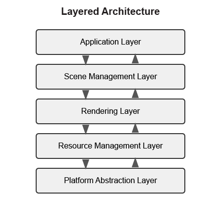

:pp: {plus}{plus}

= Appendix:

== Detailed Architectural Patterns

This appendix provides in-depth information about common architectural patterns used in modern rendering and game engines. These patterns are referenced in the main Engine Architecture section, with a focus on Component-Based Architecture in the main tutorial.

[[layered-architecture]]
=== Layered Architecture

One of the most fundamental architectural patterns is the layered architecture, where the system is divided into distinct layers, each with a specific responsibility.

==== Typical Layers in a Rendering Engine

1. *Platform Abstraction Layer* - Provides a consistent interface to platform-specific functionality.
2. *Resource Management Layer* - Manages loading, caching, and unloading of assets.
3. *Rendering Layer* - Handles the rendering pipeline, shaders, and graphics API interaction.
4. *Scene Management Layer* - Manages the scene graph, spatial partitioning, and culling.
5. *Application Layer* - Handles user input, game logic, and high-level application flow.

==== Benefits of Layered Architecture

* Clear separation of concerns
* Easier to understand and maintain
* Can replace or modify individual layers without affecting others
* Facilitates testing of individual layers

==== Implementation Example

[source,cpp]
----
// Platform Abstraction Layer
class Platform {
public:
    virtual void Initialize() = 0;
    virtual void* CreateWindow(int width, int height) = 0;
    virtual void ProcessEvents() = 0;
    // ...
};

// Resource Management Layer
class ResourceManager {
public:
    virtual Texture* LoadTexture(const std::string& path) = 0;
    virtual Mesh* LoadMesh(const std::string& path) = 0;
    // ...
};

// Rendering Layer
class Renderer {
public:
    virtual void Initialize(Platform* platform) = 0;
    virtual void RenderScene(Scene* scene) = 0;
    // ...
};

// Scene Management Layer
class SceneManager {
public:
    virtual void AddEntity(Entity* entity) = 0;
    virtual void UpdateScene(float deltaTime) = 0;
    // ...
};

// Application Layer
class Application {
private:
    Platform* platform;
    ResourceManager* resourceManager;
    Renderer* renderer;
    SceneManager* sceneManager;

public:
    void Run() {
        platform->Initialize();
        renderer->Initialize(platform);

        // Main loop
        while (running) {
            platform->ProcessEvents();
            sceneManager->UpdateScene(deltaTime);
            renderer->RenderScene(sceneManager->GetActiveScene());
        }
    }
};
----

[[data-oriented-design]]
=== Data-Oriented Design

Data-Oriented Design (DOD) focuses on organizing data for efficient processing, rather than organizing code around objects.

image::../../../images/data_oriented_design_diagram.svg[Data-Oriented Design Diagram, width=600]

==== Key Concepts

1. *Data Layout* - Organizing data for cache-friendly access patterns.
2. *Systems* - Process data in bulk, often using SIMD instructions.
3. *Entity-Component-System (ECS)* - A common implementation of DOD principles.

==== Benefits of Data-Oriented Design

* Better cache utilization
* More efficient memory usage
* Easier to parallelize
* Can lead to significant performance improvements

==== Implementation Example

[source,cpp]
----
// A simple ECS implementation
struct TransformData {
    std::vector<glm::vec3> positions;
    std::vector<glm::quat> rotations;
    std::vector<glm::vec3> scales;
};

struct RenderData {
    std::vector<Mesh*> meshes;
    std::vector<Material*> materials;
};

class TransformSystem {
private:
    TransformData& transformData;

public:
    TransformSystem(TransformData& data) : transformData(data) {}

    void Update(float deltaTime) {
        // Process all transforms in bulk
        for (size_t i = 0; i < transformData.positions.size(); ++i) {
            // Update transforms
        }
    }
};

class RenderSystem {
private:
    RenderData& renderData;
    TransformData& transformData;

public:
    RenderSystem(RenderData& rData, TransformData& tData)
        : renderData(rData), transformData(tData) {}

    void Render() {
        // Render all entities in bulk
        for (size_t i = 0; i < renderData.meshes.size(); ++i) {
            // Render mesh with transform
        }
    }
};
----

[[service-locator-pattern]]
=== Service Locator Pattern

The Service Locator pattern provides a global point of access to services without coupling consumers to concrete implementations.

image::../../../images/service_locator_pattern_diagram.svg[Service Locator Pattern Diagram, width=600]

==== Key Concepts

1. *Service Interface* - Defines the contract for a service.
2. *Service Provider* - Implements the service interface.
3. *Service Locator* - Provides access to services.

==== Benefits of Service Locator Pattern

* Decouples service consumers from service providers
* Allows for easy service replacement
* Facilitates testing with mock services

==== Implementation Example

[source,cpp]
----
// Audio service interface
class IAudioService {
public:
    virtual ~IAudioService() = default;
    virtual void PlaySound(const std::string& soundName) = 0;
    virtual void StopSound(const std::string& soundName) = 0;
};

// Concrete audio service
class OpenALAudioService : public IAudioService {
public:
    void PlaySound(const std::string& soundName) override {
        // Implementation using OpenAL
    }

    void StopSound(const std::string& soundName) override {
        // Implementation using OpenAL
    }
};

// Service locator
class ServiceLocator {
private:
    static IAudioService* audioService;
    static IAudioService nullAudioService; // Default null service

public:
    static void Initialize() {
        audioService = &nullAudioService;
    }

    static IAudioService& GetAudioService() {
        return *audioService;
    }

    static void ProvideAudioService(IAudioService* service) {
        if (service == nullptr) {
            audioService = &nullAudioService;
        } else {
            audioService = service;
        }
    }
};

// Usage example
void PlayGameSound() {
    ServiceLocator::GetAudioService().PlaySound("explosion");
}
----

=== Comparative Analysis of Architectural Patterns

Below is a comparative analysis of the architectural patterns discussed in this appendix:

|===
| Pattern | Strengths | Weaknesses | Best Used For

| Layered Architecture
| * Clear separation of concerns
  * Easy to understand
  * Good for beginners
| * Can lead to "layer bloat"
  * May introduce unnecessary indirection
  * Potential performance overhead from layer traversal
| * Smaller engines
  * Educational projects
  * When clarity is more important than performance

| Component-Based Architecture
| * Highly flexible and modular
  * Promotes code reuse
  * Avoids deep inheritance hierarchies
  * Easier to extend with new features
| * More complex to implement initially
  * Can be harder to debug
  * Potential performance overhead from component lookups
| * Modern rendering engines
  * Systems with diverse object types
  * Projects requiring frequent extension

| Data-Oriented Design
| * Excellent performance
  * Cache-friendly memory access
  * Good for parallel processing
| * Less intuitive than OOP
  * Steeper learning curve
  * Can make code harder to read
| * Performance-critical systems
  * Mobile platforms
  * Systems processing large amounts of similar data

| Service Locator Pattern
| * Decouples service providers from consumers
  * Facilitates testing
  * Allows runtime service swapping
| * Can hide dependencies
  * Potential for runtime errors
  * Global state concerns
| * Cross-cutting concerns
  * Systems requiring runtime configuration
  * When loose coupling is critical
|===

== Advanced Rendering Techniques

This section provides an overview of advanced rendering techniques commonly used in modern rendering engines. For more comprehensive information, refer to these excellent resources:

* *Physically Based Rendering: From Theory to Implementation* - https://www.pbr-book.org/
* *Real-Time Rendering* - https://www.realtimerendering.com/
* *GPU Gems* series - https://developer.nvidia.com/gpugems/gpugems/contributors

=== Deferred Rendering

Deferred rendering separates the geometry and lighting calculations into separate passes, which can be more efficient for scenes with many lights:

1. *Geometry Pass* - Render scene geometry to G-buffer textures (position, normal, albedo, etc.).
2. *Lighting Pass* - Apply lighting calculations using G-buffer textures.

=== Forward+ Rendering

Forward+ (or tiled forward) rendering combines the simplicity of forward rendering with some of the efficiency benefits of deferred rendering:

1. *Light Culling Pass* - Divide the screen into tiles and determine which lights affect each tile.
2. *Forward Rendering Pass* - Render scene geometry with only the lights that affect each tile.

=== Physically Based Rendering (PBR)

PBR aims to create more realistic materials by simulating how light interacts with surfaces in the real world:

1. *Material Parameters* - Define materials using physically meaningful parameters (albedo, metalness, roughness, etc.).
2. *BRDF* - Use a physically based bidirectional reflectance distribution function.
3. *Image-Based Lighting* - Use environment maps for ambient lighting.

=== Advanced Camera Techniques

This section covers advanced techniques for implementing sophisticated camera systems in 3D applications:

* *Camera Collision*: Implement a collision volume for the camera to prevent it from passing through walls
* *Context-Aware Positioning*: Adjust camera position based on the environment (e.g., zoom out in large open areas, zoom in in tight spaces)
* *Intelligent Framing*: Adjust the camera to keep both the character and important objects in frame
* *Predictive Following*: Anticipate character movement to reduce camera lag
* *Camera Obstruction Transparency*: Make objects that obstruct the view partially transparent
* *Dynamic Field of View*: Adjust the FOV based on movement speed or environmental context

== Conclusion

These architectural patterns and rendering techniques provide a foundation for designing your rendering engine. In practice, most engines use a combination of these patterns to address different aspects of the system.

When designing your engine architecture, consider:

1. *Performance Requirements* - Different patterns have different performance characteristics.
2. *Flexibility Needs* - How much flexibility do you need for future extensions?
3. *Team Size and Experience* - More complex architectures may be harder to work with for smaller teams.
4. *Project Scope* - A small project may not need the complexity of a full ECS.

xref:../Engine_Architecture/02_architectural_patterns.adoc[Back to Architectural Patterns]
xref:../Engine_Architecture/05_rendering_pipeline.adoc[Back to Rendering Pipeline]
