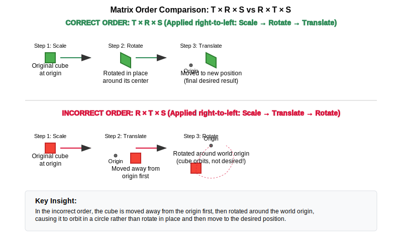

:pp: {plus}{plus}

= Camera & Transformations: Mathematical Foundations

== Mathematical Foundations for 3D Graphics

Before diving into camera implementation, let's review the essential mathematical concepts that form the foundation of 3D graphics programming. Understanding these concepts is crucial for implementing a robust camera system.

=== Vectors in 3D Graphics

Vectors are fundamental to 3D graphics as they represent positions, directions, and movements in space. In our Vulkan application, we'll primarily work with:

* *3D vectors (x, y, z)*: Used for positions, directions, and normals
* *4D vectors (x, y, z, w)*: Used for homogeneous coordinates in transformations

==== Why Vectors Matter in Graphics

In our camera system, vectors serve several critical purposes:

* The camera's position is represented as a 3D vector
* The camera's viewing direction is a 3D vector
* The "up" direction that orients the camera is also a vector

==== Vector Operations and Their Applications

* *Addition and Subtraction*: Used for calculating relative positions and movements
  - Example: `newPosition = currentPosition + movementDirection * speed`

* *Scalar Multiplication*: Used for scaling movements and directions
  - Example: Slowing down camera movement by multiplying velocity by a factor < 1

* *Dot Product*: Calculates the cosine of the angle between normalized vectors.
  - Applications: Determining if objects are facing the camera, calculating lighting intensity

==== The Right-Hand Rule

The right-hand rule is a convention used in 3D graphics and mathematics to determine the orientation of coordinate systems and the direction of cross-products.

* *For Cross Products*: When calculating A × B:

  1. Point your right hand's index finger in the direction of vector A
  2. Point your middle finger in the direction of vector B (perpendicular to A)
  3. Your thumb now points in the direction of the resulting cross-product

* *For Coordinate Systems*: In a right-handed coordinate system:

  1. Point your right hand's index finger along the positive X-axis
  2. Point your middle finger along the positive Y-axis
  3. Your thumb points along the positive Z-axis

[source,cpp]
----
// The cross product direction follows the right-hand rule
glm::vec3 xAxis(1.0f, 0.0f, 0.0f);  // Point right (positive X)
glm::vec3 yAxis(0.0f, 1.0f, 0.0f);  // Point up (positive Y)

// Cross product gives the Z axis in a right-handed system
glm::vec3 zAxis = glm::cross(xAxis, yAxis);  // Points forward (positive Z)
// zAxis will be (0.0f, 0.0f, 1.0f)

// If we reverse the order, we get the opposite direction
glm::vec3 negativeZ = glm::cross(yAxis, xAxis);  // Points backward (negative Z)
// negativeZ will be (0.0f, 0.0f, -1.0f)
----

* *Cross Product*: Creates a vector perpendicular to two input vectors
  - Applications: Generating the camera's "right" vector from "forward" and "up" vectors
  - The direction follows the right-hand rule (explained above)

* *Normalization*: Preserves the direction while setting length to 1
  - Applications: Ensuring consistent movement speed regardless of direction

[source,cpp]
----
// Vector operations using GLM
glm::vec3 a(1.0f, 2.0f, 3.0f);
glm::vec3 b(4.0f, 5.0f, 6.0f);

// Addition - combining positions or offsets
glm::vec3 sum = a + b; // (5.0, 7.0, 9.0)

// Dot product - useful for lighting calculations
float dotProduct = glm::dot(a, b); // 32.0
// If vectors are normalized, dot product = cosine of angle between them
float cosAngle = glm::dot(glm::normalize(a), glm::normalize(b)); // ~0.974

// Cross product - creating perpendicular vectors (e.g., camera orientation)
glm::vec3 crossProduct = glm::cross(a, b); // (-3.0, 6.0, -3.0)

// Normalization - ensuring consistent movement speeds
glm::vec3 normalized = glm::normalize(a); // (0.267, 0.535, 0.802)
----

=== Matrices and Transformations

Matrices are used to represent transformations in 3D space. In Vulkan and other graphics APIs, we typically use 4×4 matrices to represent transformations in homogeneous coordinates.

==== Why We Use 4×4 Matrices

Even though we work in 3D space, we use 4×4 matrices because:

1. They allow us to represent translation (movement) along with rotation and scaling
2. They can be combined (multiplied) to create complex transformations
3. They work with homogeneous coordinates (x, y, z, w) which are required for perspective projection

==== Common Transformation Matrices

* *Translation Matrix*: Moves objects in 3D space
  - In a camera system: Moving the camera position

* *Rotation Matrix*: Rotates objects around an axis
  - In a camera system: Changing where the camera is looking

* *Scale Matrix*: Changes the size of objects
  - Less commonly used for cameras, but important for objects in the scene

* *Model Matrix*: Combines transformations to position an object in world space
  - Positions the objects relative to the world origin

* *View Matrix*: Transforms world space to camera space
  - Essentially positions the world relative to the camera

* *Projection Matrix*: Transforms camera space to clip space
  - Defines how 3D objects are projected onto the 2D screen
  - Controls perspective, field of view, and visible range (near/far planes)

[source,cpp]
----
// Matrix transformations using GLM
// Translation matrix - moving an object
glm::mat4 translationMatrix = glm::translate(glm::mat4(1.0f), glm::vec3(1.0f, 2.0f, 3.0f));

// Rotation matrix (45 degrees around Y axis) - turning an object
glm::mat4 rotationMatrix = glm::rotate(glm::mat4(1.0f), glm::radians(45.0f), glm::vec3(0.0f, 1.0f, 0.0f));

// Scale matrix - resizing an object
glm::mat4 scaleMatrix = glm::scale(glm::mat4(1.0f), glm::vec3(2.0f, 2.0f, 2.0f));

// Combining transformations (scale, then rotate, then translate)
// Order matters! The rightmost transformation is applied first
glm::mat4 modelMatrix = translationMatrix * rotationMatrix * scaleMatrix;
----

==== Matrix Order Matters

The order of matrix multiplication is crucial because transformations are applied from right to left. Getting the order wrong can completely change your object's final position and orientation.

Consider this practical example: if you want to rotate a cube around its own center and then move it to a new position, you must apply the transformations in the correct order:

[source,cpp]
----
// CORRECT: Scale first, then rotate, then translate
// This rotates the cube around its own center, then moves it
glm::mat4 modelMatrix = translationMatrix * rotationMatrix * scaleMatrix;

// WRONG: Translate first, then rotate
// This would move the cube away from origin, then rotate it around the world origin
// The cube would orbit around the world center instead of rotating in place!
glm::mat4 wrongMatrix = rotationMatrix * translationMatrix * scaleMatrix;
----

For our camera pipeline: `projectionMatrix * viewMatrix * modelMatrix * vertex`
Each transformation prepares the data for the next stage, and changing this order would break the rendering pipeline.

==== Visual Example: Why Matrix Order Matters

The following diagram illustrates the difference between correct and incorrect matrix multiplication order when transforming a cube:

.Matrix Transformation Order Comparison

==== Row-Major vs. Column-Major Representation

When working with matrices in graphics programming, it's important to understand the difference between row-major and column-major representations:

* *Row-Major*: Matrix elements are stored row by row in memory
  - Used by DirectX, C/C++ multi-dimensional arrays
  - A matrix is accessed as `M[row][column]`

* *Column-Major*: Matrix elements are stored column by column in memory
  - Used by OpenGL, GLSL, and by default in GLM
  - A matrix is accessed as `M[column][row]` (in memory layout terms)

[source,cpp]
----
// Row-major vs Column-major representation of a 3x3 matrix
// For a matrix:
// [ a b c ]
// [ d e f ]
// [ g h i ]

// Row-major memory layout:
// [a, b, c, d, e, f, g, h, i]

// Column-major memory layout:
// [a, d, g, b, e, h, c, f, i]

// In GLM, matrices are column-major by default
glm::mat4 matrix = glm::mat4(1.0f);  // Identity matrix in column-major format

// When passing matrices to Vulkan shaders, you need to be aware of the layout
// Vulkan expects column-major by default, matching GLM's default
----

==== Vulkan and Matrix Layouts

Vulkan works with both row-major and column-major formats, but you need to specify which one you're using:

* By default, Vulkan expects matrices in column-major format
* You can specify row-major format in your shaders using the `row_major` qualifier
* GLM (commonly used with Vulkan) uses column-major by default, but can be configured for row-major

The practical implications:

* Matrix multiplication order may need to be reversed depending on the layout
* When debugging, matrix elements may appear transposed compared to mathematical notation
* When porting code between different APIs, matrix layouts may need to be transposed

=== Affine Transformations

Affine transformations are a fundamental concept in computer graphics that preserve parallel lines (but not necessarily angles or distances). They're essential for representing most common operations in 3D graphics.

==== Properties of Affine Transformations

An affine transformation can be represented as a combination of:

* Linear transformations (rotation, scaling, shearing)
* Translation (movement)

In mathematical terms, an affine transformation can be expressed as:

[stem]
++++
f(x) = Ax + b
++++

where A is a matrix (linear transformation) and b is a vector (translation).

==== Why Affine Transformations Matter in Graphics

* They preserve collinearity (points on a line remain on a line)
* They preserve ratios of distances along a line
* They can represent all the common transformations we need in 3D graphics
* They can be efficiently composed (combined) through matrix multiplication

==== Representing Affine Transformations with Homogeneous Coordinates

In 3D graphics, we use 4×4 matrices to represent affine transformations using homogeneous coordinates:

[source,cpp]
----
// A 4×4 matrix representing an affine transformation
// [ R R R Tx ]
// [ R R R Ty ]
// [ R R R Tz ]
// [ 0 0 0  1 ]
// Where R represents rotation/scaling/shearing and T represents translation

// Example of an affine transformation matrix in GLM
glm::mat4 affineTransform = glm::mat4(
    glm::vec4(r11, r12, r13, tx),  // First row
    glm::vec4(r21, r22, r23, ty),  // Second row
    glm::vec4(r31, r32, r33, tz),  // Third row
    glm::vec4(0.0f, 0.0f, 0.0f, 1.0f)  // Last row is always (0,0,0,1) for affine transformations
);
----

==== Affine Transformations in Practice

In our Vulkan application, almost all transformations we perform are affine:
* Moving objects around the scene (translation)
* Rotating objects to face different directions
* Scaling objects to make them larger or smaller
* Combining these operations to position and orient objects

=== Pose Matrices

A pose matrix (also called a transformation matrix or rigid body transformation) is a specific type of affine transformation that represents both the position and orientation of an object in 3D space.

==== Structure of a Pose Matrix

A pose matrix combines rotation and translation in a single 4×4 matrix:

[source,cpp]
----
// A pose matrix has this structure:
// [ R R R Tx ]
// [ R R R Ty ]
// [ R R R Tz ]
// [ 0 0 0  1 ]
// Where the 3×3 R submatrix represents rotation and [Tx,Ty,Tz] represents translation

// Creating a pose matrix in GLM
glm::mat4 poseMatrix = glm::mat4(1.0f);  // Start with identity matrix
poseMatrix = glm::translate(poseMatrix, position);  // Apply translation
poseMatrix = poseMatrix * rotationMatrix;  // Apply rotation
----

==== Applications of Pose Matrices

Pose matrices are essential in graphics engines for:

* *Object Positioning*: Defining where objects are located and how they're oriented
  - Example: Placing a character model in the world with the correct position and facing direction

* *Camera Representation*: Defining the camera's position and orientation
  - Example: The view matrix is the inverse of the camera's pose matrix

* *Hierarchical Transformations*: Building complex objects from simpler parts
  - Example: A character's hand position depends on the arm position, which depends on the torso position

* *Animation*: Interpolating between different poses
  - Example: Smoothly transitioning a camera from one position/orientation to another

==== Extracting Information from Pose Matrices

We can extract useful information from pose matrices:

[source,cpp]
----
// Extracting position from a pose matrix
glm::vec3 extractPosition(const glm::mat4& poseMatrix) {
    return glm::vec3(poseMatrix[3]);  // The translation is stored in the last column
}

// Extracting forward direction (assuming standard OpenGL orientation)
glm::vec3 extractForwardDirection(const glm::mat4& poseMatrix) {
    return -glm::vec3(poseMatrix[2]);  // Negative Z axis (third column)
}

// Extracting up direction
glm::vec3 extractUpDirection(const glm::mat4& poseMatrix) {
    return glm::vec3(poseMatrix[1]);  // Y axis (second column)
}
----

=== Implementing a Look-At Function

A "look-at" function is a fundamental tool in camera systems that creates a view matrix to orient the camera towards a specific target point. This is one of the most common operations in 3D graphics and provides an excellent example of how the mathematical concepts we've discussed are applied in practice.

==== Purpose of the Look-At Function

The look-at function serves several important purposes:

* Orients the camera to face a specific point in 3D space
* Establishes the camera's local coordinate system (right, up, forward vectors)
* Creates a view matrix that transforms world coordinates into camera space
* Simplifies camera control by focusing on a target rather than managing rotation angles

==== Mathematical Principles

The look-at function works by constructing an orthonormal basis (three perpendicular unit vectors) that defines the camera's orientation:

1. *Forward Vector (Z)*: Points from the camera position to the target position
2. *Right Vector (X)*: Perpendicular to both the forward vector and the world up vector
3. *Up Vector (Y)*: Perpendicular to both the forward and right vectors

These three vectors, along with the camera position, form the view matrix that transforms world coordinates into camera space.

==== Step-by-Step Implementation

Let's implement a custom look-at function to understand how it works:

[source,cpp]
----
glm::mat4 createLookAtMatrix(
    const glm::vec3& cameraPosition,  // Where the camera is
    const glm::vec3& targetPosition,  // What the camera is looking at
    const glm::vec3& worldUpVector    // Which way is "up" (usually Y axis)
) {
    // Step 1: Calculate the camera's forward direction (Z axis)
    // Note: We negate this because in OpenGL/Vulkan, the camera looks down the negative Z-axis
    glm::vec3 forward = glm::normalize(cameraPosition - targetPosition);

    // Step 2: Calculate the camera's right direction (X axis)
    // Using cross product between world up and forward direction
    glm::vec3 right = glm::normalize(glm::cross(worldUpVector, forward));

    // Step 3: Calculate the camera's up direction (Y axis)
    // Using cross product between forward and right to ensure orthogonality
    glm::vec3 up = glm::cross(forward, right);

    // Step 4: Construct the rotation part of the view matrix
    // Each row contains one of the camera's basis vectors
    glm::mat4 rotation = glm::mat4(1.0f);
    rotation[0][0] = right.x;
    rotation[1][0] = right.y;
    rotation[2][0] = right.z;
    rotation[0][1] = up.x;
    rotation[1][1] = up.y;
    rotation[2][1] = up.z;
    rotation[0][2] = forward.x;
    rotation[1][2] = forward.y;
    rotation[2][2] = forward.z;

    // Step 5: Construct the translation part of the view matrix
    glm::mat4 translation = glm::mat4(1.0f);
    translation[3][0] = -cameraPosition.x;
    translation[3][1] = -cameraPosition.y;
    translation[3][2] = -cameraPosition.z;

    // Step 6: Combine rotation and translation
    // The translation is applied first, then the rotation
    return rotation * translation;
}
----

==== Using GLM's Built-in Look-At Function

In practice, we typically use GLM's built-in `lookAt` function, which implements the same algorithm:

[source,cpp]
----
// Using GLM's built-in lookAt function
glm::mat4 viewMatrix = glm::lookAt(
    glm::vec3(0.0f, 0.0f, 5.0f),   // Camera position
    glm::vec3(0.0f, 0.0f, 0.0f),   // Target position (origin)
    glm::vec3(0.0f, 1.0f, 0.0f)    // World up vector (Y axis)
);
----

==== Practical Applications

The look-at function is used in various scenarios:

* *First-Person Camera*: Looking in the direction of movement
* *Third-Person Camera*: Following a character while looking at them
* *Orbit Camera*: Circling around a point of interest
* *Cinematic Camera*: Creating smooth camera movements that focus on important objects
* *Object Inspection*: Allowing users to examine 3D models from different angles

==== Example: Implementing an Orbit Camera

Here's how you might use the look-at function to implement an orbit camera that circles around a target:

[source,cpp]
----
// Orbit camera implementation
void updateOrbitCamera(float deltaTime) {
    // Update the orbit angle based on time
    orbitAngle += orbitSpeed * deltaTime;

    // Calculate the camera position on a circle around the target
    float radius = 10.0f;
    glm::vec3 cameraPosition(
        targetPosition.x + radius * cos(orbitAngle),
        targetPosition.y + 5.0f,  // Slightly above the target
        targetPosition.z + radius * sin(orbitAngle)
    );

    // Create the view matrix using lookAt
    viewMatrix = glm::lookAt(
        cameraPosition,
        targetPosition,
        glm::vec3(0.0f, 1.0f, 0.0f)
    );
}
----

==== Example: Smooth Camera Transitions

The look-at function can also be used to create smooth transitions between different camera positions and targets:

[source,cpp]
----
// Smooth camera transition
void transitionCamera(float t) {  // t ranges from 0.0 to 1.0
    // Interpolate between start and end positions
    glm::vec3 currentPosition = glm::mix(startPosition, endPosition, t);

    // Interpolate between start and end targets
    glm::vec3 currentTarget = glm::mix(startTarget, endTarget, t);

    // Update the view matrix
    viewMatrix = glm::lookAt(
        currentPosition,
        currentTarget,
        glm::vec3(0.0f, 1.0f, 0.0f)
    );
}
----

By understanding how the look-at function works, you gain insight into how cameras are oriented in 3D space and how the view matrix transforms the world from the camera's perspective.

=== Raycasting in 3D Graphics

Raycasting is a fundamental technique in 3D graphics that involves projecting rays from a point into the scene and determining what they intersect with. It's used for a wide range of applications, from picking objects in a scene to implementing collision detection and visibility determination.

==== Ray Representation

A ray in 3D space is defined by an origin point and a direction vector:

[source,cpp]
----
struct Ray {
    glm::vec3 origin;     // Starting point of the ray
    glm::vec3 direction;  // Normalized direction vector
};

// Creating a ray
Ray createRay(const glm::vec3& origin, const glm::vec3& direction) {
    Ray ray;
    ray.origin = origin;
    ray.direction = glm::normalize(direction);  // Ensure direction is normalized
    return ray;
}
----

==== Ray-Object Intersection

The core of raycasting is determining if and where a ray intersects with objects in the scene. Let's look at some common intersection tests:

===== Ray-Sphere Intersection

One of the simplest intersection tests is between a ray and a sphere:

[source,cpp]
----
struct Sphere {
    glm::vec3 center;
    float radius;
};

bool rayIntersectsSphere(const Ray& ray, const Sphere& sphere, float& t) {
    // Vector from ray origin to sphere center
    glm::vec3 oc = sphere.center - ray.origin;

    // Quadratic equation coefficients
    float a = glm::dot(ray.direction, ray.direction);  // Always 1 if direction is normalized
    float b = 2.0f * glm::dot(oc, ray.direction);
    float c = glm::dot(oc, oc) - sphere.radius * sphere.radius;

    // Discriminant
    float discriminant = b * b - 4 * a * c;

    if (discriminant < 0) {
        // No intersection
        return false;
    }

    // Find the nearest intersection point
    float sqrtDiscriminant = sqrt(discriminant);
    float t0 = (-b - sqrtDiscriminant) / (2 * a);
    float t1 = (-b + sqrtDiscriminant) / (2 * a);

    // Check if intersection is in front of the ray
    if (t0 > 0) {
        t = t0;
        return true;
    }

    if (t1 > 0) {
        t = t1;
        return true;
    }

    // Both intersections are behind the ray
    return false;
}
----

===== Ray-Triangle Intersection

Triangle intersection is essential for raycasting against 3D models:

[source,cpp]
----
struct Triangle {
    glm::vec3 v0, v1, v2;  // Vertices
};

bool rayIntersectsTriangle(const Ray& ray, const Triangle& triangle, float& t, glm::vec2& barycentricCoords) {
    // Möller–Trumbore algorithm
    glm::vec3 edge1 = triangle.v1 - triangle.v0;
    glm::vec3 edge2 = triangle.v2 - triangle.v0;
    glm::vec3 h = glm::cross(ray.direction, edge2);
    float a = glm::dot(edge1, h);

    // Check if ray is parallel to triangle
    if (a > -0.00001f && a < 0.00001f) {
        return false;
    }

    float f = 1.0f / a;
    glm::vec3 s = ray.origin - triangle.v0;
    float u = f * glm::dot(s, h);

    // Check if intersection is outside triangle
    if (u < 0.0f || u > 1.0f) {
        return false;
    }

    glm::vec3 q = glm::cross(s, edge1);
    float v = f * glm::dot(ray.direction, q);

    // Check if intersection is outside triangle
    if (v < 0.0f || u + v > 1.0f) {
        return false;
    }

    // Compute intersection distance
    t = f * glm::dot(edge2, q);

    // Check if intersection is behind the ray
    if (t <= 0.0f) {
        return false;
    }

    // Store barycentric coordinates for interpolation
    barycentricCoords = glm::vec2(u, v);
    return true;
}
----

===== Ray-AABB Intersection

Axis-Aligned Bounding Box (AABB) intersection is useful for broad-phase collision detection:

[source,cpp]
----
struct AABB {
    glm::vec3 min;  // Minimum corner
    glm::vec3 max;  // Maximum corner
};

bool rayIntersectsAABB(const Ray& ray, const AABB& aabb, float& tMin, float& tMax) {
    // Compute intersection with each slab
    glm::vec3 invDir = 1.0f / ray.direction;
    glm::vec3 t0 = (aabb.min - ray.origin) * invDir;
    glm::vec3 t1 = (aabb.max - ray.origin) * invDir;

    // Handle negative directions
    glm::vec3 tSmaller = glm::min(t0, t1);
    glm::vec3 tBigger = glm::max(t0, t1);

    // Find entry and exit points
    tMin = glm::max(tSmaller.x, glm::max(tSmaller.y, tSmaller.z));
    tMax = glm::min(tBigger.x, glm::min(tBigger.y, tBigger.z));

    // Check if there's a valid intersection
    return tMax >= tMin && tMax > 0;
}
----

==== Creating Camera Rays

One of the most common uses of raycasting is to create rays from the camera into the scene, which is essential for picking objects or implementing ray tracing:

[source,cpp]
----
Ray createCameraRay(
    const glm::vec2& screenCoord,    // Normalized screen coordinates (-1 to 1)
    const glm::mat4& viewMatrix,     // Camera view matrix
    const glm::mat4& projectionMatrix // Camera projection matrix
) {
    // Convert to clip space
    glm::vec4 clipCoords(screenCoord.x, screenCoord.y, -1.0f, 1.0f);

    // Convert to view space
    glm::mat4 invProjection = glm::inverse(projectionMatrix);
    glm::vec4 viewCoords = invProjection * clipCoords;
    viewCoords.z = -1.0f;  // Point towards negative Z in view space
    viewCoords.w = 0.0f;   // Convert to direction vector

    // Convert to world space
    glm::mat4 invView = glm::inverse(viewMatrix);
    glm::vec4 worldCoords = invView * viewCoords;

    // Create ray
    Ray ray;
    ray.origin = glm::vec3(invView[3]);  // Camera position in world space
    ray.direction = glm::normalize(glm::vec3(worldCoords));

    return ray;
}
----

==== Applications of Raycasting in Graphics

Raycasting has numerous applications in 3D graphics and game development:

* *Object Picking*: Determining which object the user clicked on in a 3D scene
  - Cast a ray from the camera through the mouse position and find the nearest intersection

* *Collision Detection*: Checking if objects will collide along a movement path
  - Cast rays in the direction of movement to detect potential collisions

* *Line of Sight*: Determining if one object can "see" another
  - Cast a ray between two objects and check for obstructions

* *Terrain Height Sampling*: Finding the height of terrain at a specific point
  - Cast a ray downward from above the terrain

* *Physics Simulations*: Implementing realistic physics behaviors
  - Raycasting is fundamental to many physics engines for collision resolution

* *AI Navigation*: Helping AI characters navigate environments
  - Raycasting can detect obstacles and determine valid paths

==== Optimizing Raycasting Performance

For complex scenes with many objects, raycasting can become computationally expensive. Here are some optimization techniques:

* *Spatial Partitioning*: Use data structures like octrees, BVHs, or k-d trees to quickly eliminate objects that can't possibly intersect with the ray

* *Bounding Volume Hierarchies*: Test against simple bounding volumes (spheres, AABBs) before performing more expensive tests against detailed geometry

* *Level of Detail*: Use simpler collision geometry for distant objects

* *Ray Batching*: Process multiple rays together to take advantage of SIMD instructions

* *Early Termination*: Stop testing once you've found any intersection (if that's all you need)

=== Projection in 3D Graphics

Projection is the process of transforming 3D coordinates in view space to 2D coordinates on the screen. In computer graphics, we use projection matrices to perform this transformation.

==== Types of Projection

There are two main types of projection used in 3D graphics:

* *Perspective Projection*: Objects appear smaller as they get farther away, simulating how we see the world
* *Orthographic Projection*: Objects maintain their size regardless of distance, useful for technical drawings, 2D games, and UI elements

==== Perspective Projection

Perspective projection creates a realistic view where distant objects appear smaller, creating the illusion of depth:

[source,cpp]
----
// Creating a perspective projection matrix
glm::mat4 createPerspectiveMatrix(
    float fovY,           // Vertical field of view in degrees
    float aspectRatio,    // Width / height of the viewport
    float nearPlane,      // Distance to the near clipping plane
    float farPlane        // Distance to the far clipping plane
) {
    return glm::perspective(glm::radians(fovY), aspectRatio, nearPlane, farPlane);
}
----

The perspective projection matrix performs several transformations:

1. Scales the view frustum based on the field of view and aspect ratio
2. Maps the view volume to a canonical view volume (a cube from -1 to 1 in each dimension)
3. Applies perspective division (dividing by w) to create the perspective effect

The resulting matrix has this structure:

[source,cpp]
----
// Structure of a perspective projection matrix
// [ (h/w)*cot(fovY/2)    0             0                   0                ]
// [        0         cot(fovY/2)       0                   0                ]
// [        0             0        -(f+n)/(f-n)    -2*f*n/(f-n)             ]
// [        0             0             -1                   0                ]
// Where:
// - fovY is the vertical field of view
// - w/h is the aspect ratio
// - n is the near plane distance
// - f is the far plane distance
----

==== Orthographic Projection

Orthographic projection maintains the size of objects regardless of their distance from the camera:

[source,cpp]
----
// Creating an orthographic projection matrix
glm::mat4 createOrthographicMatrix(
    float left,       // Left plane coordinate
    float right,      // Right plane coordinate
    float bottom,     // Bottom plane coordinate
    float top,        // Top plane coordinate
    float nearPlane,  // Near plane distance
    float farPlane    // Far plane distance
) {
    return glm::ortho(left, right, bottom, top, nearPlane, farPlane);
}
----

The orthographic projection matrix simply scales and translates the view volume to the canonical view volume without applying any perspective division:

[source,cpp]
----
// Structure of an orthographic projection matrix
// [ 2/(r-l)      0           0           -(r+l)/(r-l) ]
// [    0      2/(t-b)        0           -(t+b)/(t-b) ]
// [    0         0       -2/(f-n)        -(f+n)/(f-n) ]
// [    0         0           0                 1       ]
// Where:
// - l, r are the left and right planes
// - b, t are the bottom and top planes
// - n, f are the near and far planes
----

==== The View Frustum

The view frustum is the volume of space visible to the camera. For perspective projection, it's a truncated pyramid:

* *Near Plane*: The closest plane to the camera where rendering begins
* *Far Plane*: The farthest plane from the camera where rendering ends
* *Field of View (FOV)*: The angle that determines how wide the view is
* *Aspect Ratio*: The ratio of width to height of the viewport

[source,cpp]
----
// Calculating the corners of the view frustum
void calculateFrustumCorners(
    float fovY,
    float aspectRatio,
    float nearPlane,
    float farPlane,
    glm::vec3 corners[8]  // Output array for the 8 corners
) {
    float tanHalfFovY = tan(glm::radians(fovY) / 2.0f);

    // Near plane dimensions
    float nearHeight = 2.0f * nearPlane * tanHalfFovY;
    float nearWidth = nearHeight * aspectRatio;

    // Far plane dimensions
    float farHeight = 2.0f * farPlane * tanHalfFovY;
    float farWidth = farHeight * aspectRatio;

    // Near plane corners (in view space)
    corners[0] = glm::vec3(-nearWidth/2, -nearHeight/2, -nearPlane);  // Bottom-left
    corners[1] = glm::vec3( nearWidth/2, -nearHeight/2, -nearPlane);  // Bottom-right
    corners[2] = glm::vec3( nearWidth/2,  nearHeight/2, -nearPlane);  // Top-right
    corners[3] = glm::vec3(-nearWidth/2,  nearHeight/2, -nearPlane);  // Top-left

    // Far plane corners (in view space)
    corners[4] = glm::vec3(-farWidth/2, -farHeight/2, -farPlane);  // Bottom-left
    corners[5] = glm::vec3( farWidth/2, -farHeight/2, -farPlane);  // Bottom-right
    corners[6] = glm::vec3( farWidth/2,  farHeight/2, -farPlane);  // Top-right
    corners[7] = glm::vec3(-farWidth/2,  farHeight/2, -farPlane);  // Top-left
}
----

==== Projection and Unprojection

Projection converts 3D world coordinates to 2D screen coordinates, while unprojection does the reverse. The following code examples demonstrate these concepts for educational purposes:

[NOTE]
====
These utility functions are provided to help understand the mathematical concepts behind projection and unprojection. While they may not be directly used in the basic rendering pipeline, they are valuable for implementing features like object picking, mouse interaction with 3D objects, and custom rendering techniques.
====

[source,cpp]
----
// Project a 3D point to screen space
glm::vec2 projectPoint(
    const glm::vec3& worldPoint,
    const glm::mat4& viewMatrix,
    const glm::mat4& projectionMatrix,
    const glm::vec4& viewport  // (x, y, width, height)
) {
    // Transform to clip space
    glm::vec4 clipSpace = projectionMatrix * viewMatrix * glm::vec4(worldPoint, 1.0f);

    // Perspective division
    glm::vec3 ndcSpace = glm::vec3(clipSpace) / clipSpace.w;

    // Map to viewport
    glm::vec2 screenPos;
    screenPos.x = (ndcSpace.x + 1.0f) * 0.5f * viewport.z + viewport.x;
    screenPos.y = (1.0f - ndcSpace.y) * 0.5f * viewport.w + viewport.y;  // Y is flipped

    return screenPos;
}

// Unproject a screen point to a ray in world space
Ray unprojectScreenPoint(
    const glm::vec2& screenPoint,
    const glm::mat4& viewMatrix,
    const glm::mat4& projectionMatrix,
    const glm::vec4& viewport  // (x, y, width, height)
) {
    // Convert to normalized device coordinates
    glm::vec3 ndcPos;
    ndcPos.x = 2.0f * (screenPoint.x - viewport.x) / viewport.z - 1.0f;
    ndcPos.y = 1.0f - 2.0f * (screenPoint.y - viewport.y) / viewport.w;  // Y is flipped
    ndcPos.z = -1.0f;  // Near plane

    // Create ray from camera through this point
    return createCameraRay(glm::vec2(ndcPos.x, ndcPos.y), viewMatrix, projectionMatrix);
}
----

==== Applications of Projection in Graphics

Projection matrices are used in various ways in 3D graphics:

* *Rendering*: Converting 3D scene geometry to 2D screen pixels
* *Shadow Mapping*: Projecting the scene from a light's perspective to determine shadows
* *Reflection/Refraction*: Calculating how light bounces off or passes through surfaces
* *Texture Projection*: Mapping textures onto surfaces based on a projector's perspective
* *Screen-Space Effects*: Implementing post-processing effects like screen-space reflections or ambient occlusion

==== Choosing the Right Projection

The choice between perspective and orthographic projection depends on the application:

* *Use Perspective Projection for*:
  - First-person or third-person games
  - Realistic 3D visualizations
  - Any application where depth perception is important

* *Use Orthographic Projection for*:
  - 2D games with 3D elements
  - Technical drawings and CAD applications
  - UI elements that shouldn't be affected by perspective
  - Isometric or top-down games

=== Quaternions for Rotations

While rotation matrices work well, quaternions offer advantages for certain rotation operations, particularly for smooth camera movements and avoiding "gimbal lock" (loss of a degree of freedom in certain orientations).

==== Why Use Quaternions?

* More compact representation (4 components vs. 9 for a rotation matrix)
* Easier to interpolate smoothly between orientations (important for camera animations)
* Avoids gimbal lock issues that can occur with Euler angles (pitch, yaw, roll)

[source,cpp]
----
// Quaternion operations using GLM
// Create a quaternion from Euler angles (in radians)
glm::quat rotation = glm::quat(glm::vec3(
    glm::radians(30.0f),  // pitch (X) - looking up/down
    glm::radians(45.0f),  // yaw (Y) - looking left/right
    glm::radians(60.0f)   // roll (Z) - tilting the camera
));

// Convert quaternion to rotation matrix for use in rendering
glm::mat4 rotationMatrix = glm::mat4_cast(rotation);

// Rotate a vector using a quaternion (e.g., rotating the camera's forward vector)
glm::vec3 original(1.0f, 0.0f, 0.0f);
glm::vec3 rotated = rotation * original;
----

=== Coordinate Systems in 3D Graphics

Understanding the different coordinate systems is essential for implementing a camera system. As data moves through the rendering pipeline, it undergoes several transformations:

* *Local Space (Object Space)*: Coordinates relative to the object's origin
  - Where vertices are initially defined relative to their own object

* *World Space*: Coordinates relative to the world origin
  - Where objects are positioned relative to each other in the scene

* *View Space (Camera Space)*: Coordinates relative to the camera
  - The world as seen from the camera's position and orientation
  - The camera is at the origin (0,0,0) looking down the negative Z-axis

* *Clip Space*: Coordinates after projection, in the range [-w, w] for each axis
  - Determines what's visible on screen (inside the view frustum)

* *Screen Space*: Final 2D coordinates for display on the screen
  - The actual pixel positions where objects appear

==== Handedness of Coordinate Systems

Graphics APIs and engines use either right-handed or left-handed coordinate systems:

* *Right-Handed System* (used by OpenGL and Vulkan by convention):
  - X-axis points right
  - Y-axis points up
  - Z-axis points out of the screen (toward the viewer)
  - Cross product: Z = X × Y (using the right-hand rule)

* *Left-Handed System* (used by DirectX):
  - X-axis points right
  - Y-axis points up
  - Z-axis points into the screen (away from the viewer)
  - Cross product: Z = X × Y (using the left-hand rule)

[source,cpp]
----
// In Vulkan, we typically use a right-handed coordinate system
// But we can convert between systems if needed

// Converting a point from left-handed to right-handed system
// (just flip the Z coordinate)
glm::vec3 leftHandedPoint(x, y, z);
glm::vec3 rightHandedPoint(x, y, -z);

// When setting up a camera, the handedness affects the view matrix
// In a right-handed system, the camera typically looks down the negative Z-axis
// This is why we often see -Z as the "forward" direction in camera code
----

==== Implications for Camera Systems

The handedness of your coordinate system affects how you set up your camera:

* In a right-handed system (Vulkan convention):
  - The camera typically looks down the negative Z-axis
  - The "look" vector is often stored as a negative Z direction
  - The view matrix is constructed using the right-hand rule for cross products

* When extracting axes from a view matrix:
  - Right vector: X-axis of the view matrix
  - Up vector: Y-axis of the view matrix
  - Forward vector: Negative Z-axis of the view matrix

==== The Transformation Pipeline

The transformation pipeline typically follows this sequence:
Local Space → World Space → View Space → Clip Space → Screen Space

[source,cpp]
----
// A typical vertex transformation in a shader
gl_Position = projectionMatrix * viewMatrix * modelMatrix * vec4(vertexPosition, 1.0);
----

In the next section, we'll implement these mathematical concepts to create a flexible camera system for our Vulkan application.

=== Further Resources

If you're finding some of the mathematical concepts challenging or want to deepen your understanding, here are some helpful resources organized by topic:

==== General 3D Math Resources

* *Books*:
  - "Mathematics for 3D Game Programming and Computer Graphics" by Eric Lengyel - Comprehensive reference for 3D math
  - "3D Math Primer for Graphics and Game Development" by Fletcher Dunn and Ian Parberry - Excellent beginner-friendly introduction
  - "Essential Mathematics for Games and Interactive Applications" by James M. Van Verth and Lars M. Bishop - Practical approach with code examples

* *Online Courses*:
  - https://www.khanacademy.org/math/linear-algebra[Khan Academy Linear Algebra] - Free course covering vector and matrix fundamentals
  - https://www.coursera.org/learn/linear-algebra-machine-learning[Mathematics for Machine Learning: Linear Algebra] - Covers vectors, matrices, and transformations

* *Interactive Tools*:
  - https://eater.net/quaternions[Quaternion Visualizer] - Interactive visualization of quaternion rotations
  - https://math.hws.edu/graphicsbook/c3/s5.html[Interactive 3D Transformations] - Experiment with different transformations

==== Vectors and Vector Operations

* *Tutorials*:
  - https://www.scratchapixel.com/lessons/mathematics-physics-for-computer-graphics/geometry/vectors.html[Scratchapixel: Vectors] - Detailed explanation with graphics
  - https://www.youtube.com/watch?v=fNk_zzaMoSs&list=PLZHQObOWTQDPD3MizzM2xVFitgF8hE_ab[3Blue1Brown: Essence of Linear Algebra] - Excellent visual explanations of vectors

* *Interactive Tools*:
  - https://www.geogebra.org/m/qCHzkpXh[GeoGebra: Vector Operations] - Interactive vector addition, subtraction, dot and cross products
  - https://www.falstad.com/dotproduct/[Dot Product Visualization] - Interactive visualization of dot products

==== Matrices and Transformations

* *Tutorials*:
  - https://www.scratchapixel.com/lessons/mathematics-physics-for-computer-graphics/geometry/transformations.html[Scratchapixel: Transformations] - Detailed explanation of transformation matrices
  - https://learnopengl.com/Getting-started/Transformations[LearnOpenGL: Transformations] - Practical guide to transformations in graphics

* *Interactive Tools*:
  - https://www.shadertoy.com/view/ltBXW3[ShaderToy: Matrix Transformations] - Interactive visualization of matrix transformations
  - https://www.redblobgames.com/articles/transform/[Red Blob Games: Interactive Transformations] - Visual explanation of 2D transformations (concepts extend to 3D)

==== Quaternions

* *Tutorials*:
  - https://www.youtube.com/watch?v=zjMuIxRvygQ[3Blue1Brown: Quaternions and 3D rotation] - Visual explanation of quaternions
  - https://www.3dgep.com/understanding-quaternions/[Understanding Quaternions] - Practical guide with code examples

* *Interactive Tools*:
  - https://eater.net/quaternions[Quaternion Visualizer] - Interactive visualization of quaternion rotations
  - https://www.shadertoy.com/view/lsl3RH[ShaderToy: Quaternion Rotation] - Interactive quaternion rotation visualization

==== Coordinate Systems and Handedness

* *Tutorials*:
  - https://learnopengl.com/Getting-started/Coordinate-Systems[LearnOpenGL: Coordinate Systems] - Explanation of different coordinate systems in graphics
  - https://www.scratchapixel.com/lessons/mathematics-physics-for-computer-graphics/geometry/coordinate-systems.html[Scratchapixel: Coordinate Systems] - Detailed explanation with graphics

* *References*:
  - https://www.khronos.org/opengl/wiki/Coordinate_Transformations[OpenGL Wiki: Coordinate Transformations] - Reference for coordinate transformations
  - https://docs.microsoft.com/en-us/windows/win32/direct3d9/coordinate-systems[Microsoft Docs: Coordinate Systems] - Explanation of left-handed vs. right-handed systems

==== GLM Library (Used in our examples)

* *Documentation*:
  - https://github.com/g-truc/glm/blob/master/manual.md[GLM Manual] - Official documentation for the GLM math library
  - https://glm.g-truc.net/0.9.9/api/index.html[GLM API Documentation] - API reference

* *Tutorials*:
  - https://learnopengl.com/Getting-started/Transformations[LearnOpenGL: Transformations with GLM] - Practical guide to using GLM for transformations
  - https://www.lighthouse3d.com/tutorials/glm-tutorial/[GLM Tutorial] - Tutorial on using GLM for graphics math

==== Interactive Learning Tools

* *Visualizations*:
  - https://www.geogebra.org/3d[GeoGebra 3D Calculator] - Create and manipulate 3D objects and transformations
  - https://www.shadertoy.com/[ShaderToy] - Experiment with shaders that use 3D math

* *Practice Problems*:
  - https://www.khanacademy.org/math/linear-algebra/vectors-and-spaces[Khan Academy: Vectors and Spaces] - Practice problems for vector math
  - https://www.khanacademy.org/math/linear-algebra/matrix-transformations[Khan Academy: Matrix Transformations] - Practice problems for matrix transformations

These resources should help you gain a deeper understanding of the mathematical concepts used in 3D graphics and camera systems. If you're struggling with a particular concept, try looking at multiple resources as different explanations might resonate better with your learning style.

link:03_transformation_matrices.adoc[Next: Transformation Matrices]
