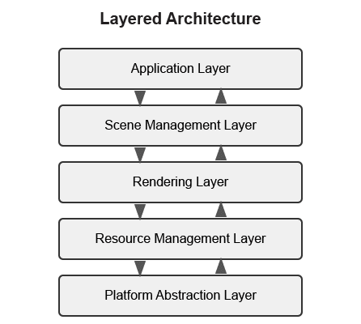
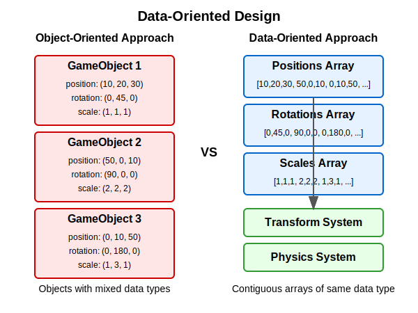
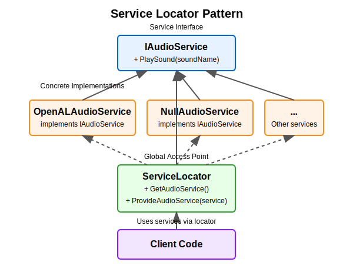
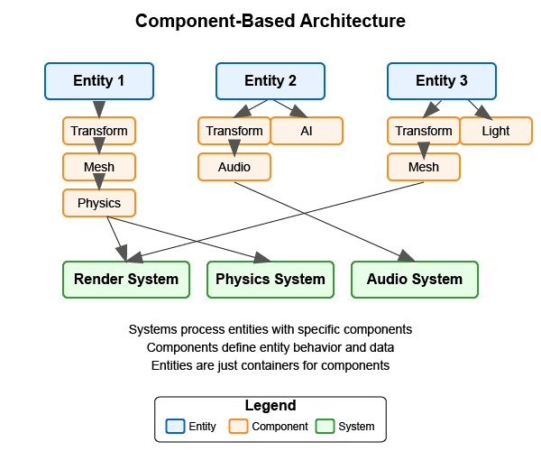

:pp: {plus}{plus}

= Engine Architecture: Architectural Patterns

== Architectural Patterns

In this section, we'll provide a quick overview of common architectural patterns used in modern rendering and game engines, with a focus on Component-Based Architecture which forms the foundation of our Vulkan rendering engine.

Before diving into specific patterns, it's important to clarify that while we're building a Vulkan-based rendering engine in this tutorial, many of the architectural patterns we'll discuss are commonly used in both rendering engines and full game engines. A rendering engine focuses primarily on graphics rendering capabilities, while a full game engine typically includes additional systems like physics, audio, AI, and gameplay logic.

=== Overview of Common Architectural Patterns

Here's a brief introduction to the most common architectural patterns used in game and rendering engines:

==== link:https://games-1312234642.cos.ap-guangzhou.myqcloud.com/course/GAMES104/GAMES104_Lecture02.pdf[Layered Architecture]

Layered architecture divides the system into distinct layers, each with a specific responsibility. Typical layers include platform abstraction, resource management, rendering, scene management, and application layers.

*Key Benefits:*
* Clear separation of concerns
* Easier to understand and maintain
* Can replace or modify individual layers without affecting others

For detailed information and implementation examples, see the xref:../Appendix/appendix.adoc#layered-architecture[Appendix: Layered Architecture].

==== link:https://www.youtube.com/watch?v=rX0ItVEVjHc[Data-Oriented Design]

Data-Oriented Design (DOD) focuses on organizing data for efficient processing rather than organizing code around objects. It emphasizes cache-friendly memory layouts and bulk processing of data.

*Key Benefits:*
* Better cache utilization
* More efficient memory usage
* Easier to parallelize

For detailed information and implementation examples, see the xref:../Appendix/appendix.adoc#data-oriented-design[Appendix: Data-Oriented Design].

==== link:https://gameprogrammingpatterns.com/service-locator.html[Service Locator Pattern]

The Service Locator pattern provides a global point of access to services without coupling consumers to concrete implementations.

*Key Benefits:*
* Decouples service consumers from service providers
* Allows for easy service replacement
* Facilitates testing with mock services

For detailed information and implementation examples, see the xref:../Appendix/appendix.adoc#service-locator-pattern[Appendix: Service Locator Pattern].

=== link:https://gameprogrammingpatterns.com/component.html[Component-Based Architecture]

Component-based architecture is widely used in modern game engines and forms the foundation of our Vulkan rendering engine. It promotes composition over inheritance and allows for more flexible entity design.

[NOTE]
====
*Diagram Legend:*

* *Boxes*: Blue boxes represent Entities, orange boxes represent Components, and green boxes represent Systems
* *Line Types*:
** Dashed lines show ownership/containment (Entities contain Components)
** Solid lines show processing relationships (Systems process specific Components)
* *Text*: All text elements use dark colors for visibility in both light and dark modes
* *Directional Flow*: Arrows indicate the direction of relationships between elements
====

==== Key Concepts

1. *Entities* - Basic containers that represent objects in the game world.
2. *Components* - Modular pieces of functionality that can be attached to entities.
3. *Systems* - Process entities with specific components to implement game logic.

==== Benefits of Component-Based Architecture

* Highly modular and flexible
* Avoids deep inheritance hierarchies
* Enables data-oriented design
* Facilitates parallel processing

==== Implementation Example

[source,cpp]
----
// Component base class
class Component {
public:
    virtual ~Component() = default;
    virtual void Update(float deltaTime) {}
};

// Specific component types
class TransformComponent : public Component {
private:
    glm::vec3 position;
    glm::quat rotation;
    glm::vec3 scale;

public:
    // Methods to manipulate transform
};

class MeshComponent : public Component {
private:
    Mesh* mesh;
    Material* material;

public:
    // Methods to render the mesh
};

// Entity class
class Entity {
private:
    std::vector<std::unique_ptr<Component>> components;

public:
    template<typename T, typename... Args>
    T* AddComponent(Args&&... args) {
        static_assert(std::is_base_of<Component, T>::value, "T must derive from Component");
        auto component = std::make_unique<T>(std::forward<Args>(args)...);
        T* componentPtr = component.get();
        components.push_back(std::move(component));
        return componentPtr;
    }

    template<typename T>
    T* GetComponent() {
        for (auto& component : components) {
            if (T* result = dynamic_cast<T*>(component.get())) {
                return result;
            }
        }
        return nullptr;
    }

    void Update(float deltaTime) {
        for (auto& component : components) {
            component->Update(deltaTime);
        }
    }
};
----

=== Why We're Focusing on Component Systems

For our Vulkan rendering engine, we've chosen to focus on component-based architecture for several key reasons:

1. *Flexibility for Graphics Features*: Component systems allow us to easily add, remove, or swap rendering features (like different shading models, post-processing effects, or lighting techniques) without major refactoring.

2. *Separation of Rendering Concerns*: Components naturally separate different aspects of rendering (geometry, materials, lighting, cameras) into manageable, reusable pieces.

3. *Industry Standard*: Most modern rendering engines and graphics frameworks use component-based approaches because they provide the right balance of flexibility, maintainability, and performance.

4. *Extensibility*: As graphics technology evolves rapidly, component systems make it easier to incorporate new Vulkan features or rendering techniques.

5. *Compatibility with Data-Oriented Optimizations*: While we're using a component-based approach, we can still apply data-oriented design principles within our components for performance-critical rendering paths.

While other architectural patterns have their merits, component-based architecture provides the best foundation for a modern, flexible rendering engine. That said, we'll incorporate aspects of other patterns where appropriate - using layered architecture for our overall engine structure, data-oriented design for performance-critical systems, and service locators for cross-cutting concerns.

=== Conclusion

We've provided a brief overview of common architectural patterns, with a focus on Component-Based Architecture which we'll use throughout this tutorial. For more detailed information about other architectural patterns, including implementation examples and comparative analysis, see the xref:../Appendix/appendix.adoc[Appendix: Detailed Architectural Patterns].

In the next section, we'll dive deeper into component systems and how to implement them effectively in your engine.

xref:01_introduction.adoc[Previous: Introduction] | xref:03_component_systems.adoc[Next: Component Systems]
