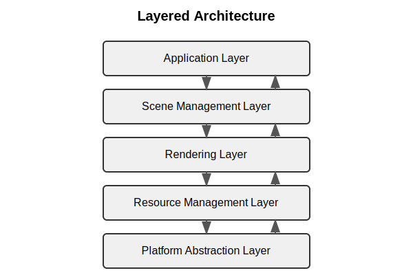
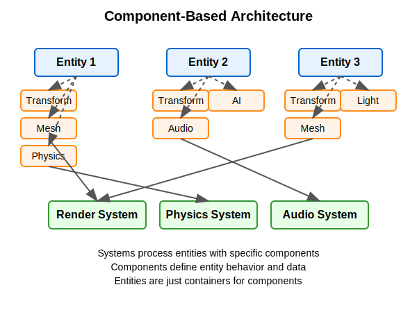

:pp: {plus}{plus}

= Engine Architecture: Architectural Patterns
:doctype: book
:sectnums:
:sectnumlevels: 4
:toc: left
:icons: font
:source-highlighter: highlightjs
:source-language: c++

== Architectural Patterns

In this section, we'll explore and compare common architectural patterns used in modern rendering and game engines. Understanding these patterns, their strengths, weaknesses, and appropriate use cases will help you make informed decisions when designing your own engine architecture.

Before diving into specific patterns, it's important to clarify that while we're building a Vulkan-based rendering engine in this tutorial, many of the architectural patterns we'll discuss are commonly used in both rendering engines and full game engines. A rendering engine focuses primarily on graphics rendering capabilities, while a full game engine typically includes additional systems like physics, audio, AI, and gameplay logic.

=== Layered Architecture

One of the most fundamental architectural patterns is the layered architecture, where the system is divided into distinct layers, each with a specific responsibility.

==== Typical Layers in a Rendering Engine

1. *Platform Abstraction Layer* - Provides a consistent interface to platform-specific functionality.
2. *Resource Management Layer* - Manages loading, caching, and unloading of assets.
3. *Rendering Layer* - Handles the rendering pipeline, shaders, and graphics API interaction.
4. *Scene Management Layer* - Manages the scene graph, spatial partitioning, and culling.
5. *Application Layer* - Handles user input, game logic, and high-level application flow.

==== Benefits of Layered Architecture

* Clear separation of concerns
* Easier to understand and maintain
* Can replace or modify individual layers without affecting others
* Facilitates testing of individual layers

==== Implementation Example

[source,cpp]
----
// Platform Abstraction Layer
class Platform {
public:
    virtual void Initialize() = 0;
    virtual void* CreateWindow(int width, int height) = 0;
    virtual void ProcessEvents() = 0;
    // ...
};

// Resource Management Layer
class ResourceManager {
public:
    virtual Texture* LoadTexture(const std::string& path) = 0;
    virtual Mesh* LoadMesh(const std::string& path) = 0;
    // ...
};

// Rendering Layer
class Renderer {
public:
    virtual void Initialize(Platform* platform) = 0;
    virtual void RenderScene(Scene* scene) = 0;
    // ...
};

// Scene Management Layer
class SceneManager {
public:
    virtual void AddEntity(Entity* entity) = 0;
    virtual void UpdateScene(float deltaTime) = 0;
    // ...
};

// Application Layer
class Application {
private:
    Platform* platform;
    ResourceManager* resourceManager;
    Renderer* renderer;
    SceneManager* sceneManager;

public:
    void Run() {
        platform->Initialize();
        renderer->Initialize(platform);

        // Main loop
        while (running) {
            platform->ProcessEvents();
            sceneManager->UpdateScene(deltaTime);
            renderer->RenderScene(sceneManager->GetActiveScene());
        }
    }
};
----

=== Data-Oriented Design

Data-Oriented Design (DOD) focuses on organizing data for efficient processing, rather than organizing code around objects.

image::../../../images/data_oriented_design_diagram.svg[Data-Oriented Design Diagram, width=600]

==== Key Concepts

1. *Data Layout* - Organizing data for cache-friendly access patterns.
2. *Systems* - Process data in bulk, often using SIMD instructions.
3. *Entity-Component-System (ECS)* - A common implementation of DOD principles.

==== Benefits of Data-Oriented Design

* Better cache utilization
* More efficient memory usage
* Easier to parallelize
* Can lead to significant performance improvements

==== Implementation Example

[source,cpp]
----
// A simple ECS implementation
struct TransformData {
    std::vector<glm::vec3> positions;
    std::vector<glm::quat> rotations;
    std::vector<glm::vec3> scales;
};

struct RenderData {
    std::vector<Mesh*> meshes;
    std::vector<Material*> materials;
};

class TransformSystem {
private:
    TransformData& transformData;

public:
    TransformSystem(TransformData& data) : transformData(data) {}

    void Update(float deltaTime) {
        // Process all transforms in bulk
        for (size_t i = 0; i < transformData.positions.size(); ++i) {
            // Update transforms
        }
    }
};

class RenderSystem {
private:
    RenderData& renderData;
    TransformData& transformData;

public:
    RenderSystem(RenderData& rData, TransformData& tData)
        : renderData(rData), transformData(tData) {}

    void Render() {
        // Render all entities in bulk
        for (size_t i = 0; i < renderData.meshes.size(); ++i) {
            // Render mesh with transform
        }
    }
};
----

=== Service Locator Pattern

The Service Locator pattern provides a global point of access to services without coupling consumers to concrete implementations.

image::../../../images/service_locator_pattern_diagram.svg[Service Locator Pattern Diagram, width=600]

==== Key Concepts

1. *Service Interface* - Defines the contract for a service.
2. *Service Provider* - Implements the service interface.
3. *Service Locator* - Provides access to services.

==== Benefits of Service Locator Pattern

* Decouples service consumers from service providers
* Allows for easy service replacement
* Facilitates testing with mock services

==== Implementation Example

[source,cpp]
----
// Audio service interface
class IAudioService {
public:
    virtual ~IAudioService() = default;
    virtual void PlaySound(const std::string& soundName) = 0;
    virtual void StopSound(const std::string& soundName) = 0;
};

// Concrete audio service
class OpenALAudioService : public IAudioService {
public:
    void PlaySound(const std::string& soundName) override {
        // Implementation using OpenAL
    }

    void StopSound(const std::string& soundName) override {
        // Implementation using OpenAL
    }
};

// Service locator
class ServiceLocator {
private:
    static IAudioService* audioService;
    static IAudioService nullAudioService; // Default null service

public:
    static void Initialize() {
        audioService = &nullAudioService;
    }

    static IAudioService& GetAudioService() {
        return *audioService;
    }

    static void ProvideAudioService(IAudioService* service) {
        if (service == nullptr) {
            audioService = &nullAudioService;
        } else {
            audioService = service;
        }
    }
};

// Usage example
void PlayGameSound() {
    ServiceLocator::GetAudioService().PlaySound("explosion");
}
----

=== Component-Based Architecture

Component-based architecture is widely used in modern game engines. It promotes composition over inheritance and allows for more flexible entity design.

==== Key Concepts

1. *Entities* - Basic containers that represent objects in the game world.
2. *Components* - Modular pieces of functionality that can be attached to entities.
3. *Systems* - Process entities with specific components to implement game logic.

==== Benefits of Component-Based Architecture

* Highly modular and flexible
* Avoids deep inheritance hierarchies
* Enables data-oriented design
* Facilitates parallel processing

==== Implementation Example

[source,cpp]
----
// Component base class
class Component {
public:
    virtual ~Component() = default;
    virtual void Update(float deltaTime) {}
};

// Specific component types
class TransformComponent : public Component {
private:
    glm::vec3 position;
    glm::quat rotation;
    glm::vec3 scale;

public:
    // Methods to manipulate transform
};

class MeshComponent : public Component {
private:
    Mesh* mesh;
    Material* material;

public:
    // Methods to render the mesh
};

// Entity class
class Entity {
private:
    std::vector<std::unique_ptr<Component>> components;

public:
    template<typename T, typename... Args>
    T* AddComponent(Args&&... args) {
        static_assert(std::is_base_of<Component, T>::value, "T must derive from Component");
        auto component = std::make_unique<T>(std::forward<Args>(args)...);
        T* componentPtr = component.get();
        components.push_back(std::move(component));
        return componentPtr;
    }

    template<typename T>
    T* GetComponent() {
        for (auto& component : components) {
            if (T* result = dynamic_cast<T*>(component.get())) {
                return result;
            }
        }
        return nullptr;
    }

    void Update(float deltaTime) {
        for (auto& component : components) {
            component->Update(deltaTime);
        }
    }
};
----

=== Comparative Analysis of Architectural Patterns

Now that we've explored several architectural patterns, let's compare them directly to understand their relative strengths and weaknesses:

|===
| Pattern | Strengths | Weaknesses | Best Used For

| Layered Architecture
| * Clear separation of concerns
  * Easy to understand
  * Good for beginners
| * Can lead to "layer bloat"
  * May introduce unnecessary indirection
  * Potential performance overhead from layer traversal
| * Smaller engines
  * Educational projects
  * When clarity is more important than performance

| Component-Based Architecture
| * Highly flexible and modular
  * Promotes code reuse
  * Avoids deep inheritance hierarchies
  * Easier to extend with new features
| * More complex to implement initially
  * Can be harder to debug
  * Potential performance overhead from component lookups
| * Modern rendering engines
  * Systems with diverse object types
  * Projects requiring frequent extension

| Data-Oriented Design
| * Excellent performance
  * Cache-friendly memory access
  * Good for parallel processing
| * Less intuitive than OOP
  * Steeper learning curve
  * Can make code harder to read
| * Performance-critical systems
  * Mobile platforms
  * Systems processing large amounts of similar data

| Service Locator Pattern
| * Decouples service providers from consumers
  * Facilitates testing
  * Allows runtime service swapping
| * Can hide dependencies
  * Potential for runtime errors
  * Global state concerns
| * Cross-cutting concerns
  * Systems requiring runtime configuration
  * When loose coupling is critical
|===

=== Why We're Focusing on Component Systems

For our Vulkan rendering engine, we've chosen to focus on component-based architecture for several key reasons:

1. *Flexibility for Graphics Features*: Component systems allow us to easily add, remove, or swap rendering features (like different shading models, post-processing effects, or lighting techniques) without major refactoring.

2. *Separation of Rendering Concerns*: Components naturally separate different aspects of rendering (geometry, materials, lighting, cameras) into manageable, reusable pieces.

3. *Industry Standard*: Most modern rendering engines and graphics frameworks use component-based approaches because they provide the right balance of flexibility, maintainability, and performance.

4. *Extensibility*: As graphics technology evolves rapidly, component systems make it easier to incorporate new Vulkan features or rendering techniques.

5. *Compatibility with Data-Oriented Optimizations*: While we're using a component-based approach, we can still apply data-oriented design principles within our components for performance-critical rendering paths.

While other architectural patterns have their merits, component-based architecture provides the best foundation for a modern, flexible rendering engine. That said, we'll incorporate aspects of other patterns where appropriate - using layered architecture for our overall engine structure, data-oriented design for performance-critical systems, and service locators for cross-cutting concerns.

=== Conclusion

These architectural patterns provide a foundation for designing your rendering engine. In practice, most engines use a combination of these patterns to address different aspects of the system.

When designing your engine architecture, consider:

1. *Performance Requirements* - Different patterns have different performance characteristics.
2. *Flexibility Needs* - How much flexibility do you need for future extensions?
3. *Team Size and Experience* - More complex architectures may be harder to work with for smaller teams.
4. *Project Scope* - A small project may not need the complexity of a full ECS.

In the next section, we'll dive deeper into component systems and how to implement them effectively in your engine.

link:01_introduction.adoc[Previous: Introduction] | link:03_component_systems.adoc[Next: Component Systems]
