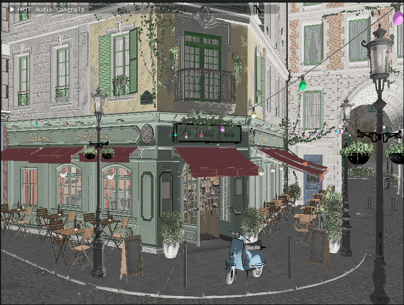

= Introduction to Lighting & Materials

In this chapter, we'll explore the fundamentals of lighting and materials in 3D rendering, with a focus on Physically Based Rendering (PBR). Lighting is a crucial aspect of creating realistic and visually appealing 3D scenes. Without proper lighting, even the most detailed models can appear flat and lifeless.

[NOTE]
====
*About PBR References*: Throughout this tutorial, you may encounter references to PBR (Physically Based Rendering) before reaching this chapter. PBR is a modern rendering approach that simulates how light interacts with surfaces based on physical principles. We'll cover PBR in detail in the sections that follow, so don't worry if you're not familiar with these concepts yet.
====

This chapter serves as the foundation for understanding how light interacts with different materials in a physically accurate way. The concepts you'll learn here will be applied in later chapters, including the Loading_Models chapter where we'll use this knowledge to render glTF models with PBR materials.

Throughout our engine implementation, we'll be using vk::raii dynamic rendering and C++20 modules. The vk::raii namespace provides Resource Acquisition Is Initialization (RAII) wrappers for Vulkan objects, which helps with resource management and makes the code cleaner. Dynamic rendering simplifies the rendering process by eliminating the need for explicit render passes and framebuffers. C++20 modules improve code organization, compilation times, and encapsulation compared to traditional header files.

== Why Lighting Matters

Lighting in computer graphics serves several important purposes:

1. *Visual Realism*: Proper lighting creates shadows, highlights, and gradients that make 3D objects appear more realistic.
2. *Spatial Understanding*: Lighting helps viewers understand the spatial relationships between objects in a scene.
3. *Mood and Atmosphere*: Different lighting setups can dramatically change the mood and atmosphere of a scene.
4. *Focus and Attention*: Lighting can be used to draw attention to important elements in a scene.

== Physically Based Rendering (PBR)

=== Introduction to PBR

Physically Based Rendering (PBR) represents one of the most significant advancements in real-time graphics over the past decade. Unlike traditional rendering approaches that used ad-hoc shading models, PBR aims to simulate how light interacts with surfaces in the real world based on the principles of physics.

=== The Evolution of Real-Time Rendering

To appreciate PBR, it helps to understand how real-time rendering has evolved:

1. *Fixed-Function Pipeline (1990s)*: Early 3D hardware used fixed lighting models like Gouraud or Phong shading with limited material properties.

2. *Programmable Shaders (2000s)*: With the introduction of shader programming, developers could implement custom lighting models, but these were often inconsistent across different lighting conditions.

3. *Physically Based Rendering (2010s)*: By basing rendering on physical principles, PBR provides more realistic results that remain consistent across different environments.

The key advantages of PBR include:

* *Realism*: Materials look correct under any lighting condition
* *Consistency*: Artists can create materials that work in all environments
* *Intuitiveness*: Material parameters have physical meaning, making them easier to understand
* *Efficiency*: Modern PBR implementations are optimized for real-time performance

=== Core Principles of PBR

PBR is built on several key principles that distinguish it from earlier rendering approaches:

==== Energy Conservation

In the real world, a surface cannot reflect more light than it receives. This principle of energy conservation is fundamental to PBR:

* The sum of diffuse and specular reflection must not exceed 1.0
* As surfaces become more metallic, they have less diffuse reflection
* As surfaces become rougher, specular highlights become larger but less intense

==== Microfacet Theory

PBR uses microfacet theory to model surface roughness. This theory assumes that surfaces are composed of tiny, perfectly reflective microfacets with varying orientations:

* Smooth surfaces have microfacets that are mostly aligned, creating sharp reflections
* Rough surfaces have randomly oriented microfacets, scattering light and creating blurry reflections
* The distribution of these microfacets is controlled by the roughness parameter

==== Fresnel Effect

The Fresnel effect describes how reflectivity changes with viewing angle:

* All surfaces become more reflective at grazing angles (angles where the viewing direction is nearly parallel to the surface)
* This effect is more noticeable on smooth surfaces
* The base reflectivity at normal incidence (F0, when light hits the surface perpendicularly), is determined by the material's index of refraction
* For metals, F0 is colored (based on the metal's properties)
* For non-metals (dielectrics), F0 is typically around 0.04 (4%)

==== Metallic-Roughness Workflow

The PBR implementation in glTF and many modern engines uses the metallic-roughness workflow, which defines materials using these primary parameters:

* *Base Color*: The albedo or diffuse color of the surface
* *Metallic*: How "metal-like" the surface is (0.0 = non-metal, 1.0 = metal)
* *Roughness*: How smooth or rough the surface is (0.0 = mirror-like, 1.0 = rough)

This workflow is intuitive for artists and efficient for real-time rendering.

=== The BRDF in PBR

The Bidirectional Reflectance Distribution Function (BRDF) is at the heart of PBR. It describes how light is reflected from a surface, taking into account:

* The incoming light direction
* The outgoing view direction
* The surface normal
* The material properties

In PBR, the BRDF is typically split into two components:

* *Diffuse BRDF*: Handles light that penetrates the surface, scatters, and exits
* *Specular BRDF*: Handles light that reflects directly from the surface

==== Diffuse BRDF

The simplest diffuse BRDF is the Lambertian model:

[source]
----
f_diffuse = albedo / π
----

Where:
* albedo is the base color of the surface
* π is a normalization factor

More advanced models like Disney's diffuse or Oren-Nayar can be used for increased realism, especially for rough surfaces.

==== Specular BRDF

For the specular component, PBR typically uses a microfacet BRDF:

[source]
----
f_specular = D * F * G / (4 * (n·ωo) * (n·ωi))
----

Where:
* D is the Normal Distribution Function (NDF)
* F is the Fresnel term
* G is the Geometry term
* n is the surface normal
* ωo is the outgoing (view) direction
* ωi is the incoming (light) direction

Popular implementations include:
* *D*: GGX (Trowbridge-Reitz) distribution
* *F*: Schlick's approximation
* *G*: Smith shadowing-masking function

== Materials in Computer Graphics

Materials define how surfaces interact with light. Different materials reflect, absorb, and transmit light in different ways. Understanding materials is crucial for creating realistic renderings.

=== Material Properties

In computer graphics, materials are defined by various properties:

* *Base Color/Albedo*: The color of the surface under diffuse lighting
* *Metalness*: How metallic the surface is (affects specular reflection and diffuse absorption)
* *Roughness/Smoothness*: How rough or smooth the surface is (affects specular highlight size and sharpness)
* *Normal Map*: Adds surface detail without increasing geometric complexity
* *Ambient Occlusion*: Approximates how much ambient light a surface point receives
* *Emissive*: Makes parts of the surface emit light
* *Opacity/Transparency*: Controls how transparent the material is
* *Refraction*: Controls how light bends when passing through the material

=== Common Material Types

Different types of materials have different characteristics:

* *Metals*: High specular reflection, colored specular, no diffuse reflection
* *Dielectrics (Non-metals)*: Lower specular reflection, white specular, strong diffuse reflection
* *Translucent Materials*: Allow light to pass through and scatter within (e.g., skin, wax, marble)
* *Transparent Materials*: Allow light to pass through with minimal scattering (e.g., glass, water)
* *Anisotropic Materials*: Reflect light differently based on direction (e.g., brushed metal, hair)

=== Push Constants for Material Properties

In our implementation, we'll use push constants to efficiently pass material properties to our shaders.

Push constants are a way to send a small amount of data to shaders without having to create and manage descriptor sets. They're perfect for frequently changing data like material properties.

== What You'll Learn

By the end of this chapter, you'll understand:

1. How Physically Based Rendering works
2. How to implement PBR in Slang shaders
3. How to use push constants for material properties
4. How to integrate PBR lighting with Vulkan

Let's get started by exploring the principles of Physically Based Rendering in more detail.

link:../Camera_Transformations/06_conclusion.adoc[Previous: Camera Transformations - Conclusion] | link:02_lighting_models.adoc[Next: Lighting Models]
