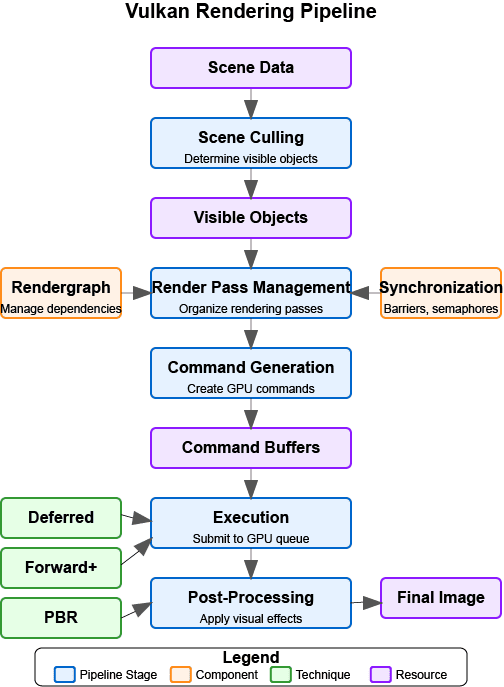

= Vulkan Integration

In this section, we'll integrate our PBR implementation with the rest of the Vulkan rendering pipeline. We'll update our renderer class to support advanced lighting techniques that can be used with glTF models and their PBR materials. The techniques we develop here will be applied in the Loading_Models chapter when we load and render glTF models.

To keep the flow concrete and avoid repeating earlier theory, use this quick roadmap:

1) Extend the renderer with PBR pipeline objects and a material push-constant block
2) Create the PBR pipeline (layout, shaders, blending, formats) alongside the main pipeline
3) Record draws: bind PBR pipeline, bind geometry, and push per-material constants per mesh
4) Clean up via RAII (no special teardown required)

[NOTE]
====
We won’t re-explain PBR theory or push-constant fundamentals here. See Lighting_Materials/03_push_constants.adoc for push constants and Lighting_Materials/01_introduction.adoc (and 05_pbr_rendering.adoc) for PBR concepts.
====

The PBR pass slots into the graphics pipeline as shown below:

== Updating the Renderer Class

First, let's update our renderer class to include the new members we need for our PBR implementation:

[source,cpp]
----
class Renderer {
public:
    // ... existing members ...

    // PBR pipeline
    vk::raii::PipelineLayout pbrPipelineLayout;
    vk::raii::Pipeline pbrPipeline;

    // Push constant block for PBR material properties
    struct PushConstantBlock {
        glm::vec4 baseColorFactor;
        float metallicFactor;
        float roughnessFactor;
        int baseColorTextureSet;
        int physicalDescriptorTextureSet;
        int normalTextureSet;
        int occlusionTextureSet;
        int emissiveTextureSet;
        float alphaMask;
        float alphaMaskCutoff;
    };

    // ... existing methods ...

    // New methods
    bool createPBRPipeline();
    void pushMaterialProperties(vk::CommandBuffer commandBuffer, const Model* model, uint32_t materialIndex);
};
----

We've added members for the PBR pipeline and a struct for PBR material properties. We've also added methods for creating the PBR pipeline and pushing material properties to the shader.

== Updating the Initialization

Next, we need to update the initialization process to create our PBR pipeline:

[source,cpp]
----
bool Renderer::Initialize(const std::string& appName, bool enableValidationLayers) {
    // ... existing initialization code ...

    // Create graphics pipeline
    if (!createGraphicsPipeline()) {
        return false;
    }

    // Create PBR pipeline
    if (!createPBRPipeline()) {
        std::cerr << "Failed to create PBR pipeline" << std::endl;
        return false;
    }

    // ... rest of initialization code ...

    initialized = true;
    return true;
}
----

== Updating the Cleanup

We also need to update the cleanup process to destroy our PBR pipeline:

[source,cpp]
----
void Renderer::Cleanup() {
    // ... existing cleanup code ...

    // With vk::raii, pipeline and pipeline layout objects are automatically destroyed
    // when they go out of scope, so we don't need explicit destruction calls

    // ... rest of cleanup code ...
}
----

== Updating the Rendering Process

Finally, we need to update the rendering process to use our PBR pipeline and push material properties:

[source,cpp]
----
void Renderer::recordCommandBuffer(vk::CommandBuffer commandBuffer, uint32_t imageIndex) {
    // ... existing command buffer recording code ...

    // Bind the PBR pipeline
    commandBuffer.bindPipeline(vk::PipelineBindPoint::eGraphics, *pbrPipeline);

    // For each model in the scene
    for (const auto& model : models) {
        // Bind vertex and index buffers
        vk::Buffer vertexBuffers[] = {model->vertexBuffer};
        vk::DeviceSize offsets[] = {0};
        commandBuffer.bindVertexBuffers(0, 1, vertexBuffers, offsets);
        commandBuffer.bindIndexBuffer(model->indexBuffer, 0, vk::IndexType::eUint32);

        // For each mesh in the model
        for (const auto& mesh : model->meshes) {
            // Push material properties
            pushMaterialProperties(commandBuffer, model, mesh.materialIndex);

            // Bind descriptor sets
            commandBuffer.bindDescriptorSets(
                vk::PipelineBindPoint::eGraphics,
                *pbrPipelineLayout,
                0,
                1,
                &descriptorSets[imageIndex],
                0,
                nullptr
            );

            // Draw
            commandBuffer.drawIndexed(mesh.indexCount, 1, mesh.firstIndex, 0, 0);
        }
    }

    // ... rest of command buffer recording code ...
}
----

== PBR Shader Reference

This chapter reuses the exact PBR shader defined in the previous section to avoid duplication and drift. Please refer to link:04_lighting_implementation.adoc[Implementing the PBR Shader] for the full pbr.slang source and detailed explanations. Here we focus strictly on Vulkan integration: pipeline layout, descriptor bindings, push constants, and draw submission.

== Compiling the Shader

After creating the shader file, we need to compile it using slangc. This is typically done as part of the build process, but we can also do it manually:

[source,bash]
----
slangc shaders/pbr.slang -target spirv -profile spirv_1_4 -o shaders/pbr.spv
----

== Testing the Implementation with glTF Models

To test our implementation, we can use glTF models, which already have PBR materials defined that are compatible with our implementation. In the Loading_Models chapter, we'll learn how to load these models, but for now, let's assume we have a way to load them.

Here's an example of how to set up a test scene with glTF models:

[source,cpp]
----
void Renderer::renderTestScene() {
    // Set up camera
    glm::vec3 cameraPos = glm::vec3(0.0f, 0.0f, 3.0f);
    glm::vec3 cameraTarget = glm::vec3(0.0f, 0.0f, 0.0f);
    glm::vec3 cameraUp = glm::vec3(0.0f, 1.0f, 0.0f);

    // Set up lights
    // Light 1: White light from above
    glm::vec4 lightPos1 = glm::vec4(0.0f, 5.0f, 5.0f, 1.0f);
    glm::vec4 lightColor1 = glm::vec4(300.0f, 300.0f, 300.0f, 1.0f);

    // Light 2: Blue light from the left
    glm::vec4 lightPos2 = glm::vec4(-5.0f, 0.0f, 0.0f, 1.0f);
    glm::vec4 lightColor2 = glm::vec4(0.0f, 0.0f, 300.0f, 1.0f);

    // Load glTF models
    Model* damagedHelmet = modelLoader.loadModel("models/DamagedHelmet/DamagedHelmet.gltf");
    Model* flightHelmet = modelLoader.loadModel("models/FlightHelmet/FlightHelmet.gltf");

    // The models already have PBR materials defined in the glTF file
    // We can render them directly with our PBR pipeline

    // Render the models with different transformations
    renderModel(damagedHelmet, glm::vec3(-1.0f, 0.0f, 0.0f), glm::vec3(0.5f));
    renderModel(flightHelmet, glm::vec3(1.0f, 0.0f, 0.0f), glm::vec3(0.5f));

    // We can also experiment with modifying the material properties
    // For example, to make the damaged helmet more metallic:
    if (damagedHelmet->materials.size() > 0) {
        // Store the original value to restore later
        float originalMetallic = damagedHelmet->materials[0].metallicFactor;

        // Modify the material
        damagedHelmet->materials[0].metallicFactor = 1.0f;

        // Render with modified material
        renderModel(damagedHelmet, glm::vec3(-2.0f, 0.0f, 0.0f), glm::vec3(0.5f));

        // Restore original value
        damagedHelmet->materials[0].metallicFactor = originalMetallic;
    }
}
----

== Conclusion

In this section, we've integrated our PBR implementation with the rest of the Vulkan rendering pipeline. We've updated our renderer class to support advanced lighting techniques that can be used with glTF models and their PBR materials. We've created a PBR shader based on the concepts we've learned and shown how to test the implementation with glTF models.

This approach provides a solid foundation for rendering physically accurate materials, which we'll apply in the Loading_Models chapter when we load and render glTF models. It also gives us the flexibility to modify and extend the material properties as needed for our specific rendering requirements.

In the next section, we'll explore how to add high-quality shadows using Vulkan Ray Query.

link:04_lighting_implementation.adoc[Previous: Lighting Implementation] | link:07_shadows.adoc[Next: Shadows]
