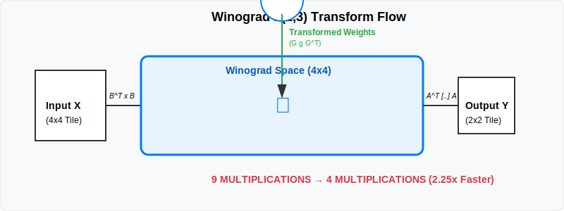

= Model Optimization Techniques: Beyond the Code
:pp: ++
:stem: latexmath

You’ve optimized your kernels, quantized to INT8, and managed your memory heaps. But your inference is still too slow. The problem isn't your implementation—it's the **Model itself**.

The models you download from the "Model Zoo" are trained for one thing: **Accuracy**. They are often full of redundant operations and architectural "dead weight" that doesn't contribute to the final prediction. In this chapter, we are going to learn how to "rewrite" the neural network using techniques like **Operator Fusion**, **Knowledge Distillation**, and the **Winograd Transform**.

== The Pragmatic Path: Library-Level Graph Optimization

If you are using ONNX Runtime, much of this "rewriting" happens automatically. However, as a professional, you must know how to control and verify these transformations.

=== 1. Graph Optimization Levels
ONNX Runtime has three levels of optimization:

*   **Basic**: Constant folding, redundant node removal.
*   **Extended**: Fusing simple sequences (e.g., `Conv + ReLU` -> `FusedConv`).
*   **All**: Complex vendor-specific fusions (e.g., fusing an entire Attention block for Transformers).

[source,cpp]
----
Ort::SessionOptions options;
// Level ORT_ENABLE_ALL is recommended for production.
options.SetGraphOptimizationLevel(GraphOptimizationLevel::ORT_ENABLE_ALL);

// You can also 'Export' the optimized model to see what it did!
options.SetOptimizedModelFilePath(L"models/optimized_model.onnx");
----

=== 2. The ONNX Simplifier
Sometimes the graph from PyTorch is so messy that ONNX Runtime's internal optimizer gets confused.

*   **The Tool**: `onnx-simplifier` (Python).
*   **The Command**: `python -m onnxsim model.onnx model_sim.onnx`
*   **Why?**: It pre-calculates every constant sub-expression in your model, often reducing the node count by 30-50%.

== Strategy 1: Operator Fusion (The Bandwidth Saver)

In high-performance ML, we treat the neural network as a **Computation Graph**. Every node is an operation (like Convolution) and every edge is a tensor. Optimization is the process of **Graph Rewriting**—mathematically proving that a sequence of five operations can be replaced by one single operation that produces the exact same result.

In a naive network, every layer is a separate Vulkan kernel. **Convolution latexmath:[\to] BatchNorm latexmath:[\to] ReLU**.
This forces the GPU to write the convolution output to VRAM, then read it back for BatchNorm, then write it again, then read it back for ReLU. Since we are usually memory-bandwidth bound, this is a disaster.

**The Solution**: Fuse them. We "fold" the parameters of BatchNorm and Bias into the weights of the convolution.

=== The Mathematics of Folding
Given a convolution result latexmath:[z = W \ast x + b], BatchNorm performs:
[latexmath]
++++
y = \gamma \left( \frac{z - \mu}{\sqrt{\sigma^2 + \epsilon}} \right) + \beta
++++

By substituting latexmath:[z], we can derive new "Fused" weights latexmath:[W_{fused}] and a fused bias latexmath:[b_{fused}]:
[latexmath]
++++
W_{fused} = W \cdot \frac{\gamma}{\sqrt{\sigma^2 + \epsilon}}
++++
[latexmath]
++++
b_{fused} = (b - \mu) \cdot \frac{\gamma}{\sqrt{\sigma^2 + \epsilon}} + \beta
++++

**The Result**: You move from three kernel launches and six VRAM accesses to **one kernel launch and two VRAM accesses**. This provides a latexmath:[3\times] speedup for "free" with zero loss in accuracy. This folding should be done once at "Export Time" so the shader only sees a standard convolution.

== Strategy 2: Structured Pruning (Trimming the Fat)

Pruning is the process of removing "unimportant" weights from the network to reduce its size and complexity. While **Unstructured Pruning** (random zeros) is popular in research, **Structured Pruning** is the only one that provides a speedup on general hardware.

Instead of individual weights, we remove **entire filters** (rows in a matrix) or **entire channels**.

=== Sensitivity Analysis: The "Hunt for Dead Weight"
How do you know which filters are "important"?

1.  **Calibration**: Run your model on a validation dataset.
2.  **Calculate Energy**: For every filter in a layer, calculate the sum of its absolute activations (latexmath:[L1] norm).
3.  **The "Tail" of the Distribution**: Plot the energy of all filters. Typically, you'll see a few "Superstars" that fire on every image, and a long "Tail" of filters that barely ever fire.
4.  **Prune**: Physically remove the bottom 20% of filters and their corresponding inputs in the next layer.

**The Payoff**: If you prune 50% of the filters in a layer, the matrix becomes half as wide and half as tall. It is genuinely smaller and runs latexmath:[2\times] faster on **any** hardware because you are doing half the math.

== Strategy 3: Knowledge Distillation (Teacher and Student)

Sometimes a model (like ResNet-152) is just too large to run in real-time, no matter how much you optimize. In this case, we use **Knowledge Distillation**.

1.  **The Teacher**: A massive, slow, highly accurate model (the "Gold Standard").
2.  **The Student**: A tiny, fast model (e.g., MobileNetV2).

During training, we don't just teach the student to predict the right label (Dog/Cat). We teach it to mimic the **Soft Probabilities** of the teacher. We use a **Temperature** parameter latexmath:[\tau] to "smooth" the probabilities so the student can see the "nuances" (e.g., why the teacher thought this dog looked 10% like a cat).

[latexmath]
++++
\mathcal{L}_{distill} = \tau^2 \cdot KL\left( \text{Softmax}\left(\frac{Z_{teacher}}{\tau}\right), \text{Softmax}\left(\frac{Z_{student}}{\tau}\right) \right)
++++

**The Result**: The student model achieves higher accuracy than if it were trained alone, because it is "inheriting" the deep feature representation of the teacher. It learns to find the same patterns but with 100x fewer parameters.

== Strategy 4: The Winograd Transform (The Algebra Trick)

For the most common convolution—the **3x3 kernel**—we can use the **Winograd latexmath:[F(2,3)] transform**. This is how high-end engines like NVIDIA cuDNN and ARM Compute Library achieve their record-breaking speeds.

.Winograd Transform Pipeline

*   **Traditional Conv**: Requires 9 multiplications per output pixel.
*   **Winograd Conv**: Transforms the input and weights into a "Winograd Space," performs an element-wise multiplication, and transforms back.

[latexmath]
++++
Y = A^T [ (GgG^T) \odot (B^T x B) ] A
++++

Where latexmath:[G], latexmath:[B], and latexmath:[A] are fixed transformation matrices. For latexmath:[F(2,3)], which produces a 2x2 output tile from a 4x4 input tile using a 3x3 filter, the transformation matrices are:

[latexmath]
++++
B^T = \begin{bmatrix} 1 & 0 & -1 & 0 \\ 0 & 1 & 1 & 0 \\ 0 & -1 & 1 & 0 \\ 0 & 1 & 0 & -1 \end{bmatrix} , \quad G = \begin{bmatrix} 1 & 0 & 0 \\ 1/2 & 1/2 & 1/2 \\ 1/2 & -1/2 & 1/2 \\ 0 & 0 & 1 \end{bmatrix} , \quad A^T = \begin{bmatrix} 1 & 1 & 1 & 0 \\ 0 & 1 & -1 & -1 \end{bmatrix}
++++

=== Why Winograd?
Winograd works by shifting the computational cost from **multiplications** (which are expensive and power-hungry) to **additions** (which are cheap). It reduces the number of multiplications from 9 to 4. This is a latexmath:[2.25\times] theoretical speedup.

=== Hands-on: The Winograd Transformation (C++)
To use Winograd in a shader, you must first transform your **Weights** offline. Unlike BatchNorm folding, which changes the values, Winograd weight transformation changes the **Dimensions**.

[source,cpp]
----
// Transforming a 3x3 filter 'g' into a 4x4 Winograd filter 'GgG^T'
void transformWeightToWinograd(const float* g, float* out4x4) {
    const float G[4][3] = {
        { 1.0f,  0.0f,  0.0f},
        { 0.5f,  0.5f,  0.5f},
        { 0.5f, -0.5f,  0.5f},
        { 0.0f,  0.0f,  1.0f}
    };
    // 1. Perform G * g
    // 2. Perform (G * g) * G^T
    // Result is a 4x4 matrix ready for Hadamard product in the shader.
}
----

== Strategy 5: Dynamic Shape Optimization

In many real-world apps, you don't know the input size. A user might upload a portrait or landscape photo. Standard engines often "Pad" every image to a large square (e.g. 1024x1024), which is incredibly wasteful.

*   **The Problem**: If you render a 224x224 image inside a 1024x1024 padded buffer, you are wasting latexmath:[20\times] the compute power on "Zero" pixels.
*   **The Solution**: **Bucketing**.
    1.  Define 3-4 standard aspect ratios (e.g. 1:1, 16:9, 9:16).
    2.  Pre-compile 3-4 separate Vulkan compute pipelines, each tuned for one of these buckets.
    3.  At runtime, pick the bucket that is the "Tightest Fit" for the user's image.

== Strategy 6: GAP + FC Fusion (Classifier Head)

In the final layers of a classifier, you have a **Global Average Pool (GAP)** followed by a **Fully Connected (FC)** layer.

*   **GAP**: Averages a latexmath:[7 \times 7 \times 1024] tensor into a latexmath:[1 \times 1 \times 1024] vector.
*   **FC**: Multiplies that vector by a latexmath:[1024 \times 1000] weight matrix.

Instead of two kernels, we can **Fuse** them. As the FC kernel threads load the weights, they also perform the averaging of the latexmath:[7 \times 7] spatial tile in **Shared Memory**. This eliminates the need to store the intermediate 1024-element vector in VRAM entirely.

== Summary: The Optimization Roadmap

Model optimization is about **rewriting the graph** to suit the silicon.

1.  **Pragmatic Path**: Use `onnx-simplifier` and set `ORT_ENABLE_ALL`.
2.  **Fuse**: Fold BatchNorm and Bias into your Convolutions at export time.
3.  **Prune**: Perform sensitivity analysis to remove filters that never fire.
4.  **Distill**: Use Distillation if your "Small" model isn't accurate enough.
5.  **Transform**: Implement Winograd for 3x3 kernels if you are compute-bound.

You have now mastered the Advanced Topics of ML Inference. You can quantize, tune for specific vendors, manage complex memory pools, and rewrite network architectures.

In our final section, we will take all these skills and apply them to the most challenging environment of all: **Embedded Applications**.

xref:04_memory_management.adoc[Previous: Advanced Memory Management] | xref:../Embedded_Applications/01_introduction.adoc[Next: Embedded Applications]
