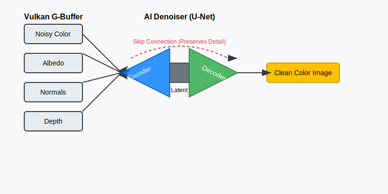
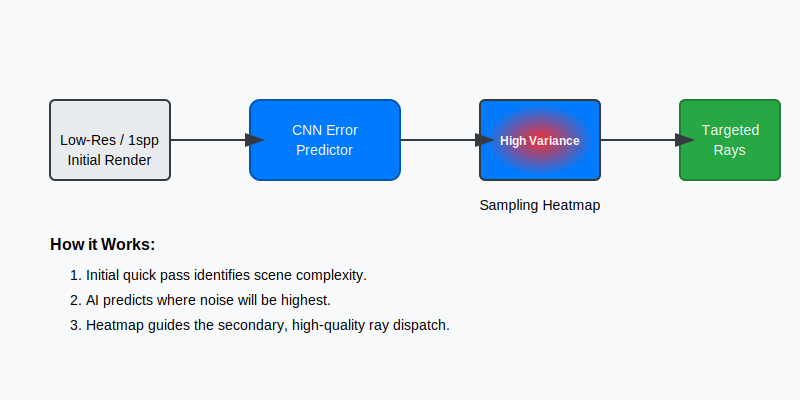

:pp: {plus}{plus}
:stem: latexmath

= Ray Tracing Optimization: Denoising and Adaptive Sampling

Ray tracing is the "holy grail" of graphics, but it's computationally expensive. Even with modern Vulkan Ray Tracing extensions (`VK_KHR_ray_tracing_pipeline`), rendering a scene with enough samples to be noise-free in real-time is often impossible on current hardware.

If you cast only 1 or 2 rays per pixel, your render will look like "salt and pepper" noise. To get a clean image, you might need 1000+ rays per pixel, which would take seconds or even minutes per frame. In this chapter, we're going to use ML to bridge that gap, taking a "noisy" 1-sample-per-pixel (1spp) render and using AI to turn it into a production-quality image.

This isn't just about "faking" it. We are using the laws of probability and neural networks to intelligently reconstruct the physics that our hardware doesn't have time to calculate. By the end of this chapter, you'll understand how to build a pipeline that makes a single ray work like a thousand.

== The Physics of Noise: Why Ray Tracing is Hard

To understand why we need AI, we first have to understand why Ray Tracing is so noisy.

In a traditional rasterizer, you draw a triangle, and you know exactly what color every pixel should be because the math is deterministic. You project the 3D coordinates to 2D screen space, interpolate the vertex attributes, and run a fragment shader. The result is "sharp" but often lacks the subtle interplay of light—reflections, soft shadows, and global illumination.

In Ray Tracing, we move from deterministic projection to **Monte Carlo integration**. We are trying to solve a complex integral called the **Rendering Equation**.

=== The Rendering Equation: A Quick Primer

The Rendering Equation is the mathematical heart of graphics. It states that the light leaving a point is the sum of the light it emits itself, plus all the light hitting that point from the surrounding environment that reflects toward your eye.

[latexmath]
++++
L_o(p, \omega_o) = L_e(p, \omega_o) + \int_{\Omega} f_r(p, \omega_i, \omega_o) L_i(p, \omega_i) (\omega_i \cdot n) d\omega_i
++++

Don't let the math scare you. Here's the human translation:

*   **latexmath:[L_o]**: The light leaving point latexmath:[p] toward your eye (latexmath:[\omega_o]).
*   **latexmath:[L_e]**: The light the surface emits (like a neon sign).
*   **The Integral (latexmath:[\int])**: This is the hard part. It says "look at every possible direction (latexmath:[\Omega]) that light could be coming from."
*   **latexmath:[f_r]**: The material's property (BRDF). Is it shiny? Is it matte?
*   **latexmath:[L_i]**: The light coming *in* from that direction.
*   **latexmath:[(\omega_i \cdot n)]**: A correction factor for the angle of the light.

In a perfect world, we would solve this integral by checking every single photon. In a computer, we use **Monte Carlo sampling**. We pick a few random directions, see what color they are, and average them.

=== The Disco Ball Problem: Visualizing Variance

Imagine you're trying to figure out the average color of a disco ball in a dark room with a single spotlight.

1. You shoot a single ray at the ball.
2. It hits a tiny mirror.
3. If that mirror happens to reflect the spotlight, the pixel is **pure white (10,000.0 brightness)**.
4. If it reflects a dark wall, the pixel is **pure black (0.0 brightness)**.

At 1 Sample Per Pixel (1spp), your image is a mess of black and white dots. This is called **Variance**. Mathematically, variance is the average of the squared differences from the mean. In graphics, it’s the "salt and pepper" noise that ruins your render.

In graphics, the noise you see is literally the mathematical "error" of your guess. As you increase the number of rays (samples), the noise decreases according to the **Law of Large Numbers**, but it happens slowly—the error decreases by the square root of the number of samples (latexmath:[1/\sqrt{N}]). To cut the noise in half, you need latexmath:[4\times] more rays. To cut it by latexmath:[10\times], you need latexmath:[100\times] more rays!

=== Why Traditional Filters Fail

Simple blurs (like Gaussian or Bilinear filters) try to fix this by averaging nearby pixels. But a blur is a "dumb" operator—it doesn't know the difference between "noise" and "a sharp edge."

If you have a sharp black-to-white edge (like a shadow) and you blur it, you get a grey smudge. You've removed the noise, but you've also destroyed the geometry of the scene.

We use AI to solve this because a Neural Network can be trained to recognize the *patterns* of noise and separate them from the *patterns* of geometry. It learns that a "dot" of bright light on a curved surface is likely a specular highlight, not a random artifact. It "sees" the context.

To solve this without waiting for 1,000 rays per frame, we use a three-stage AI pipeline:

1. **Denoising**: Reconstructing the missing detail from a noisy 1spp frame by learning from millions of high-quality examples.
2. **Adaptive Sampling**: Using a second, tiny AI to predict which pixels are "difficult" (high variance) and need more rays *before* we render them.
3. **Temporal Stability**: Blending multiple frames together over time using motion vectors and AI to eliminate "ghosting" artifacts.

== Technique 1: AI Denoising (The U-Net)

AI Denoising is a **reconstruction** task. We aren't just smoothing pixels; we are asking a neural network to look at a noisy patch and "hallucinate" the clean version based on millions of examples it has seen during training.

=== The Vocabulary: Tensors and Channels

Before we look at the architecture, we need to speak the same language. In machine learning, we don't just talk about "images"; we talk about **Tensors**.

A Tensor is just a multi-dimensional array. A standard color pixel in your Vulkan swapchain has three **Channels**: Red, Green, and Blue (RGB). You can think of these as three separate "sheets" of data stacked on top of each other.

In AI-enhanced graphics, we extend this concept. We can stack any data we want into these "sheets." If we add a sheet for **Depth** and three sheets for **Surface Normals** (X, Y, Z), we now have a 7-channel tensor. The AI treats these extra channels as "hints" or "auxiliary buffers." These buffers are noise-free because they come from the first hit of the ray (the G-Buffer), giving the AI a stable "skeleton" to rebuild the noisy lighting on top of.

=== The Architecture: How the U-Net Sees Detail

The industry standard for reconstruction is the **U-Net**. It was originally designed for medical imaging (finding tumors in noisy X-rays), but it turns out to be perfect for finding "clean pixels" in noisy renders.

The U-Net is designed specifically to handle the **Scale Problem** in images.

.AI Denoising Architecture (U-Net)

Let's break down the three parts of the "U" in detail:

==== 1. The Encoder: Compression and Context
The first half of the "U" is a series of downsampling steps. Each step consists of a **Double Convolution** followed by a **MaxPooling** layer.

===== The Mathematics of a 3x3 Convolution
What actually happens inside that `nn.Conv2d(3, 32, 3)` call?

Imagine a 3x3 grid of weights (the **Kernel**). As this kernel slides across your image, it performs a "Weighted Sum" of the pixels it currently covers.

[source,cpp]
----
// Conceptual Convolution in C++
float kernel[3][3] = {
    {-1, -1, -1},
    {-1,  8, -1},
    {-1, -1, -1}
}; // This is a simple edge-detection kernel

float output_pixel = 0;
for(int i = -1; i <= 1; i++) {
    for(int j = -1; j <= 1; j++) {
        output_pixel += input_image[y+i][x+j] * kernel[i+1][j+1];
    }
}
----

If the kernel covers a flat area (all pixels same color), the output is zero. If it covers an edge, the output is a high number. In a denoiser, the AI doesn't just have one kernel; it has **32 or 64 kernels** per layer. Some learn to find horizontal edges, some find "firefly" noise patterns, and some find texture gradients.

===== Why Double Convolutions?
We apply two 3x3 filters back-to-back. The first layer finds "primitive" features (edges). The second layer sees the output of the first and finds "complex" features (curves, corners, or noise clusters). This increases the **Effective Receptive Field** without requiring expensive large filters (like 7x7).

===== MaxPooling (2x2): The Scale Shift
After the convolutions, we reduce the resolution by half.

*   **The Mechanism**: We look at every 2x2 block of pixels and keep only the largest value.
*   **The Intuition**: A 3x3 convolution filter on a 1080p image only sees a tiny 3-pixel area. It has no context. It can't tell if a white pixel is a "firefly" (a bright noise artifact) or a small light bulb.
*   By shrinking the image to 1/2, 1/4, and 1/8 size, those same 3x3 filters suddenly see a much larger portion of the scene. At the lowest resolution, a 3x3 filter might be looking at what used to be a 64x64 area of the original image. This gives the AI **Global Context**—it can see that a cluster of noisy pixels is actually part of a large, smooth shadow cast by a building.

==== 2. The Bottleneck: The Latent Representation
At the bottom of the "U," the network has a very "low resolution" but "high semantic" understanding of the scene. It has squeezed the image through a "bottleneck," forcing it to keep only the most important information. At this stage, the AI doesn't see "pixels" anymore; it sees "features." It knows:

*   "There is a metallic sphere in the center."
*   "The primary light source is an area light on the ceiling."
*   "The background is a matte wall with soft indirect bounce light."

==== 3. The Decoder: Reconstruction and Refinement
The second half of the "U" upsamples the image back to its original 1080p size using **Transpose Convolutions**.

*   **Transpose Convolution**: This is the opposite of pooling. It takes a small image and "smears" it out into a larger one, using learned weights to decide how to fill in the new pixels.

==== 4. Skip Connections: Preserving Geometric Sharpness
This is the most critical part of the U-Net. As the Decoder grows the image, it "reaches across" the U and grabs the high-resolution features from the corresponding layer in the Encoder.

*   **The Problem**: When the image was shrunk in the Encoder, we lost the exact location of edges. We know there's a "sphere," but the precise, pixel-perfect outline was lost in the pooling layers.
*   **The Solution**: Skip connections act like "cheat sheets." They feed the sharp, geometric edges from the early layers (before they were shrunk) directly into the final reconstruction layers.
*   This allows the network to combine its **High-Level Understanding** (from the bottleneck) with **Pixel-Perfect Detail** (from the encoder). This is why U-Net denoisers are so good at keeping edges sharp while smoothing out the flat, noisy areas.

[source,python]
----
import torch
import torch.nn as nn

class DenoisingUNet(nn.Module):
    def __init__(self, in_channels=10):
        super().__init__()
        # Input: Noisy RGB (3) + Albedo (3) + Normals (3) + Depth (1) = 10 channels

        # Encoder Stage 1 (Full Res -> Half Res)
        # We start with 10 channels and expand to 32 internal 'feature' channels
        self.enc1 = self.double_conv(in_channels, 32)
        self.pool1 = nn.MaxPool2d(2)

        # Encoder Stage 2 (Half Res -> Quarter Res)
        self.enc2 = self.double_conv(32, 64)
        self.pool2 = nn.MaxPool2d(2)

        # Bottleneck (Quarter Res)
        # This is where the AI understands the 'meaning' of the noise
        self.bottleneck = self.double_conv(64, 128)

        # Decoder Stage 2 (Quarter -> Half)
        # We use a Transpose Convolution to upsample
        self.up2 = nn.ConvTranspose2d(128, 64, kernel_size=2, stride=2)
        # We concatenate the upsampled data (64) with the skip connection (64)
        self.dec2 = self.double_conv(128, 64)

        # Decoder Stage 1 (Half -> Full)
        self.up1 = nn.ConvTranspose2d(64, 32, kernel_size=2, stride=2)
        self.dec1 = self.double_conv(64, 32) # 32 (up) + 32 (skip)

        # Final Layer: Map the 32 feature channels back to 3-channel RGB
        self.final = nn.Conv2d(32, 3, kernel_size=1)

    def double_conv(self, in_c, out_c):
        """A helper that applies two convolutions back-to-back with ReLU"""
        return nn.Sequential(
            nn.Conv2d(in_c, out_c, 3, padding=1), nn.ReLU(),
            nn.Conv2d(out_c, out_c, 3, padding=1), nn.ReLU()
        )

    def forward(self, x):
        # Encoder Path
        # We save 's1' and 's2' to use as Skip Connections later
        s1 = self.enc1(x)
        p1 = self.pool1(s1)
        s2 = self.enc2(p1)
        p2 = self.pool2(s2)

        # Bottleneck
        b = self.bottleneck(p2)

        # Decoder Path with Skip Connections (torch.cat)
        d2 = self.up2(b)
        # Concatenate along the 'channel' dimension
        d2 = torch.cat([d2, s2], dim=1)
        d2 = self.dec2(d2)

        d1 = self.up1(d2)
        d1 = torch.cat([d1, s1], dim=1)
        d1 = self.dec1(d1)

        return self.final(d1)
----

=== Structural Anchors: The G-Buffer Advantage

A denoiser that only sees a noisy color image is working blind. It has to guess where an object ends and the background begins. In a Vulkan Ray Tracer, we don't have to guess. We have access to **G-Buffers** (Geometry Buffers).

G-Buffers are the data generated by the very first hit of the ray. Because they don't depend on light bouncing around the room, they are **mathematically perfect**—no noise, no variance.

*   **World Normals (3 Channels)**: These provide the exact orientation (XYZ) of every surface. If two neighboring pixels have drastically different normals, the AI knows there is a geometric edge (like a corner) there. It will refuse to "leak" color across that edge, preventing the "smudge" look of traditional blurs.
*   **Albedo / Base Color (3 Channels)**: This provides the raw texture of the object (e.g., the wood grain or the stone pattern) without any shadows or lighting. This allows the AI to distinguish between "noise" and "texture detail." If it sees a pattern in the albedo, it knows to preserve it.
*   **Depth (1 Channel)**: This provides the distance from the camera. It helps the AI separate overlapping objects and understand the scale of the scene.

By feeding these 10 channels (Noisy RGB + Albedo + Normals + Depth) into our U-Net, we give the AI a high-resolution "skeleton." Its job is no longer to "invent" an image, but to "paint" the light on top of a perfectly understood 3D model.

=== Data Layout: Why NCHW Matters for Vulkan

Wait, how do we "feed" 10 channels into a network that usually takes 3 (RGB)? This is where the **Input Tensor Layout** becomes a performance bottleneck.

Most graphics programmers are used to **Interleaved** data (RGBA, RGBA, RGBA). In ML, this is called **NHWC** layout.

*   **N**: Batch size
*   **H**: Height
*   **W**: Width
*   **C**: Channels (the RGB values are next to each other in memory)

However, GPUs are much faster at processing **Planar** data, called **NCHW**.

*   In NCHW, we store all Red values for the entire image first, then all Green values, then all Blue, then all Normals, etc.
*   **Why?** When a convolution filter runs, it wants to read many pixels from the same "channel" at once. If the data is planar, the GPU can "coalesce" these memory reads, fetching 32 or 64 pixels in a single memory cycle. If the data is interleaved, the GPU has to jump over the G and B values to get to the next R value, wasting bandwidth.

In your Vulkan preprocessing compute shader, you must transform your interleaved G-Buffers into a single planar NCHW buffer before sending it to ONNX Runtime.

=== Stability: The HDR Log-Scaling Problem

Vulkan Ray Tracers usually output in 16-bit or 32-bit floating point (HDR). A sun-lamp might have a brightness value of **50,000.0**, while a dark shadow is **0.0001**.

Neural networks hate this. Their mathematical foundations (like weight initializations and activation functions like ReLU) are tuned for values between 0.0 and 1.0. If you feed 50,000.0 into a network, it's like screaming in someone's ear—the gradients will "explode," the weights will become `NaN`, and the AI will never learn.

The solution is **Logarithmic Compression**. Before sending the image to the AI, we "squash" the range in our compute shader:

[source,glsl]
----
// Preprocessing Compute Shader
// Squash HDR range [0, infinity] to a manageable [0, ~12]
vec3 compressed = log(1.0 + noisyColor.rgb);
----

After the AI gives us the "clean" output, we expand it back to the original HDR range:

[source,glsl]
----
// Postprocessing Compute Shader
// Expand [0, ~12] back to [0, infinity]
vec3 cleanHDR = exp(aiOutput.rgb) - 1.0;
----

This ensures the AI only ever sees "manageable" numbers, leading to much more stable training and a dramatic reduction in "fireflies" (those single bright pixels that ruin many renders).

=== Training Strategy: How to "Teach" Denoising

To train this network, you need a "Reference Path Tracer." This is a version of your renderer that is allowed to be slow.

1.  **Scene Selection**: Take a complex scene in your Vulkan engine—something with many different materials (metals, glass, wood), complex lighting (point lights, area lights), and deep shadows.
2.  **Render Noisy (The Input)**: Render a frame at 1spp (1 sample per pixel). This will be the input to your AI. Save the RGB color and all the G-Buffers (Albedo, Normals, Depth).
3.  **Render Gold (The Truth)**: Stay on the same frame, but render at 4096spp. This might take several minutes per frame, but the result is a "ground truth" image—a noise-free reference of what the 1spp frame *should* have looked like.
4.  **Repeat**: Move the camera a tiny amount and repeat the process. To train a robust denoiser, you usually need at least 1,000 to 5,000 such pairs from varied scenes.

**The Loss Function**:
How do we tell the AI it did a good job? We compare its output to the "Gold Reference" using a **Loss Function**.

Don't just use **Mean Squared Error (MSE)**. MSE calculates the average of the squared difference between pixels. It’s mathematically simple, but it’s terrible for graphics. If the AI shifts a sharp edge by just one pixel, the MSE will be huge, even though it looks fine to a human. Worse, MSE tends to "average out" high frequencies, resulting in blurry, "plastic-looking" renders.

Instead, use a weighted combination:

*   **L1 Loss (Mean Absolute Error)**: For general color accuracy. It’s more robust than MSE and doesn't over-penalize small differences.
*   **SSIM (Structural Similarity Index)**: This is the most important component. SSIM looks at local patterns of contrast and structure. It forces the AI to preserve the sharp edges and fine textures that define high-quality graphics.
*   **LPIPS (Learned Perceptual Image Patch Similarity)**: As we learned in the CI validation chapter, LPIPS uses another neural network to judge if the images "look" similar to a human. This helps the AI capture the "feel" of the lighting correctly.

A common industry "recipe" for training denoisers is:
**Loss = 0.8 * SSIM + 0.2 * L1**

== Technique 2: AI-Guided Adaptive Sampling

In a naive renderer, every pixel gets the same number of rays. But in a real scene, light isn't distributed evenly. A flat white wall might be "solved" (noise-free) in just 1 or 2 samples. However, a complex glass chandelier with multiple reflections and refractions might still look like "salt and pepper" noise even at 100 samples.

**Adaptive Sampling** is the art of spending your computation budget only where the noise is "stubborn." Instead of casting 8 rays per pixel everywhere, we aim to cast 1 ray on the flat wall and 64 rays on the chandelier. This ensures that every part of the image reaches the same level of quality at the same time.

.Adaptive Sampling Workflow

=== The Theory of Variance: Where Does Noise Hide?

In Monte Carlo integration, **Variance** is a measure of how much our samples differ from each other. In graphics, high variance equals high noise.

*   **Low Variance**: If you shoot 10 rays at a pixel and they all return nearly the same brightness (e.g., they all hit a dimly lit wall), we are confident that the average is correct. The pixel is "solved."
*   **High Variance**: If 5 rays return "black" and 5 rays return "bright white" (e.g., the pixel is near a sharp shadow edge or a small light source), the average is 0.5—but that's just a guess. The 11th ray could change the average significantly. This pixel is "noisy" and needs more samples.

The problem? Calculating variance traditionally requires shooting multiple rays first (at least 4-8) just to see if we *need* more rays. This is a waste of time. AI allows us to **predict** the variance from a single 1spp probe by looking for visual patterns that always lead to noise.

=== The Error Predictor: A Tiny AI for Budgeting

To drive our adaptive sampler, we build a secondary, extremely lightweight CNN called the **Error Predictor**.

Unlike the Denoiser (which is a heavy U-Net that tries to fix the image), the Error Predictor is a "Specialist" designed for extreme speed. It usually consists of only 4 or 5 convolutional layers and no expensive decoder. Its only job is to look at a noisy 1spp frame and say, "That area looks like it's going to be difficult."

1.  **Input**: The initial 1spp noisy render.
2.  **Target during Training**: The absolute error between the 1spp frame and the 4096spp Gold Reference (`abs(1spp - Gold)`).
3.  **The Goal**: The AI learns that high-contrast shadow edges, specular highlights on metal, and refractive glass are "dangerous" areas that always result in high error. It also learns that smooth gradients on walls are "easy" and don't need many rays.

=== The Heatmap: Managing the Ray Budget

The output of this tiny AI is a **Heatmap**—a single-channel texture (think of it as a greyscale image) where 1.0 means "High Noise Expected" and 0.0 means "Low Noise Expected."

We use this Heatmap as a **Ray Budget Map**. This is where we bridge the gap between AI prediction and the Vulkan Ray Tracing hardware.

==== The Mathematical Scaling Function
We don't just use the Heatmap value directly as a ray count. We use a **Non-Linear Scaling Function**.

Why? Because the human eye is much more sensitive to noise in shadows than in bright areas. Also, we want to prevent "Ray Spikes"—where one pixel suddenly shoots 1000 rays and stalls the whole GPU.

[source,glsl]
----
// Inside the Ray Generation Shader
float heat = texture(heatmap, uv).r;

// We use a Power Function to create a steep ramp.
// Most pixels (heat < 0.2) stay at 1 ray.
// Difficult pixels (heat > 0.8) scale up rapidly.
float scaledHeat = pow(heat, 3.0);

int maxExtraRays = 31;
int extraRays = int(scaledHeat * float(maxExtraRays));
----

==== Vulkan Integration: The Multi-Pass Strategy

To implement this in Vulkan, you need to coordinate your command buffers across three distinct passes:

**Pass 1: The Probe Pass (1spp)**
We shoot exactly 1 ray per pixel using `vkCmdTraceRaysKHR`.
*   **Input**: Scene TLAS, Camera UBO.
*   **Output**: `probeColorImage` (1spp Noisy).

**Pass 2: AI Variance Prediction**
We run our Error Predictor ONNX model.
*   **Input**: `probeColorImage`.
*   **Output**: `heatmapImage`.
*   **Optimization**: Since the model is tiny, we can run this using **Compute-Queue Async** while the GPU is finishing other tasks.

**Pass 3: The Targeted Pass (Variable spp)**
We run a second Ray Generation shader that reads both the `probeColorImage` and the `heatmapImage`.

[source,glsl]
----
// Ray Generation Shader (Targeted Pass)
void main() {
    // 1. Fetch the 'Heat' value for this pixel
    float heat = texture(heatmap, uv).r;

    // 2. Decide the extra ray budget
    int extraRays = int(pow(heat, 2.0) * 31.0);

    // 3. Retrieve the color from our first (probe) pass
    vec3 accumulatedColor = texelFetch(probePassBuffer, ivec2(gl_LaunchIDEXT.xy), 0).rgb;

    // 4. Cast the additional rays only where needed
    for(int i = 0; i < extraRays; i++) {
        // We use the 'i' as an offset to our Blue Noise texture
        // to ensure we don't sample the same direction twice.
        uint seed = initRandom(gl_LaunchIDEXT.xy, frameCount, i);
        vec3 sample = traceIndirectRay(seed);
        accumulatedColor += sample;
    }

    // 5. Compute the final average (Total samples = 1 probe + extraRays)
    finalOutput = accumulatedColor / (1.0 + float(extraRays));
}
----

By spending 32 rays on the chandelier and 1 ray on the wall, we achieve the same visual quality as if we had spent 32 rays *everywhere*, but at a fraction of the cost. This technique typically provides a **3-5x speedup** in overall render time.

=== Advanced Adaptive Sampling: Probability and Blue Noise

To make adaptive sampling truly shine, you need to combine your AI's predictions with high-quality **Sampling Distributions**.

==== The Monte Carlo PDF
When the RayGen shader reads the Heatmap and sees a "Hot" pixel (Heat = 1.0), it doesn't just shoot 32 rays in random directions. It uses a **Probability Density Function (PDF)** to bias the rays toward the light sources. The AI heatmap essentially acts as a "Secondary PDF" that tells the hardware where the most complex interactions are happening.

==== Blue Noise vs. White Noise
If you use standard random numbers (`rand()`) for your ray directions, you will get "clumping"—where many rays go in the same direction, leaving other areas dark. This creates "dirty" noise.

*   **Blue Noise**: This is a specialized type of noise where the samples are distributed as evenly as possible.
*   **The AI Connection**: AI denoisers are much better at cleaning up "Blue Noise" than "White Noise" because blue noise has a very specific mathematical frequency that the U-Net can easily identify and subtract.

**Implementation Tip**: Load a 64x64 Blue Noise texture into your Vulkan Ray Tracing pipeline. Use the pixel coordinate and the current sample index to offset into this texture. This ensures that even with a low ray budget (like the 1-32 rays we discussed), your samples cover the hemisphere as efficiently as possible.

== Technique 3: Temporal Stability (The Anti-Ghosting AI)

Even with AI-guided sampling, a single frame might still have some noise. To reach "cinema-quality" smoothness, we need to use information from **previous frames**. If the camera isn't moving, we can simply average the last 60 frames together to get a perfect, 1000-ray result.

However, in a game, things move. The camera rotates, characters run, and lights flicker. If we naively average frames, we get **Ghosting**—a blurry trail of "old" colors following moving objects.

To solve this, we use a technique called **Temporal Reprojection** combined with an **AI Confidence Model**.

=== Reprojection Math: Looking into the Past

To use the previous frame, we have to know where the current pixel *was* in the last frame. This is a coordinate transformation problem.

==== The Mathematical Journey of a Pixel
Think about what happens to a point in your 3D world as it moves through your Vulkan pipeline:
1.  **World Space**: The point has coordinates like `(10.0, 5.0, -2.0)`.
2.  **View Space**: We multiply by the **View Matrix** (the camera's position/rotation).
3.  **Clip Space**: We multiply by the **Projection Matrix** (the lens properties).
4.  **Screen Space**: We divide by latexmath:[W] and map to your monitor's pixel grid (e.g., 1920x1080).

To "look back," we reverse this journey. We take the current pixel, use the Depth buffer to find its 3D world position, and then re-project that world position using the **Previous Frame's matrices**.

[source,cpp]
----
// Reprojection Logic in C++ (Conceptual)
// This is what you would implement in your Motion Vector shader
vec4 current_clip_pos = vec4(pixel_x / width * 2 - 1, pixel_y / height * 2 - 1, depth, 1.0);
vec4 world_pos = inv_current_view_proj * current_clip_pos;
world_pos /= world_pos.w;

// Now, where was this world position in the previous frame's screen?
vec4 prev_clip_pos = prev_view_proj * world_pos;
prev_clip_pos /= prev_clip_pos.w;

vec2 prev_screen_uv = (prev_clip_pos.xy + 1.0) / 2.0;
vec2 motion_vector = current_uv - prev_screen_uv;
----

==== Handling Character Animation
Wait, what if the camera is static, but a character is running? The camera matrices only account for the camera's movement. To handle moving objects, you must also store the **Model Matrix** from the previous frame for each object. In your vertex shader, you calculate the position twice: once for "now" and once for "then," passing the difference down to the pixel shader as a motion vector.

[source,glsl]
----
// Motion Vector Calculation in Vertex Shader
void main() {
    vec4 currentPos = ubo.viewProj * ubo.model * vec4(inPos, 1.0);
    vec4 previousPos = ubo.prevViewProj * ubo.prevModel * vec4(inPos, 1.0);

    // Pass these to the fragment shader
    outCurrentPos = currentPos;
    outPreviousPos = previousPos;
    gl_Position = currentPos;
}

// Fragment Shader
void main() {
    vec2 curUV = (outCurrentPos.xy / outCurrentPos.w) * 0.5 + 0.5;
    vec2 prevUV = (outPreviousPos.xy / outPreviousPos.w) * 0.5 + 0.5;
    outMotionVector = curUV - prevUV;
}
----

If you get these motion vectors wrong, your AI will see "smearing" even in simple scenes. **Pro Tip**: Visualize your motion vectors as colors (Red for X movement, Green for Y). If the colors don't match the direction objects are moving, your temporal stability will fail.

=== Using the Vectors in the Shader

[source,glsl]
----
// In the Temporal Accumulation Shader
vec2 velocity = texture(motionVectorBuffer, uv).xy;
vec2 historyUV = uv - velocity;

// Fetch the color we rendered in the previous frame
vec3 historyColor = texture(previousFrameResult, historyUV).rgb;
----

If the math is perfect and nothing has changed, `historyColor` should be exactly what our current pixel looked like one frame ago. We can then blend them: `finalColor = mix(historyColor, currentColor, 0.05)`. This is an **Exponential Moving Average (EMA)**.

=== The Problem: Occlusions and Lighting Shifts

Reprojection fails in two common scenarios:

1.  **Occlusion/Disocclusion**: Imagine a character walks in front of a wall. When they move away, the wall is "revealed." The previous frame only saw the character at that position, not the wall. If we use the history, we'll "smear" the character's color onto the wall.
2.  **Dynamic Lighting**: If an explosion happens, the current frame is suddenly bright, but the history is dark. Blending them will cause the light to "ramp up" slowly and look sluggish.

=== The AI Confidence Model: Intelligent Blending

To handle these "bad" history cases, we train a third AI model: the **Confidence Predictor**. This is a small CNN that looks at the current frame and the reprojected history and decides, pixel-by-pixel, how much to trust the past.

==== The Logic of Rejection
The AI is trained to detect when the history is "stale" or "occluded." It looks for specific "Warning Signs":

*   **Depth Discrepancy**: It compares the current Depth to the Reprojected Depth from the previous frame. If they differ significantly (e.g., more than 5%), it means an object has moved in front of (or away from) this pixel. The history is invalid.
*   **Normal Alignment**: It calculates the Dot Product between the current normal and the previous normal. If the dot product is low (e.g., < 0.9), it means the surface has rotated drastically, and its orientation to the light has changed.
*   **Luma Difference**: It compares the brightness (Luminance) of the reprojected history to the current noisy probe. Large jumps often indicate a sudden lighting change or a disocclusion that the geometric signals missed.

==== Training the Confidence Model
This model is trained differently from the denoiser. Its target isn't a "Gold" image, but rather a **Binary Mask** of where reprojection failed.
1. We take two frames of 4096spp "Gold" data.
2. We warp the first into the second using perfect motion vectors.
3. Anywhere they don't match is a "Disocclusion" or "Lighting Shift."
4. The AI learns to predict this difference mask using only the noisy 1spp inputs.

=== Intelligent Blending: The EMA logic

The AI outputs a **Confidence Score** from 0.0 (Reject History) to 1.0 (Keep History). We use this score to drive our **Exponential Moving Average (EMA)** blending:

[source,glsl]
----
float confidence = predictConfidence(current_buffers, history_buffers);

// 'Alpha' is our blending factor.
// If confidence is 1.0 (Static), alpha is 0.01 (99% history, 1% new).
// If confidence is 0.0 (Moving), alpha is 1.0 (0% history, 100% new).
float alpha = mix(1.0, 0.01, confidence);

// We also cap the accumulation to prevent 'Forever Smearing'
alpha = max(alpha, 1.0 / float(maxFramesAccumulated));

vec3 finalColor = mix(historyColor, currentNoisyColor, alpha);
----

By using this AI-driven approach, we can accumulate **hundreds of rays** over time for static areas (making them perfectly clean), while instantly switching to new data the moment something moves, eliminating ghosting entirely.

=== Temporal Clamping: The Mathematical Safety Net

Even the best AI can sometimes make mistakes. To prevent mathematical "leakage" or "infinite trails," professional renderers use a technique called **Color Box Clamping** (or Neighborhood Clipping).

1.  **Find the Neighborhood**: We look at a 3x3 neighborhood of pixels around the current pixel in the *current* frame.
2.  **Calculate Statistics**: We find the **Minimum**, **Maximum**, and **Average** color in that 3x3 box.
3.  **Clamp the History**: If our `historyColor` is outside the [Min, Max] range of the current neighborhood, we "clip" it to the edge of the box.

[source,glsl]
----
// Simple Color Box Clamping logic
vec3 minColor = vec3(10000.0);
vec3 maxColor = vec3(-10000.0);

for(int y = -1; j <= 1; y++) {
    for(int x = -1; x <= 1; x++) {
        vec3 neighbor = texelFetch(currentFrame, pos + ivec2(x, y), 0).rgb;
        minColor = min(minColor, neighbor);
        maxColor = max(maxColor, neighbor);
    }
}

// Ensure history stays within the bounds of current reality
vec3 clampedHistory = clamp(historyColor, minColor, maxColor);
----

This provides a guarantee that our history will never deviate too far from current reality, acting as a final safeguard against ghosting artifacts even if the AI confidence model is temporarily confused.

=== Advanced Temporal Stability: Variance Rectification

While Color Box Clamping works well for sharp images, it can be too aggressive for noisy ray-traced frames. If the current frame is very noisy, the "Box" will be huge, and history won't be clamped at all. If the current frame is clean, the box will be tiny, and history will be destroyed.

==== The Variance logic
Instead of a simple Min/Max box, high-end temporal filters use **Variance Rectification**:
1.  Calculate the **Mean** (latexmath:[\mu]) and **Standard Deviation** (latexmath:[\sigma]) of the current 3x3 neighborhood.
2.  Set the valid range to be latexmath:[[\mu - k\sigma, \mu + k\sigma]], where latexmath:[k] is usually between 1.0 and 2.0.
3.  This creates a "Fuzzy Box" that accounts for the statistical noise in the current frame.

[source,glsl]
----
// Variance Rectification Snippet
vec3 m1 = vec3(0.0); // First moment (Sum)
vec3 m2 = vec3(0.0); // Second moment (Sum of squares)

for(int i = -1; i <= 1; i++) {
    for(int j = -1; j <= 1; j++) {
        vec3 color = texelFetch(current, pos + ivec2(i, j), 0).rgb;
        m1 += color;
        m2 += color * color;
    }
}

vec3 mean = m1 / 9.0;
vec3 stddev = sqrt(max(vec3(0.0), (m2 / 9.0) - (mean * mean)));

// Clamp history to Mean +/- 1.5 * StdDev
vec3 rectifiedHistory = clamp(historyColor, mean - 1.5 * stddev, mean + 1.5 * stddev);
----

By combining this statistical approach with the AI's high-level confidence score, you get a temporal filter that is both incredibly smooth and perfectly sharp.

== Data Harvesting and Training: Building Your Own AI

To build these models, you need a training pipeline that can generate millions of pairs of "Noisy" and "Clean" data. This is where the "educational path" of this tutorial pays off—since you control the Vulkan renderer, you can automate this process.

=== Step 1: Scripting the "Truth Engine"

Modify your Vulkan application to include a specialized **Dataset Mode**. In this mode, the application doesn't run in real-time. Instead, it acts as a "Truth Engine" that generates training data:

1.  **Freeze the World**: Disable all physics, particle systems, and time-based animations. We want to render the exact same state twice.
2.  **Render the Input (Noisy)**:
    *   Set your ray tracer to 1spp.
    *   Capture the final color buffer.
    *   Capture the G-Buffers: Albedo, World-Space Normals, and Linear Depth.
    *   Save these as high-precision `.exr` or `.hdr` files.
3.  **Render the Truth (Gold)**:
    *   Switch your ray tracer to 4,096spp (or even 16,384spp for complex scenes).
    *   Wait for the render to finish (it might take 5-10 minutes).
    *   Save this as your "Ground Truth" target.
4.  **Move and Repeat**:
    *   Automate the camera to fly through the scene on a spline, or teleport to random locations.
    *   Change the lighting conditions—render some frames at noon, some at sunset, and some with only a flickering candle.
    *   Vary the materials—add more metal, more glass, or more complex textures to different areas.

A diverse dataset is the only way to prevent the AI from "overfitting"—where it works perfectly on your development scene but fails on a new level.

=== Step 2: Training in PyTorch

Once you have your folders full of `.exr` files, you use PyTorch to train the neural networks.

**Pro Tip: Training on Patches**
Don't train on full 1080p or 4K images. It’s too slow and memory-intensive. Instead, your data loader should take a random **256x256 pixel crop** (a "patch") from the high-resolution images. This forces the AI to learn local texture and noise patterns rather than memorizing the global layout of your level.

=== Step 3: Advanced Training Recipes

If you want your denoiser to look "Triple-A," you need to go beyond a simple training loop. Here are the secrets used by production studios:

==== Data Augmentation: Making the AI Robust
If you only train on "perfect" G-Buffers, your AI will be fragile. Real hardware has rounding errors, and sometimes your motion vectors might be slightly off. You should "mess with" your training data to make the AI tougher:

1.  **Gaussian Noise injection**: Add a tiny bit of random noise to your "perfect" Albedo and Normals during training. This teaches the AI not to rely *too* much on perfect inputs.
2.  **Color Jittering**: Randomly adjust the brightness and contrast of your images during training. This ensures the denoiser works just as well in a dark dungeon as it does in a bright sunny field.
3.  **Rotation and Flipping**: Flip your training patches horizontally and vertically. A shadow edge is still a shadow edge, no matter the orientation.

==== Curriculum Learning: Learning to Crawl Before Running
Don't start training at 1spp immediately. The AI might get overwhelmed by the noise.
*   **Stage 1**: Train the AI to clean up 16spp images (moderate noise).
*   **Stage 2**: Once it's good at that, move to 4spp.
*   **Stage 3**: Finally, train it on 1spp.
This "Curriculum" helps the AI gradually build an internal model of how light behaves before it tackles the most difficult, chaotic data.

==== Loss Weighting: The "Firefly" Penalty
In Ray Tracing, a "Firefly" is a single pixel that is latexmath:[1000\times] brighter than its neighbors because it happened to hit a light source. Standard loss functions will prioritize these pixels above all else, often causing the AI to over-blur the rest of the image to compensate.
*   **Solution**: Use a **Robust Loss** like Charbonnier loss, or simply clamp your gradients during training so that a single bright pixel doesn't "hijack" the entire training session.

[source,python]
----
# Example of Robust Training Loop snippet
def train_step(noisy, clean):
    output = model(noisy)

    # SSIM captures structural edges
    ssim_loss = 1 - ssim(output, clean)

    # L1 captures color accuracy
    l1_loss = torch.abs(output - clean).mean()

    # Combined Loss with a bias toward structure
    total_loss = 0.8 * ssim_loss + 0.2 * l1_loss

    total_loss.backward()

    # Gradient Clamping to prevent Fireflies from ruining weights
    torch.nn.utils.clip_grad_norm_(model.parameters(), max_norm=1.0)

    optimizer.step()
----

[source,python]
----
import torch
import torch.optim as optim
from torch.utils.data import DataLoader
from my_vulkan_dataset import RayTracingDataset

def train_model():
    # 1. Initialize our U-Net
    # Input is 10 channels (RGB, Albedo, Normals, Depth)
    model = DenoisingUNet(in_channels=10).cuda()

    # 2. Setup optimizer and loss
    # We use Adam, the industry standard for neural network optimization
    optimizer = optim.Adam(model.parameters(), lr=1e-4)
    criterion = CombinedLoss() # SSIM + L1

    # 3. Load the data captured from Vulkan
    dataset = RayTracingDataset("path/to/vulkan_data/")
    loader = DataLoader(dataset, batch_size=16, shuffle=True)

    # 4. The Training Loop
    for epoch in range(100):
        for noisy_patch, clean_patch in loader:
            optimizer.zero_grad()

            # AI tries to clean the noisy patch
            output = model(noisy_patch.cuda())

            # Compare output to the 'Gold' reference
            loss = criterion(output, clean_patch.cuda())

            # Update the AI's weights
            loss.backward()
            optimizer.step()

        print(f"Epoch {epoch} complete. Loss: {loss.item()}")

    # 5. Export for Vulkan use
    # We export to ONNX format so we can load it in our C++ application
    dummy_input = torch.randn(1, 10, 256, 256).cuda()
    torch.onnx.export(model, dummy_input, "denoiser.onnx")

train_model()
----

== Implementation Roadmap: Your Integration Guide

If you were to implement this from scratch in a Vulkan project, here is your concrete 5-stage pipeline. This roadmap moves from the GPU's fixed-function units to the AI's learned weights.

=== Stage 1: The Anchor Pass (G-Buffers)

Before you cast a single indirect light ray, you need your "Anchor" data. You can get this using a fast rasterization pass or a simple "Primary Ray" hit pass. This data must be noise-free.

*   **Goal**: Generate Albedo (RGB), World Normals (XYZ), Linear Depth (Z), and Motion Vectors (XY).
*   **Precision Matters**: Use `VK_FORMAT_R16G16B16A16_SFLOAT` for normals and motion vectors. Standard 8-bit `UNORM` formats (like `R8G8B8A8`) aren't precise enough; the rounding errors will look like "wobble" to the AI.
*   **Motion Vectors**: Calculate these by taking the current world position, projecting it with the *current* VP matrix, then projecting it with the *previous* VP matrix. The difference is your velocity.

=== Stage 2: The Stochastic Ray Pass

This is where the actual Monte Carlo ray tracing happens.

1.  **Guided Sampling**:
    *   Run your tiny **Error Predictor** ONNX model on a quick 1spp probe.
    *   This outputs the Heatmap texture.
2.  **Targeted Trace**:
    *   Dispatch your `vkCmdTraceRaysKHR` pipeline.
    *   Inside the RayGen shader, read the Heatmap.
    *   Allocate your ray budget dynamically.

[source,glsl]
----
// Inside RayGen Shader
float heat = texture(heatmap, uv).r;
int samples = (heat > 0.5) ? 32 : 1; // Simplest adaptive logic

for(int i = 0; i < samples; i++) {
    // Trace and accumulate...
}
----

=== Stage 3: ML Preprocessing (Vulkan Compute)

The AI needs its data in a specific format. You use a Vulkan Compute Shader to transform your interleaved graphics buffers into a single ML tensor.

1.  **Normalization**: Map your World Normals from [-1, 1] to the [0, 1] range.
2.  **Log-Scaling**: Apply `log(1.0 + x)` to the noisy color to squash the HDR range.
3.  **Planar Packing (NCHW)**: Reorganize the data. This is often the most complex part of the shader. You must write each channel into its own section of the final buffer.

[source,glsl]
----
layout(std430, binding = 0) writeonly buffer TensorBuffer { float data[]; } tensor;

void main() {
    ivec2 pos = ivec2(gl_GlobalInvocationID.xy);
    uint pixelIdx = pos.y * width + pos.x;
    uint planeSize = width * height;

    vec3 color = log(1.0 + texelFetch(noisyImage, pos, 0).rgb);

    // NCHW Planar Layout
    tensor.data[0 * planeSize + pixelIdx] = color.r;
    tensor.data[1 * planeSize + pixelIdx] = color.g;
    tensor.data[2 * planeSize + pixelIdx] = color.b;
    // ... continue for Albedo, Normals, Depth ...
}
----

=== Stage 4: The Inference Stage (ONNX Runtime)

Now, you run the heavy AI models. This is the most computationally expensive stage of the entire pipeline. To maintain a real-time frame rate (16.6ms for 60 FPS), you must be extremely careful with how you handle GPU memory.

==== Advanced GPU Memory Management

In a naive application, you might download the G-Buffers from the GPU to the CPU, feed them to ONNX Runtime, and then upload the result back to the GPU. **Do not do this.** The PCIe bus is far too slow for this kind of "round-trip" at 60 FPS.

Instead, use **Zero-Copy Memory Sharing**:

1.  **Vulkan Side**:
    *   Allocate your preprocessing output buffer using `VK_MEMORY_PROPERTY_DEVICE_LOCAL_BIT`.
    *   Ensure the memory is "exportable" by using the `VK_EXTERNAL_MEMORY_HANDLE_TYPE_OPAQUE_WIN32_BIT` (on Windows) or `VK_EXTERNAL_MEMORY_HANDLE_TYPE_OPAQUE_FD_BIT` (on Linux).
    *   Get a "Handle" to this memory using `vkGetMemoryWin32HandleKHR` or `vkGetMemoryFdKHR`.

2.  **ML Side (ONNX Runtime / TensorRT)**:
    *   Import that handle into the ML framework.
    *   Tell the AI: "Don't allocate your own memory for input; use this specific handle instead."
    *   The AI will now read your Vulkan buffer directly from GPU memory.

3.  **Synchronization (The "Handshake")**:
    *   You must ensure the GPU has finished the Preprocessing pass before the AI starts reading the buffer.
    *   Since Vulkan and ONNX Runtime run on the same GPU, you use **Timeline Semaphores** or **Timeline Fences** to coordinate.
    *   Vulkan waits on a semaphore latexmath:[\to] Signals ONNX latexmath:[\to] ONNX completes latexmath:[\to] Signals Vulkan to start the Post-Processing pass.

==== Model Precision: FP32 vs FP16

A standard U-Net uses 32-bit floats (FP32). However, modern GPUs have specialized hardware (like NVIDIA Tensor Cores) that can process 16-bit floats (FP16) much faster—often latexmath:[2\times] to latexmath:[4\times] speedup.

*   **FP32**: Safe, high precision, but slow.
*   **FP16**: Fast, uses half the memory, but can lead to "NaN" (Not a Number) errors if you don't handle the logarithmic scaling we discussed earlier.
*   **Recommendation**: Use FP16 for the Denoiser and Confidence Predictor. The visual difference is usually imperceptible, but the performance gain is what makes the difference between 30 FPS and 60 FPS.

==== Model Optimization for Real-Time Graphics

Even with FP16, a U-Net is a "heavy" model. In a fast-paced game, you might only have 5ms for the entire denoising pass. To achieve this, you need to use **Model Optimization Techniques**:

1.  **Layer Fusion**: When you export your model to ONNX, use an optimizer (like `onnx-simplifier` or TensorRT's graph compiler) to combine layers. For example, a "Convolution + ReLU" sequence can be fused into a single GPU kernel, saving precious memory bandwidth.
2.  **Pruning**: You can remove "dead" weights from your network that don't contribute much to the final image. A 20% pruned U-Net can run significantly faster with zero loss in visual quality.
3.  **Kernel Specialization**: High-end solutions (like NVIDIA OptiX) use hand-written Winograd convolutions that are much faster than the generic convolutions used by standard ML frameworks.

=== Stage 5: Final Accumulation and Post-FX

The final step brings everything together on the screen.

1.  **Inverse Scaling**: Dispatch a compute shader to apply `exp(x) - 1.0` to the AI's output.
2.  **Temporal Blending**: Use the AI-generated Confidence Map and your Motion Vectors to blend the current result with the previous frame's result.
3.  **Tonemapping**: Apply standard post-processing: Exposure Control (e.g., Reinhard or ACES), Color Grading, and Gamma correction.

== Comparing AI to Traditional Denoisers: A Visual Tradeoff

You might ask: "Why use a heavy neural network when traditional filters like **SVGF (Spatiotemporal Variance-Guided Filtering)** exist?"

[options="header"]
|===
| Feature | Traditional (SVGF/ASVGF) | AI (U-Net)
| **Detail Preservation** | Often blurs fine textures. | Excellent at separating noise from texture.
| **Edge Sharpness** | Reliant on manually tuned G-buffer weights. | Learned automatically from "Gold" data.
| **Setup Time** | Months of manual "tuning" of edge weights. | "Tuned" automatically during training.
| **Performance** | Extremely fast (2-5ms). | Heavier (10-20ms).
| **Versatility** | Optimized for specific light types. | Can be trained for any lighting style.
|===

**The Industry Verdict**: For real-time games, a hybrid approach is often the winner. Use SVGF for the "easy" direct light noise, and use a specialized AI Denoiser for the complex "difficult" noise like glossy reflections and global illumination.

== Acquiring the Models: The "Structural Roadmap"

You don't need to be an AI researcher to begin experimenting. You can generate the "empty" models (the structural roadmap) using the following Python script. While these won't be trained yet, they define the exact input/output shapes needed for your Vulkan integration code.

[source,python]
----
import torch
import torch.nn as nn

# 1. The Denoiser: The U-Net architecture we discussed
class DenoisingUNet(nn.Module):
    def __init__(self, in_channels=10, out_channels=3):
        super().__init__()
        # 10 channels = Noisy RGB (3) + Albedo (3) + Normals (3) + Depth (1)
        self.enc1 = self.conv_block(in_channels, 32)
        self.pool1 = nn.MaxPool2d(2)
        self.enc2 = self.conv_block(32, 64)
        self.up1 = nn.ConvTranspose2d(64, 32, 2, stride=2)
        self.dec1 = self.conv_block(64, 32)
        self.final = nn.Conv2d(32, out_channels, 1)

    def conv_block(self, in_c, out_c):
        return nn.Sequential(
            nn.Conv2d(in_c, out_c, 3, padding=1), nn.ReLU(),
            nn.Conv2d(out_c, out_c, 3, padding=1), nn.ReLU()
        )

    def forward(self, x):
        e1 = self.enc1(x)
        d1 = self.up1(self.enc2(self.pool1(e1)))
        return self.final(self.dec1(torch.cat([d1, e1], dim=1)))

# 2. The Error Predictor: A very lightweight CNN for adaptive sampling
class ErrorPredictor(nn.Module):
    def __init__(self):
        super().__init__()
        self.net = nn.Sequential(
            nn.Conv2d(3, 16, 3, padding=1), nn.ReLU(),
            nn.Conv2d(16, 16, 3, padding=1), nn.ReLU(),
            nn.Conv2d(16, 1, 1), nn.Sigmoid()
        )
    def forward(self, x): return self.net(x)

# 3. The Confidence Predictor: Handles temporal anti-ghosting
class ConfidencePredictor(nn.Module):
    def __init__(self):
        super().__init__()
        # Input: Current RGB, History RGB, Current Depth, Previous Depth
        self.net = nn.Sequential(
            nn.Conv2d(8, 16, 3, padding=1), nn.ReLU(),
            nn.Conv2d(16, 1, 1), nn.Sigmoid()
        )
    def forward(self, x): return self.net(x)

def export_all():
    torch.onnx.export(DenoisingUNet(), torch.randn(1, 10, 256, 256), "denoiser.onnx")
    torch.onnx.export(ErrorPredictor(), torch.randn(1, 3, 256, 256), "error_predictor.onnx")
    torch.onnx.export(ConfidencePredictor(), torch.randn(1, 8, 256, 256), "confidence.onnx")
    print("Empty ONNX models exported successfully.")

export_all()
----

== Professional Solutions: When to Buy vs. Build

While building your own AI graphics pipeline from scratch is the best way to understand the underlying technology, large-scale production projects often rely on highly optimized vendor solutions. These libraries use similar U-Net and Spatio-temporal architectures to what we've discussed but are hand-tuned for specific hardware architectures.

*   **NVIDIA OptiX Denoiser**: Included with the OptiX SDK, this is the gold standard for NVIDIA GPUs. It uses a specialized A-SVGF filter combined with a deep learning denoiser that is tuned specifically for RTX Tensor Cores. link:https://developer.nvidia.com/optix-denoiser[NVIDIA OptiX]
*   **Intel® Open Image Denoise (OIDN)**: A high-performance, open-source denoiser that works on *any* CPU or GPU (including NVIDIA, AMD, and Intel). It is widely used in offline rendering engines like Blender Cycles and is increasingly capable of reaching interactive speeds. link:https://www.openimagedenoise.org/[Intel OIDN]
*   **NVIDIA Real-Time Denoisers (NRD)**: A library specifically designed for low-latency spatio-temporal denoising in real-time games. It handles the adaptive sampling and temporal stability math for you, allowing you to focus on your creative shaders. link:https://developer.nvidia.com/nrd[NVIDIA NRD]

== Summary: The Future of Graphics is AI

AI-enhanced Ray Tracing is about **Efficiency**. You are using deep learning to "predict" the physics that you don't have time to calculate. By combining U-Net reconstruction, adaptive ray budgeting, and temporal validation, you can deliver "cinema-quality" visuals in a real-time Vulkan environment.

You’ve moved from simply rendering triangles to using the laws of probability and the power of neural networks to intelligently reconstruct the world. This is the cutting edge of modern graphics engineering.

=== Key Takeaways for the Vulkan Developer

1.  **G-Buffers are Gold**: Your first-hit data (Albedo, Normals, Depth) is your best friend. Use it as a "structural anchor" for your AI models.
2.  **Orchestration is King**: The bottleneck isn't the AI's math; it's the movement of data. Use Zero-Copy memory sharing and async compute to keep your pipeline running at 60 FPS.
3.  **Statistical Safety**: Always combine AI with mathematical safeguards like Color Box Clamping or Variance Rectification. The AI provides the "guess," but the math provides the "guarantee."

=== The road ahead: Hardware Evolution

As you continue your journey, keep an eye on how hardware is evolving. New extensions like `VK_NV_ray_tracing_motion_blur` and specialized AI cores are making the techniques we discussed today even more powerful. The line between "Graphics Programmer" and "ML Engineer" is blurring, and you are now at the forefront of that change.

Happy rendering!

=== Final Thoughts: The Infinite Loop of Learning

The most important thing to remember is that an AI denoiser is never truly "finished." As you add new materials to your engine—like thin-film interference for soap bubbles or complex volumetric fog—you will need to harvest new data and retrain your models.

By treating your graphics pipeline as a living, learning system, you can ensure that your application always looks its best, no matter how complex the world becomes.

xref:06_rl_automated_exploration.adoc[Previous: RL-Based Automated Exploration] | xref:08_future_directions.adoc[Next: Future Directions]
