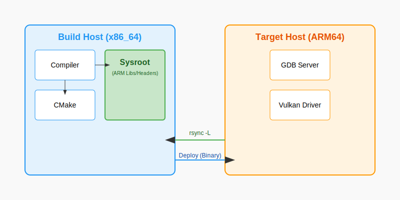

= Cross-Compilation: Building for the ARM Empire
:pp: {plus}{plus}
:stem: latexmath

You are developing on a powerful x86_64 workstation with 128GB of RAM and a liquid-cooled GPU. Your target is a **Raspberry Pi 5** or an **NVIDIA Jetson** with an ARM64 processor and a fraction of the resources. You could try to compile your Vulkan C{pp} code directly on the device, but you will quickly discover that building a large project like ONNX Runtime or a complex Vulkan engine on a micro-computer is a recipe for disaster.

If you attempt a local build, you will hit **Memory Thrashing**—where the system spends more time swapping memory pages to the slow SD card than actually compiling code. Eventually, the Linux **Out of Memory (OOM) Killer** will wake up and terminate your compiler to save the system from freezing. Even if it succeeds, you'll be waiting 8 hours for a build that your workstation could finish in 2 minutes.

**Cross-Compilation** is the professional solution. It allows you to use the "Brute Force" of your workstation to generate binary code for a completely different architecture.

In this chapter, we are going to demystify the cross-compilation process. We will learn how to set up a **Sysroot**, configure a link:https://cmake.org/cmake/help/latest/manual/cmake-toolchains.7.html[**CMake Toolchain**], and build a remote deployment pipeline that feels as seamless as local development.

It is important to understand that most OEMs provide everything we learn about below and if you can, you should use their pre-built toolchains and sysroots to avoid the complexity of setting up your own.  However, if you are working with a custom or non-standard ARM device, you may need to set up your own toolchain and sysroot; and learning how that works enables you to understand what to expect from a development environment setup.

In an effort to not complicate this further, we will avoid diving into the specifics of setting up the IDE as there's many IDE's available each with their own Quarks and setup gotchas.  The core path outlined below will be common for all of them in some way.

== The Two-World Problem: Host vs. Target

In cross-compilation, you live in two worlds simultaneously:
1.  **The Build Host**: Your x86_64 Linux/Windows machine where the compiler (`gcc` or `clang`) actually runs.
2.  **The Target Host**: The ARM64 device where the resulting binary code will execute.

.Cross-Compilation Ecosystem

The biggest mistake beginners make is trying to link against their Build Host's libraries. If you link your ARM code against an x86 `libvulkan.so`, the linker will either scream in confusion ("File format not recognized") or produce a binary that crashes with an "Invalid Instruction" error the moment it hits the first Vulkan call.

You must maintain a strict separation between the **Tools** (which run on x86) and the **Libraries** (which must be ARM). The compiler is a tool; the `.so` files are libraries.

== Pillar 1: The Sysroot (The Target's Reflection)

A **Sysroot** is a folder on your Build Host that contains a perfect copy of the Target Host’s filesystem. It includes every header (`.h`) and library (`.so`) that the ARM device uses.

=== Creating a Sysroot with `rsync`
Don't download random libraries from the internet. The best sysroot comes directly from your hardware. We use `rsync` to clone the "Vital Organs" of the target OS.

[source,bash]
----
# On your development machine
mkdir -p ~/target_sysroot

# Pull the vital organs of the target OS
# -a: Archive mode (preserves permissions and timestamps)
# -v: Verbose output so you can see the progress
# -z: Compress data during transfer to save network bandwidth
# -L: CRITICAL - Transforms absolute symlinks into relative ones.
# On Linux, /usr/lib/libvulkan.so often points to /lib/aarch64-linux-gnu/libvulkan.so.1
# Without -L, that link would point to your workstation's root, not the sysroot!
rsync -avzL --rsync-path="sudo rsync" \
    pi@raspberrypi.local:/lib/aarch64-linux-gnu ~/target_sysroot/
rsync -avzL --rsync-path="sudo rsync" \
    pi@raspberrypi.local:/usr/include ~/target_sysroot/usr/
rsync -avzL --rsync-path="sudo rsync" \
    pi@raspberrypi.local:/usr/lib/aarch64-linux-gnu ~/target_sysroot/usr/lib/
----

=== Deep Dive: The Linker's search path
On Linux, many `.so` files are actually text scripts (linker scripts) or contain absolute paths. For example, `/usr/lib/aarch64-linux-gnu/libpthread.so` is often a text file that says:
`GROUP ( /lib/aarch64-linux-gnu/libpthread.so.0  /usr/lib/aarch64-linux-gnu/libpthread_nonshared.a )`

When you are cross-compiling, that path `/lib/...` points to your **Host's** root directory, not the **Sysroot's** root. This will cause the link to fail because your workstation's `libpthread.so.0` is an x86 binary.

**The Fix**: We use the `--sysroot` flag in the compiler to tell the linker: "Whenever you see an absolute path in a linker script or a library search, prefix it with `~/target_sysroot` first."

=== Troubleshooting Symlinks
A common failure point in `rsync`-based sysroots is broken symlinks. On the target device, `/usr/lib/libvulkan.so` might be a symlink to `../../lib/aarch64-linux-gnu/libvulkan.so.1.2.3`. If you don't use the `-L` flag with `rsync`, you will copy a "dangling" link that points to a non-existent path on your workstation.

Even with `-L`, some absolute symlinks might still sneak in. You can use a tool like `symlinks` to fix them:
[source,bash]
----
sudo apt install symlinks
# Convert all absolute symlinks to relative ones within the sysroot
symlinks -cr ~/target_sysroot
----

== Pillar 2: The Docker Advantage (Reproducible Forges)

While setting up a sysroot on your local machine works, it is fragile. If you update your workstation's OS, your cross-compiler might change versions, breaking compatibility with your target's GLIBC.

**Docker** allows you to create a "Frozen Forge" that is identical for every developer on your team. It also simplifies the management of link:https://docs.docker.com/build/building/multi-platform/[multi-architecture builds] by providing consistent environments.

=== The Multi-Arch Dockerfile
We can create a Docker image that contains the cross-compiler and the sysroot pre-configured.

[source,dockerfile]
----
# Dockerfile.cross
FROM ubuntu:22.04

# 1. Install the cross-compilation tools
RUN apt-get update && apt-get install -y \
    build-essential \
    cmake \
    git \
    pkg-config \
    g++-aarch64-linux-gnu \
    rsync \
    && rm -rf /var/lib/apt/lists/*

# 2. Define the sysroot location
ENV SYSROOT=/opt/sysroot
RUN mkdir -p ${SYSROOT}

# (Optional) You can copy a pre-built sysroot into the image
# COPY ./target_sysroot ${SYSROOT}

# 3. Set up environment for CMake
ENV ARCH=aarch64
ENV CROSS_COMPILE=aarch64-linux-gnu-
----

=== Building inside Docker
You can mount your source code into the container and build without "polluting" your workstation.

[source,bash]
----
docker build -t vulkan-cross-builder -f Dockerfile.cross .
docker run --rm -v $(pwd):/src -w /src vulkan-cross-builder \
    cmake -B build-arm64 -DCMAKE_TOOLCHAIN_FILE=cmake/aarch64-toolchain.cmake .
----

== Pillar 3: The CMake Toolchain File

CMake doesn't "know" you are cross-compiling unless you tell it. We use a **Toolchain File** to redirect CMake away from your workstation's system folders and toward your Sysroot.

[source,cmake]
----
# cmake/aarch64-toolchain.cmake
set(CMAKE_SYSTEM_NAME Linux)
set(CMAKE_SYSTEM_PROCESSOR aarch64)

# 1. Point to the ARM cross-compiler
# You can install this on Ubuntu via: sudo apt install g++-aarch64-linux-gnu
set(CMAKE_C_COMPILER aarch64-linux-gnu-gcc)
set(CMAKE_CXX_COMPILER aarch64-linux-gnu-g++)

# 2. Point to our local Sysroot mirror
# We use an environment variable so the path can be different in Docker vs Local
if(NOT DEFINED ENV{SYSROOT})
    set(CMAKE_SYSROOT $ENV{HOME}/target_sysroot)
else()
    set(CMAKE_SYSROOT $ENV{SYSROOT})
endif()

# 3. CRITICAL: Don't look for libraries on the workstation host!
set(CMAKE_FIND_ROOT_PATH_MODE_PROGRAM NEVER) # Use workstation's 'make', 'ls', 'cmake'
set(CMAKE_FIND_ROOT_PATH_MODE_LIBRARY ONLY)  # ONLY look in sysroot for libraries
set(CMAKE_FIND_ROOT_PATH_MODE_INCLUDE ONLY)  # ONLY look in sysroot for headers
set(CMAKE_FIND_ROOT_PATH_MODE_PACKAGE ONLY)  # ONLY look in sysroot for cmake-packages

# 4. Handle Pkg-Config for ARM
# Pkg-config is the most common cause of "Header not found" errors.
# We must prevent it from returning paths like /usr/include (which is your x86 host).
set(ENV{PKG_CONFIG_DIR} "")
set(ENV{PKG_CONFIG_LIBDIR} "${CMAKE_SYSROOT}/usr/lib/aarch64-linux-gnu/pkgconfig:${CMAKE_SYSROOT}/usr/share/pkgconfig")
set(ENV{PKG_CONFIG_SYSROOT_DIR} "${CMAKE_SYSROOT}")

# 5. Staging: Where do we 'install' our ARM binaries?
set(CMAKE_STAGING_PREFIX $ENV{HOME}/arm64_build_output)
----

== Pillar 4: Handling the Vulkan SDK

When cross-compiling for Vulkan, you need two things:
1.  **Vulkan Headers**: These are architecture-independent. You can use the ones on your host.
2.  **Vulkan Loader (`libvulkan.so`)**: This MUST be the ARM version from your sysroot.

=== Finding Vulkan Correctly
In your `CMakeLists.txt`, don't use hardcoded paths. Use `find_package(Vulkan REQUIRED)`. Because we set `CMAKE_FIND_ROOT_PATH_MODE_LIBRARY ONLY` in our toolchain, CMake will automatically skip your host's Vulkan and find the one in the sysroot.

[source,cmake]
----
find_package(Vulkan REQUIRED)
add_executable(vulkan_ml_app main.cpp)
target_link_libraries(vulkan_ml_app PRIVATE Vulkan::Vulkan)
----

=== Verification
After building, use `readelf` to verify that your binary is actually ARM64 and not x86:
[source,bash]
----
readelf -h build-arm64/vulkan_ml_app | grep Machine
# Should output: Machine: AArch64
----

== Pillar 5: CPU-Specific Optimizations

ARM is a massive family of processors. A binary compiled for a generic "ARM64" will run on a Raspberry Pi 5, but it will be slow because it won't use the specialized hardware instructions that make the Pi 5 fast.

=== Tuning the Flags
To get production performance, you should add architecture-specific flags to your CMake build. These flags enable specific silicon features like NEON SIMD or Dot-Product instructions. You can find a full list of available flags in the link:https://gcc.gnu.org/onlinedocs/gcc/AArch64-Options.html[GCC AArch64 Options] documentation.

[cols="1,2,2"]
|===
| Target SoC | `-march` (Architecture) | `-mtune` (Tuning)

| Raspberry Pi 4 | `armv8-a+crc` | `cortex-a72`
| Raspberry Pi 5 | `armv8.2-a+fp16+rcpc+dotprod` | `cortex-a76`
| NVIDIA Jetson Orin | `armv8.2-a+fp16` | `cortex-a78ae`
| Apple Silicon (M1/M2) | `armv8.5-a+fp16+sha3` | `apple-m1`
|===

*   **`+fp16`**: Enables hardware support for half-precision floats. This is the single most important flag for Vulkan ML, as it doubles the throughput of your shaders and reduces register pressure.
*   **`+dotprod`**: Enables specialized instructions for integer dot-products (UDOT/SDOT), which are vital for INT8 quantized models.

[source,cmake]
----
if(CMAKE_SYSTEM_PROCESSOR STREQUAL "aarch64")
    # Tell the compiler exactly which silicon we are targeting
    # Note: Using -mcpu is often a shorthand for -march + -mtune
    add_compile_options(-march=armv8.2-a+fp16+dotprod -mtune=cortex-a76)
endif()
----

== Pillar 6: Managing GLIBC Compatibility

The most common and frustrating runtime error in embedded Linux is:
`./app: /lib/aarch64-linux-gnu/libc.so.6: version 'GLIBC_2.34' not found`

*   **The Cause**: You compiled against a Sysroot that has a *newer* version of the C-Library (GLIBC) than the one running on your actual hardware. GLIBC is backward compatible but not forward compatible.
*   **The Rule**: You can always run a binary compiled against an **older** GLIBC on a **newer** system, but never the other way around.
*   **Expert Tip**: If you are developing for an older Debian/Ubuntu release (like JetPack 4.x), use a Docker image based on an older Ubuntu version (like 18.04) to ensure your cross-compiler links against an older GLIBC.

== Pillar 7: Remote Deployment and Debugging

A professional embedded workflow is: **Code latexmath:[\to] Build latexmath:[\to] Deploy latexmath:[\to] Run** in one click from your IDE.

=== Automated Deployment with SSH Keys
Don't type your password every time you build. It ruins your creative flow. Generate an SSH key on your workstation and copy it to the target:

[source,bash]
----
ssh-keygen -t ed25519
ssh-copy-id pi@raspberrypi.local
----

Now, you can use a deployment script to sync your binaries in milliseconds. Using `rsync` for deployment is better than `scp` because it only transfers the bytes that actually changed.

[source,bash]
----
#!/bin/bash
# deploy.sh
set -e

TARGET="pi@192.168.1.50"
DEPLOY_DIR="~/edge_ai"

# 1. Build the project locally
cmake -B build-arm64 -DCMAKE_TOOLCHAIN_FILE=cmake/aarch64-toolchain.cmake .
cmake --build build-arm64 -j$(nproc)

# 2. Sync to the target (Only transfers changed files)
rsync -avz build-arm64/vulkan_ml_app $TARGET:$DEPLOY_DIR/

# 3. Remote Execution
ssh $TARGET "$DEPLOY_DIR/vulkan_ml_app --model $DEPLOY_DIR/resnet.onnx"
----

=== Deep Dive: Remote Debugging with GDB
You can debug your ARM code line-by-line using your workstation's high-resolution monitor and IDE, while the code actually executes on the tiny processor.

1.  **On the Target (The ARM device)**:
    Launch the **GDB Server**. It acts as a "Remote Control" for the processor.
    [source,bash]
    ----
    # Listen on port 1234
    gdbserver :1234 ./vulkan_ml_app --model resnet.onnx
    ----

2.  **On the Host (Your Workstation)**:
    Launch `gdb-multiarch`. You must point it to the **local copy** of the binary (which has the debug symbols) and the **sysroot**.
    [source,bash]
    ----
    gdb-multiarch ./build-arm64/vulkan_ml_app
    (gdb) set sysroot ~/target_sysroot
    (gdb) target remote 192.168.1.50:1234
    (gdb) continue
    ----

== Pillar 8: Runtime Search Paths (RPATH)

When you link against a library like `libonnxruntime.so` in your Sysroot, the linker records the path `~/target_sysroot/usr/lib/...`. But on the Pi, that library is at `/usr/lib/...`.

*   **The Problem**: The app might try to find the library using the Build Host path and fail to start with a "Shared library not found" error.
*   **The Fix**: Use `CMAKE_INSTALL_RPATH`. This embeds a search path into the binary's header.

[source,cmake]
----
# Tell the app to look in its own folder ($ORIGIN)
# and the standard system folders on the target.
set(CMAKE_INSTALL_RPATH "$ORIGIN;/usr/lib/aarch64-linux-gnu")

# Ensure RPATH is not cleared during installation
set(CMAKE_INSTALL_RPATH_USE_LINK_PATH TRUE)
----

== Summary: The Cross-Compilation Checklist

1.  **The Forge**: `g++-aarch64-linux-gnu` cross-compiler installed on the host or inside a Docker container.
2.  **The Mirror**: A fresh `rsync` of the target's `/usr/include` and `/usr/lib` folders, with absolute symlinks resolved.
3.  **The Guide**: A toolchain file that sets `CMAKE_SYSROOT`, redirects `pkg-config`, and configures `CMAKE_FIND_ROOT_PATH_MODE_*`.
4.  **The Optimization**: Architecture-specific `-march` and `-mtune` flags for your specific silicon generation (e.g., `+fp16`).
5.  **The Handshake**: ed25519 SSH keys configured for passwordless, fast deployment.
6.  **The Microscope**: `gdbserver` on the target and `gdb-multiarch` on your workstation.

Cross-compilation is the "Entry Fee" for professional embedded development. Once you pay it, you have the full power of a liquid-cooled workstation focused on a tiny, efficient piece of silicon.

Next, we will look at how to feed raw, high-bandwidth data into this pipeline using **Low-Latency Camera Integration**.

xref:01_introduction.adoc[Previous: Introduction] | xref:03_camera_integration.adoc[Next: Camera Integration]
