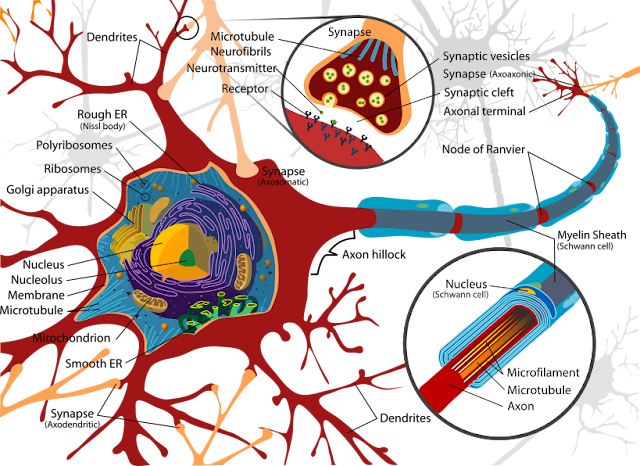
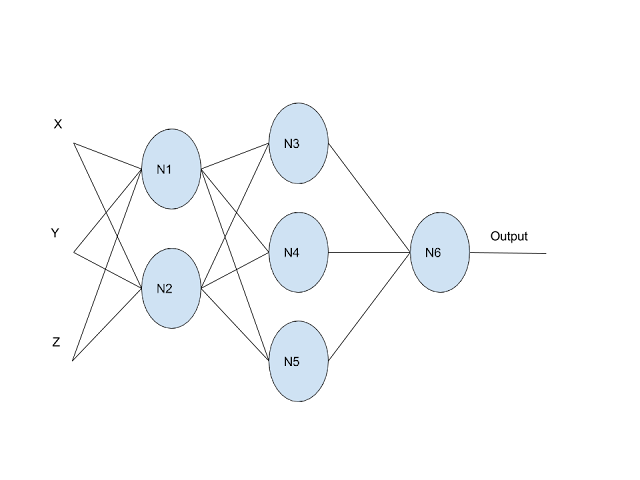
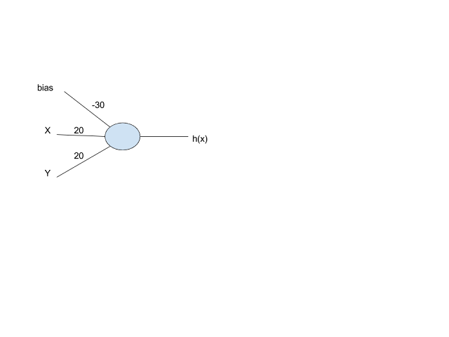

:pp: {plus}{plus}

= Neural Networks Fundamentals

== Introduction

Before we discuss inference, let's build a solid understanding of what neural networks actually are. While there's tremendous excitement around neural networks and AI, it's important to understand the fundamentals rather than treating them as magical black boxes. Neural networks are powerful, but they're ultimately just mathematical functions—limited and empowered by the rules of mathematics.

This chapter builds neural network understanding from first principles, starting with mathematical functions, drawing inspiration from biological neurons, and showing why non-linear activation functions are essential for neural networks to work.

== What's a Function?

Let's start with the most basic concept: a mathematical function. A *function* is a way to relate some input to an output. All functions within mathematics take some number of inputs and create exactly one output that corresponds to those inputs. A key property of functions is that given the same input, they always yield the same output.

Note that the output doesn't have to be just one number—it could be a structure like a vector or matrix. This simple concept is surprisingly powerful. In fact, computer programs are essentially running mathematical functions, which is why they can do so many different things.

Functions can be as simple or complex as we need:

- *Linear*: `y = f(x) = x + 1`
- *Parabolic*: `y = f(x) = x² + 1`
- *Multi-input*: `y = f(a,b,c,d) = 23a + 42b + 51c + d`
- *Complex*: Gradient descent from linear regression
- *Unknown*: `Diagnosis = f(symptoms) = ???`

That last example is crucial: sometimes we're looking for a function that we don't even know how to write. If there's a function that can relate a patient's symptoms to a diagnosis, but we don't know what that function is, machine learning—and specifically neural networks—can help us find it.

As we discussed with linear regression, machine learning seeks to find a function that best fits the data. Neural networks are one of the most generic tools in our arsenal for finding unknown functions. However, being very generic means that while they will find a function, it might not be the most efficient implementation. More on that later.

== Learning from Nature: Biological Neurons

Let's take inspiration from how the human brain works. Everything you've ever thought, every memory you've formed, every skill you've learned—all of it emerges from the coordinated activity of billions of neurons. The remarkable thing is that each individual neuron is surprisingly simple. The complexity and power of the brain comes not from sophisticated individual components, but from vast numbers of simple components working together.

=== The Structure: A Communication Network

Think about your own nervous system for a moment. When you touch something hot, you instantly pull your hand away. When you see a friend's face, you recognize them immediately. When you read these words, you understand their meaning. All of these processes—sensation, recognition, comprehension—happen through networks of neurons communicating with each other.

A biological neuron has three main parts:

1. *Dendrites* - The spidery web-like structures that receive input from other neurons. Think of these as the neuron's "ears"—they're listening to what other neurons are saying. A single neuron might have thousands of dendrites, each connected to a different neuron, allowing it to integrate information from many sources simultaneously.

2. *Cell Body* (Soma) - The main part of the neuron that processes the inputs and makes the decision to activate. This is where the "thinking" happens—the cell body adds up all the signals coming in through the dendrites and decides whether the combined input is strong enough to warrant sending a message forward.

3. *Axon* - The long tube extending from the cell body (starting at the Axon Hillock and ending at the Axon Terminal) that transmits the output signal. This is the neuron's "voice"—when it decides to fire, an electrical signal races down the axon to communicate with other neurons. Some axons are incredibly long; the neurons that control your toes have axons that stretch from your spinal cord all the way down your leg.

The *Synapse* is the gap between one neuron's Axon Terminal and another neuron's Dendrite. This is where signals pass from one neuron to the next. Interestingly, neurons don't actually touch each other—there's a tiny gap at the synapse. When an electrical signal reaches the end of an axon, it triggers the release of chemical messengers (neurotransmitters) that float across this gap and bind to receptors on the next neuron's dendrites. This chemical communication is crucial for how the brain works.

Notice the key pattern: each neuron has many dendrites (multiple inputs) and one axon (single output). Sound familiar? That's exactly the definition of a mathematical function we discussed earlier! This isn't a coincidence—when we design artificial neural networks, we're directly inspired by this biological architecture.

=== How Neurons Actually Work: The Firing Process

The biological process is elegantly simple yet powerful. Imagine you're at a concert, and you're trying to decide whether to start clapping. You're listening to the people around you—some are clapping enthusiastically, some are sitting quietly, some are booing. You're unconsciously weighing all these inputs: "Three people near me are clapping, but two are silent, and that one person is really enthusiastic..." When enough of the signals you're receiving say "clap," you start clapping too.

Neurons work similarly. The cell body receives signals through multiple dendrites. Some of these signals are *excitatory*—they push the neuron toward firing. Others are *inhibitory*—they push against firing. The cell body is constantly summing up these competing signals. When the total excitation exceeds a certain threshold, the neuron "fires" by sending an electrical pulse down its axon.

This firing is an all-or-nothing event. The neuron doesn't fire "a little bit" or "a lot"—it either fires or it doesn't, like flipping a light switch. However, neurons can fire repeatedly at different rates. A neuron that's receiving strong, consistent excitation might fire many times per second, while one receiving weaker signals might fire only occasionally. This firing rate is how neurons encode the strength of a signal.

Here's what makes this fascinating: the threshold for firing isn't fixed. Through a process called *synaptic plasticity*, the connections between neurons can strengthen or weaken over time. When you learn something new, you're literally changing the strength of synaptic connections in your brain. The phrase, "neurons that fire together, wire together" captures this idea—when two neurons are repeatedly active at the same time, the connection between them strengthens, making it easier for one to activate the other in the future.

=== The Power of Networks: How Complexity Emerges

A single neuron is simple, but your brain contains roughly 86 billion neurons, each connected to thousands of others. That's trillions of connections, forming networks of staggering complexity. This is where the magic happens.

Consider what happens when you recognize a face. Light hits your retina, activating neurons in your eye. These neurons send signals to neurons in your visual cortex, which detect basic features like edges and colors. Those neurons connect to others that recognize more complex patterns like curves and shapes. Those connect to neurons that recognize facial features like eyes and noses. And those connect to neurons that recognize specific faces—there are literally neurons in your brain that respond specifically to familiar faces.

This is a *hierarchy of features*. Simple neurons detect simple things. Their outputs feed into neurons that detect more complex things. And so on, building up from basic sensory input to high-level concepts. This hierarchical organization is one of the key insights we'll use when building artificial neural networks.

Memory works through similar principles. When you remember something, you're not accessing a file stored in a specific location (like a computer does). Instead, you're reactivating a pattern of neural activity. The memory of your childhood home involves neurons that encode visual details, emotional associations, spatial relationships, and more—all firing together in a coordinated pattern. This is why memories can be triggered by unexpected cues: a smell, a song, a similar-looking place. Any part of the pattern can reactivate the whole.

=== Plasticity and Learning: The Brain's Superpower

Perhaps the most remarkable property of biological neural networks is their ability to reorganize themselves. This is called *neuroplasticity*, and it's the foundation of all learning.

When you practice a skill—playing an instrument, speaking a language, solving math problems—you're strengthening specific neural pathways. The neurons involved in that skill fire together repeatedly, and their connections grow stronger. This is why practice works: you're literally rewiring your brain to perform that task more efficiently.

The brain is also remarkably adaptable to damage. If one area is injured, other areas can sometimes take over its functions. People who lose their sight often develop enhanced hearing and touch sensitivity—not because their ears or fingers change, but because the brain regions that would normally process vision get repurposed for processing other senses. The neurons are the same; it's the connections and patterns that change.

This adaptability extends to specialization. While certain brain regions tend to handle certain tasks (language in the left hemisphere for most people, spatial reasoning in the right), these aren't hard-coded. The brain organizes itself based on experience. A professional musician's brain dedicates more neural real estate to processing music than a non-musician's brain. A London taxi driver's brain develops an enlarged hippocampus (the region involved in spatial navigation) from memorizing the city's complex street layout.

=== Why This Matters for Artificial Neural Networks

Understanding biological neurons gives us both inspiration and humility. The inspiration is clear: the brain's architecture—simple processing units, weighted connections, hierarchical organization, learning through connection strength adjustment—provides a blueprint for artificial neural networks.

The humility comes from recognizing what we're leaving out. Biological neurons are far more complex than our artificial versions. They have intricate internal chemistry, they communicate through dozens of different neurotransmitters, they form connections that can be excitatory or inhibitory, they operate on multiple timescales simultaneously. We're not trying to replicate all of this complexity—we're extracting the core computational principles and implementing them in a form we can work with mathematically.

The key insight is this: you don't need to perfectly simulate biology to capture its computational power. Just as airplanes don't flap their wings like birds but still achieve flight, artificial neural networks don't replicate every detail of biological neurons but still achieve impressive information processing capabilities.

What we're building is inspired by biology but optimized for implementation on digital computers—and specifically, for efficient execution on GPUs using Vulkan compute shaders. We take the core ideas (weighted inputs, thresholds, networks of simple units, learning through adjustment) and implement them in a form that maps well to parallel computation.

== Mimicking Nature: Artificial Neurons

With this biological understanding, we can replicate how the brain works by creating artificial neurons that take inputs, make decisions, and produce outputs. An artificial neuron with three inputs and one output would look like this:

image::images/linear_perceptron.png[An artificial neuron (perceptron) with three inputs and one output]

This means our artificial neuron has a mathematical function: `output = f(x, y, z)`.

But what function should we use? Before we answer that, we need to understand two fundamental concepts that make neural networks work: *weights* and *biases*.

=== Understanding Weights: The Importance Multipliers

A *weight* is a number that gets multiplied by an input, determining how much that input influences the output. Large weights mean "this input matters a lot." Small weights mean "this input barely matters." Negative weights mean "this input pushes the output in the opposite direction."

When making decisions, we naturally weigh different factors differently—some matter more than others. Neural networks do the same thing mathematically.

In our three-input neuron, we might have:

- `w₁ = 5.0` (first input is very important)
- `w₂ = 0.1` (second input barely matters)
- `w₃ = -2.0` (third input is moderately important but works in reverse)

When the neuron computes `w₁·x + w₂·y + w₃·z`, it's creating a weighted sum—each input contributes to the result proportionally to its weight. This is how the neuron "learns" which inputs matter: during training, these weights get adjusted until the neuron responds correctly to its inputs.

=== Understanding Bias: The Threshold Adjuster

The *bias* is a constant value added to the weighted sum, and it adjusts the neuron's activation threshold. A large positive bias makes the neuron easier to activate (it fires more readily). A large negative bias makes it harder to activate (it needs stronger input signals to fire).

The bias represents the neuron's "default tendency." Without any inputs at all (x = 0, y = 0, z = 0), the weighted sum would be zero. But with a bias of, say, `b = -10`, the neuron starts at -10 and needs positive inputs to overcome that negative offset. With a bias of `b = +10`, the neuron is already predisposed to activate.

Together, weights and biases give each neuron its unique personality—what it responds to and how readily it fires. During training, both weights and biases are adjusted to make the network produce the right outputs. During inference (what we're focused on), they're fixed values that we load from the trained model and use in our computations.

=== Putting It Together: The Linear Neuron

Now we can write our neuron's function more meaningfully. Let's start with an experiment. Assume the function is linear—that is, it describes a straight line or plane:

[source]
----
output = f(x, y, z) = w₁·x + w₂·y + w₃·z + b
----

Where:

- `w₁`, `w₂`, `w₃` are the *weights* (learned values that determine each input's importance)
- `b` is the *bias* (a learned value that adjusts the activation threshold)
- `x`, `y`, `z` are the inputs
- The output is the weighted sum plus bias

== The Problem with Linear Functions

Now let's see what happens when we connect multiple neurons in a network:

In this network, the output comes from node N6. Let's trace through the mathematics:

*Final Layer:*

[source]
----
output = N6_output
N6_output = w_a · N5_output + w_b · N4_output + w_c · N3_output + b_d
----

*Hidden Layer:*

[source]
----
N3_output = w_e · N1_output + w_f · N2_output + b_g
N4_output = w_h · N1_output + w_i · N2_output + b_j
N5_output = w_k · N1_output + w_l · N2_output + b_m
----

*Input Layer:*

[source]
----
N1_output = w_n · X + w_o · Y + w_p · Z + b_q
N2_output = w_r · X + w_s · Y + w_t · Z + b_u
----

Here's the problem: if we substitute all these equations into each other and simplify, we get:

[source]
----
output = f(x,y,z) = w_final_a · X + w_final_b · Y + w_final_c · Z + b_final
----

Our entire neural network just collapsed into a single linear function! This happens because *a combination of linear functions is always linear*, no matter how many layers we add. All our extra neurons just create unnecessary computation that could be reduced to a simpler form. The beautiful complexity we talked about when we described those trillions of possible biological connections vanishes into mathmatical simplicity.  We simply will be unable to maintain complexity in a network designed off of linear activation.

== The Solution: Non-Linear Activation Functions

To solve this problem, and get our complexity back, we need to use *non-linear functions*—functions that don't have a linear relationship between inputs and outputs. This gives us a surprising and powerful property: by the *Universal Approximation Theorem*, any function can be approximated by a neural network of non-linear functions.

Think about that for a moment: if a function *can* exist which can relate some inputs to some outputs, a neural network using non-linear functions can approximate that function. We don't need to have anything more than inputs, and outputs in order to approximate that function.  This is what makes neural networks so powerful and general-purpose.

While many non-linear functions exist, let's discuss one of the most intuitive to our purposes: the *sigmoid function* (also called the logistic function):

[source]
----
σ(z) = 1 / (1 + e^(-z))
----

The sigmoid function has several useful properties:

- Its output is always between 0 and 1 (representing "off" to "on")
- It's smooth and differentiable (important for training, though not for inference)
- It naturally creates a threshold behavior

When the sigmoid output is greater than 0.5, we can consider the neuron "activated." We can even create a bias or a way to adjust that 0.5 activation threshold. We can do that by adding a bias term before applying the activation function.

== A Concrete Example: Building an AND Gate

Let's see how this works with a simple example. We'll build a neural network that implements a logical AND function:

The neuron computes: `output = σ(-30 + 20·X + 20·Y)`

Let's work through the truth table:

[cols="1,1,2,1", options="header"]
|===
|X |Y |Calculation |Output

|0
|0
|σ(-30 + 0 + 0) = σ(-30)
|≈ 0

|1
|0
|σ(-30 + 20 + 0) = σ(-10)
|≈ 0

|0
|1
|σ(-30 + 0 + 20) = σ(-10)
|≈ 0

|1
|1
|σ(-30 + 20 + 20) = σ(10)
|≈ 1
|===

Our single-layer neural network successfully implements an AND function! The weights (20, 20) and bias (-30) were chosen to create the right threshold behavior.

== The Cost of Generality

This example reveals an important insight: if you already know the function you're looking for (like AND), a neural network is overkill. A simple AND operation is a single, constant-time operation. But in a neural network, we must:

1. Store the learned weights and biases (-30, 20, 20)
2. Perform floating-point multiplications and additions
3. Evaluate the sigmoid function (which involves an exponential)
4. Do all this for every prediction

This is *very expensive* compared to a direct implementation. Neural networks are powerful because they can find unknown functions, but they're not the most efficient way to implement known functions.

When you know the relationship between inputs and outputs beforehand, use something simpler than a neural network. However, when you need to discover the function from data—and simpler machine learning approaches (like linear regression, support vector machines, etc.) fail.  Neural networks can eventually find the correct function through training.

== Modern Activation Functions: Why Sigmoid Isn't Enough

While we've focused on the sigmoid function for its intuitive properties—it smoothly maps any input to a value between 0 and 1, mimicking the "on/off" behavior of biological neurons—modern neural networks rarely use sigmoid for hidden layers. Why not? To understand this, we need to peek briefly into the training process and understand some fundamental concepts about how neural networks learn.

=== How Neural Networks Learn: A Gentle Introduction

Before we discuss why sigmoid has limitations, let's understand how neural networks actually learn. Remember, we're focused on inference in this tutorial, but understanding the basics of training helps us appreciate why models use different activation functions and how to implement them correctly.

Think back to our AND gate example. We said the weights were "chosen" to be 20, 20, and -30. But how would a neural network discover these values on its own? This is where training comes in.

==== The Learning Problem

Neural network training is an iterative process. The network makes a prediction, we measure how wrong it was (the *error* or *loss*), and then we adjust the weights to reduce that error. The key question is: *how* do we adjust the weights? If we increase a particular weight, will the error go up or down? By how much?

==== Enter Gradients

This is where *gradients* come in. A gradient is simply a measure of how much the output changes when you change the input. In calculus terms, it's the derivative—the slope of the function at a particular point.

Let's make this concrete. Suppose you have a simple function: `error = (prediction - actual)²`. If your prediction is 0.8 and the actual value is 1.0, your error is `(0.8 - 1.0)² = 0.04`. Now, if you increase your prediction slightly to 0.81, the error becomes `(0.81 - 1.0)² = 0.0361`. The error went down! The gradient tells you this relationship: "if you increase the prediction, the error decreases."

For neural networks, we need to know: if we change a particular weight, how does the error change? The gradient of the error with respect to that weight tells us exactly this. If the gradient is positive, increasing the weight increases the error (bad). If the gradient is negative, increasing the weight decreases the error (good).

==== Gradient Descent: The Mountain Trail Analogy

Once we know the gradient for each weight, we can use a beautifully simple algorithm called *gradient descent*. To understand how it works, let's build a detailed mental model.

===== Starting with a Random Guess

Imagine you're dropped randomly somewhere on a mountain trail—maybe near the peak, maybe halfway down, maybe on a ridge. You have no map, no GPS, just your feet and the ability to feel which direction slopes downward. Your goal is to reach the lowest point in the valley below.

This is exactly how neural network training begins. We start with *random initial weights*—essentially a random guess at what the function should be. These initial weights might be terrible, producing predictions that are wildly wrong. That's okay; we're not expecting to start with good weights. We're expecting to *find* good weights through the training process.

===== The Loss Function: Your Compass

How do you know if you're making progress? You need a way to measure how wrong your current position is. In our mountain analogy, this is your elevation—the higher you are, the farther you are from your goal.

In neural networks, this measurement is called the *loss function* (or *error function* or *cost function*—these terms are used interchangeably). The loss function takes your model's predictions and compares them to the actual correct answers, producing a single number that represents "how wrong" you are.

Common loss functions include:

*Mean Squared Error (MSE)*: `loss = average((prediction - actual)²)` - Used for regression problems where you're predicting continuous values. Squaring the errors means larger mistakes are penalized more heavily than small ones.

*Cross-Entropy Loss*: Used for classification problems where you're predicting categories. It measures how different your predicted probability distribution is from the true distribution.

The key insight: the loss function creates a landscape. Every possible combination of weights corresponds to a point in this landscape, and the "height" at that point is the loss. Good weights are in the valleys (low loss), bad weights are on the peaks (high loss). Training is the process of navigating this landscape to find the valleys.

===== Taking Steps Downhill

Back to our mountain trail. You feel the ground beneath your feet and determine which direction slopes downward most steeply. You take a step in that direction. Then you feel the slope again where you foot landed, and take another step. You repeat this process, always moving in the direction that goes downhill.

This is gradient descent. The gradient tells you which direction is "downhill" in the weight space—which direction reduces the loss most quickly. You adjust your weights in that direction:

[source]
----
new_weight = old_weight - learning_rate × gradient
----

The minus sign is crucial: if the gradient is positive (loss increases when weight increases), we *decrease* the weight. If the gradient is negative (loss decreases when weight increases), we *increase* the weight. We're always moving opposite to the gradient, which means moving downhill.

The `learning_rate` is how big a step you take. This is a critical parameter:

- *Too large*: You might leap over the valley entirely, bouncing from one side to the other, never settling at the bottom. Or worse, you might jump to a completely different part of the mountain.
- *Too small*: You'll eventually reach the bottom, but it might take thousands or millions of steps. Training becomes painfully slow.
- *Just right*: You make steady progress toward the minimum without overshooting.

In practice, the learning rate often starts larger (to make quick progress) and gradually decreases (to settle into the minimum without overshooting). This is called *learning rate scheduling*.

===== When to Stop: Convergence

How do you know when you've reached the bottom? In our mountain analogy, you might notice that no matter which direction you step, you go uphill. You're at a local low point.

In neural network training, we look for *convergence*—the point where the loss stops decreasing significantly. Several indicators tell us we've converged:

*Loss plateaus*: The loss value stops changing much between training steps. If the loss was 0.523, then 0.522, then 0.521, and it's been changing by less than 0.001 for many steps, you're probably converged.

*Gradient magnitude becomes tiny*: When the gradient approaches zero, you're at a flat spot in the landscape—either a minimum or a plateau.

*Validation performance stops improving*: This is the most practical indicator. You set aside some data that the model hasn't seen during training (the validation set) and periodically check performance on it. When validation performance stops improving, it's time to stop training.

===== The Challenge: Local vs Global Minima

Here's where our mountain analogy reveals a critical challenge. Imagine the landscape isn't a simple bowl-shaped valley. Instead, it's a complex mountain range with many valleys, ridges, and depressions. Some valleys are deep (low loss), others are shallow (higher loss).

If you start on one part of the mountain and follow the gradient downhill, you might end up in a small depression—a *local minimum*. From there, every direction goes uphill, so gradient descent stops. But there might be a much deeper valley (the *global minimum*) on the other side of a ridge. You'd never find it because you'd have to go uphill first to get over the ridge.

This is a fundamental challenge in neural network training:

*Global minimum*: The absolute lowest point in the entire loss landscape. This represents the best possible weights for your model on the training data.

*Local minimum*: A low point that's surrounded by higher points, but not the absolute lowest. Gradient descent can get stuck here.

In practice, for modern deep neural networks, this turns out to be less of a problem than you might expect. The loss landscape in high-dimensional spaces (millions of weights) has interesting properties—there are many "good enough" minima that all perform similarly well. Finding the absolute global minimum isn't necessary; finding any sufficiently deep minimum works fine.

Additionally, techniques like:

- *Momentum*: Adding "inertia" to gradient descent so it can roll through small bumps and depressions
- *Random restarts*: Starting training multiple times from different random initializations
- *Stochastic gradient descent*: Using randomness in the training process, which helps escape shallow local minima

help navigate the complex loss landscape and find good solutions even when the global minimum is elusive.

===== Evaluating Models: How to Tell When a Model Is Better

With the basics of how training works, an important question arises: how do we know if our model is actually good? How do we compare two different models and decide which one is better?

The loss function tells us how well the model fits the training data, but that's not the whole story. What we really care about is how well the model performs on *new, unseen data*—data it wasn't trained on. This is called *generalization*.  Let's briefly talk about the learning process so the inference model makes.

====== Training vs Validation vs Test Data

To properly evaluate a model, we split our data into three sets:

*Training data* (typically 70-80% of data): Used to train the model—to adjust the weights through gradient descent. The model sees this data during training and learns from it.

*Validation data* (typically 10-15% of data): Used to evaluate the model during training and tune hyperparameters (like learning rate, network architecture, etc.). The model doesn't train on this data, but we use it to make decisions about the training process.

*Test data* (typically 10-15% of data): Used only at the very end to get a final, unbiased estimate of model performance. The model never sees this data during training or hyperparameter tuning.

Why three sets? If we only had training data, we couldn't tell if the model was memorizing the training examples (overfitting) or actually learning general patterns. If we only had training and test data, we'd be tempted to tune our model based on test performance, which would leak information from the test set into our model design. The three-way split keeps our final evaluation honest.

====== Key Evaluation Metrics

Different tasks require different metrics:

*For Classification (predicting categories)*:

- *Accuracy*: What percentage of predictions are correct? Simple and intuitive, but can be misleading if classes are imbalanced (e.g., if 95% of examples are "not spam," a model that always predicts "not spam" has 95% accuracy but is useless).

- *Precision and Recall*: Precision asks "of the examples we predicted as positive, how many actually were positive?" Recall asks "of all the actual positive examples, how many did we find?" These are crucial for imbalanced problems.

- *F1 Score*: The harmonic mean of precision and recall, providing a single number that balances both concerns.

*For Regression (predicting continuous values)*:

- *Mean Absolute Error (MAE)*: Average of the absolute differences between predictions and actual values. Easy to interpret—if MAE is 5, predictions are off by 5 units on average.

- *Mean Squared Error (MSE)*: Average of the squared differences. Penalizes large errors more heavily than small ones.

- *R² Score*: Measures how much of the variance in the data the model explains. An R² of 1.0 means perfect predictions, 0.0 means the model is no better than just predicting the average.

====== Comparing Models

When comparing two models, we look at their performance on the validation set (during development) or test set (for final evaluation):

*Model A has lower validation loss than Model B*: Model A is likely better, assuming both models have similar complexity. Lower loss means better fit to the data.

*Model A has higher validation accuracy than Model B*: For classification tasks, Model A is making more correct predictions.

*Model A has lower validation error but higher training error than Model B*: This might indicate Model A generalizes better—it's not overfitting to the training data as much as Model B.

The key insight: a good model isn't just one that performs well on training data—it's one that performs well on data it hasn't seen. This is why we always evaluate on held-out validation/test data, never on training data alone.

====== Overfitting vs Underfitting

Two common failure modes help us understand model quality:

*Overfitting*: The model performs very well on training data but poorly on validation data. It has essentially memorized the training examples rather than learning general patterns. This happens when the model is too complex for the amount of training data available. Solutions include: getting more training data, using a simpler model, or applying regularization techniques.

*Underfitting*: The model performs poorly on both training and validation data. It hasn't learned the patterns in the data at all—the model is too simple to capture the underlying relationships. Solutions include: using a more complex model, training longer, or improving the features/data representation.

The sweet spot is a model that performs well on both training and validation data, with validation performance close to (but typically slightly below) training performance. This indicates the model has learned general patterns that transfer to new data.

==== Backpropagation: Computing Gradients Efficiently

Here's the challenge: a neural network might have millions of weights. We need the gradient of the error with respect to *every single weight*. Computing this naively would be impossibly slow.

*Backpropagation* is the clever algorithm that makes this efficient. It uses a mathematical principle called the *chain rule* to compute all these gradients in one backward pass through the network.

==== Understanding the Chain Rule

The chain rule is a fundamental concept from calculus that tells us how to find the rate of change when we have *composite functions*—functions nested inside other functions.

The key principle: when A affects B, and B affects C, then A's effect on C is found by multiplying the individual effects together.

Mathematically, if you have `y = f(u)` and `u = g(x)`, then the rate of change of y with respect to x is:

[source]
----
dy/dx = (dy/du) × (du/dx)
----

You multiply the derivative of the outer function by the derivative of the inner function. This extends to longer chains: if you have four functions nested together, you multiply four derivatives together.

==== Why Neural Networks Are Perfect for the Chain Rule

Now here's the beautiful insight: *neural networks are inherently composite functions*. Each layer is a function that takes the previous layer's output as input. When you stack layers together, you're composing functions:

[source]
----
output = layer_n(layer_{n-1}(...layer_2(layer_1(input))...))
----

This is exactly the structure the chain rule was designed for! Let's trace through a simple example. Suppose we have a three-layer network:

1. Input layer computes: `h₁ = activation(W₁ × input + b₁)`
2. Hidden layer computes: `h₂ = activation(W₂ × h₁ + b₂)`
3. Output layer computes: `output = activation(W₃ × h₂ + b₃)`
4. Error is computed: `error = (output - target)²`

Now, if we want to know how changing a weight in the first layer (say, one element of W₁) affects the final error, we need to trace through this chain of dependencies:

- Changing W₁ affects h₁
- Changing h₁ affects h₂
- Changing h₂ affects output
- Changing output affects error

By the chain rule, the gradient of error with respect to W₁ is:

[source]
----
∂error/∂W₁ = (∂error/∂output) × (∂output/∂h₂) × (∂h₂/∂h₁) × (∂h₁/∂W₁)
----

We multiply together all the intermediate derivatives. This is why it's called "backpropagation"—we start at the error (the end) and propagate the gradient backward through each layer, multiplying by each layer's derivative as we go.

==== The Key Insight for Activation Functions

Here's where activation functions become crucial: each layer's derivative includes the derivative of its activation function. When we compute `∂h₁/∂W₁`, we need the derivative of the activation function applied to that layer.

If the activation function has a tiny derivative (like sigmoid when inputs are large), that small number gets multiplied into the chain. In a deep network with many layers, you're multiplying many small numbers together, and the gradient can vanish—becoming so tiny that learning effectively stops. This is why the choice of activation function matters so much for training, and why we ended up with functions like ReLU that have better gradient properties.

=== The Training Challenge: Vanishing Gradients

Now we can understand the problem with sigmoid. During backpropagation, the gradient flowing backward through each layer gets multiplied by the derivative of the activation function at that layer.

Here's the problem with sigmoid: its gradient is very small for large positive or negative inputs. When you're far from zero (say, at x = 10 or x = -10), the sigmoid curve is nearly flat, so its derivative approaches zero. During backpropagation, these tiny gradients get multiplied together as they flow backward through the network. In a deep network with many layers, you're multiplying many small numbers together, and the gradient effectively vanishes—becoming so small that learning stops.

This is called the *vanishing gradient problem*, and it plagued early deep neural networks. Layers near the input would barely learn at all because the gradient signal from the output had diminished to nearly nothing by the time it reached them.

=== Enter ReLU: A Simple Solution

In 2011, researchers discovered that a remarkably simple activation function could largely solve this problem:

*ReLU (Rectified Linear Unit)*: `f(x) = max(0, x)`

ReLU is almost embarrassingly simple: if the input is positive, output it unchanged; if it's negative, output zero. Yet this simplicity brings several advantages:

1. *No vanishing gradient for positive values* - The gradient is exactly 1 for any positive input, so it doesn't diminish during backpropagation
2. *Computationally cheap* - Just a comparison and a selection, no exponentials like sigmoid
3. *Sparse activation* - About half the neurons output zero, creating sparse representations that can be more efficient

ReLU became the default activation function for hidden layers in deep networks, enabling the training of much deeper architectures than was previously possible. This was a key breakthrough that helped launch the deep learning revolution.

However, ReLU has its own problem: the *dying ReLU problem*. If a neuron's output becomes negative during training, ReLU outputs zero, and the gradient is also zero. The neuron stops learning entirely and remains "dead" for the rest of training. In some networks, a significant fraction of neurons can die this way.

=== Variations and Alternatives

ReLU solved the vanishing gradient problem, but it introduced the dying ReLU issue. This sparked research into activation functions that could preserve ReLU's advantages while addressing its limitations. But the story doesn't end there—different neural network architectures have different needs, and researchers discovered that no single activation function is optimal for all situations.

==== Leaky ReLU: Fixing the Dying Neuron Problem

*Leaky ReLU*: `f(x) = max(0.01x, x)`

The most direct fix to dying ReLU is simple: don't let the gradient become exactly zero. Instead of outputting zero for negative inputs, Leaky ReLU outputs a small negative value (typically 0.01x). This ensures that neurons never completely die—they can always recover during training because the gradient is never exactly zero.

Leaky ReLU preserves all of ReLU's computational advantages (it's still just a comparison and multiplication) while eliminating the dying neuron problem. For many applications, it's a drop-in replacement for ReLU that works slightly better.

==== Tanh: When You Need Symmetry

But wait—if Leaky ReLU fixes ReLU's problem, why do we need other activation functions? The answer lies in understanding that different architectures have different requirements.

*Tanh (Hyperbolic Tangent)*: `f(x) = tanh(x)`

Tanh addresses a different issue: the asymmetry of ReLU and its variants. ReLU-family functions always output non-negative values (or mostly non-negative for Leaky ReLU). This creates a subtle problem: if all activations in a layer are positive, the gradients for the weights in the next layer will all have the same sign. This can make optimization less efficient—the network can only move in certain directions through the weight space.

Tanh outputs values from -1 to 1, centered around zero. This *zero-centered output* means that activations can be positive or negative, allowing gradients to point in any direction. For some architectures, particularly recurrent neural networks (RNNs) that process sequences, this symmetry is important for stable training.

The tradeoff? Tanh still suffers from vanishing gradients, though less severely than sigmoid. It's more expensive to compute than ReLU (requiring exponentials). So it's not a universal replacement—it's used when its specific properties (zero-centered, bounded output, smooth gradients) are beneficial for the architecture.

==== Other Modern Variants: Specialized Solutions

Beyond Leaky ReLU and Tanh, researchers have developed activation functions optimized for specific scenarios:

*PReLU (Parametric ReLU)*: Like Leaky ReLU, but the negative slope is learned during training rather than fixed. This adds flexibility—the network can decide how much negative information to preserve in each layer.

*ELU (Exponential Linear Unit)*: Outputs negative values for negative inputs (like Leaky ReLU) but uses a smooth exponential curve instead of a linear slope. This can help with training stability in very deep networks.

*GELU (Gaussian Error Linear Unit)*: Used in modern transformer architectures like GPT and BERT. It's based on stochastic regularization ideas and has smooth, non-monotonic properties that seem to help with training huge language models.

Each of these variants emerged from specific training challenges in specific architectures. They're not arbitrary choices—they reflect a deep understanding of how different activation properties affect learning dynamics in different contexts.

=== Why This Matters for Inference

You might wonder: "If these activation functions were designed to solve training problems, why do they matter for inference? We're not training anything!"

Great question. Here's why understanding is important for inference:

1. *You'll encounter these functions in real models* - When you load a pre-trained model, you need to implement whatever activation functions it uses. Understanding why they exist and why they are needed helps you implement them correctly with an eye towards when and what to optimize.

2. *Performance characteristics differ* - ReLU is much faster to compute than sigmoid (no exponentials), which matters when you're running inference thousands of times per second. Knowing the computational cost helps you optimize your Vulkan shaders.

3. *Numerical stability* - Some activation functions are more prone to numerical issues (overflow, underflow) than others. Understanding their behavior helps you write robust inference code.

4. *Architecture understanding* - Different model architectures use different activation functions for good reasons. A model using tanh in certain layers and ReLU in others isn't arbitrary—it reflects the training dynamics and the function the model learned.

For our Vulkan implementation, the choice of activation function affects which operations we need to implement in our compute shaders. ReLU is trivial (a single max operation), while sigmoid requires computing an exponential. We'll cover the implementation details in later chapters, but now you understand *why* models use different activation functions and what trade-offs they represent.

== Summary

Neural networks are mathematical functions that can approximate any other function, making them powerful tools for discovering unknown relationships in data. They draw inspiration from biological neurons, which take multiple inputs and produce a single output based on whether a threshold is reached.

The key insight is that linear functions alone are insufficient—they collapse into simpler forms regardless of network depth. Non-linear activation functions like sigmoid, ReLU, and tanh are essential for neural networks to approximate complex functions.

While neural networks are general-purpose and powerful, they come with a cost: they're computationally expensive compared to direct implementations of known functions. This computational cost is why GPU acceleration with Vulkan becomes crucial for real-time inference.

With this understanding of how neural networks work at a fundamental level, we're ready to explore the distinction between training and inference, and understand what it means to run inference on the GPU.

xref:ML_Inference/ML_Inference_Pipeline/02_what_is_machine_learning.adoc[Previous: What Is Machine Learning?] | xref:ML_Inference/ML_Inference_Pipeline/04_inference_explained.adoc[Next: Inference Explained]
