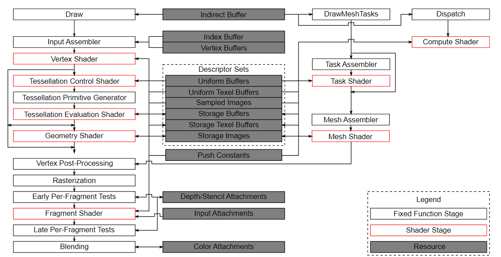

:pp: {plus}{plus}
= Refined Pipeline Stages: Precision is Performance

== Introduction

In the previous sections, we saw how Synchronization 2 unifies the API. But the real performance gains come from how you use it. Mastering `vk::PipelineStageFlagBits2` and `vk::AccessFlagBits2` is about precision. In legacy Vulkan, many developers fell into the trap of using `eAllCommands` (or worse, `eTopOfPipe` and `eBottomOfPipe`) as a catch-all solution. While this "works" in the sense that it prevents data corruption, it’s the digital equivalent of stopping every car in the city just so one pedestrian can cross the street.

=== The Pipeline Bubble

When you use an overly broad stage mask, you create what’s known as a **Pipeline Bubble**. Modern GPUs are designed to keep as many specialized hardware units—the rasterizers, the compute cores, the fixed-function blit engines—busy as possible. If you tell the GPU to wait at `eAllCommands`, you are essentially draining the entire pipeline. The GPU must wait until every previous operation is completely finished before it can start even the smallest part of the next operation.

With Synchronization 2, we can be far more surgical. If you're only interested in ensuring that a compute shader has finished writing to a storage buffer before a fragment shader reads it, you can target `eComputeShader` and `eFragmentShader` specifically. This allows other parts of the GPU, like the geometry engine or the rasterizer, to keep working on independent tasks.

=== Choosing the Right Stage

Picking the right stage mask requires a solid understanding of where your data is coming from and where it's going. Here are a few common patterns we use in our engine:

*   **Render to Texture**: If you're transitioning a color attachment so it can be sampled in a later pass, your source stage should be `eColorAttachmentOutput`.
*   **Compute Post-Processing**: When a compute shader finishes a pass that will be used by the fragment shader, use `eComputeShader` as the source and `eFragmentShader` as the destination.
*   **Transfer to Graphics**: When you've finished uploading a buffer or image using a transfer queue, the source stage is `eTransfer`.

=== The Power of Access Flags

Stage flags tell the GPU *when* to wait, but **Access Flags** tell it *why*. They control the cache flushes and invalidations we discussed in the "Execution vs. Memory" section.

Pairing a stage with the correct access flag is vital. For example, if you're reading a storage buffer in a compute shader, you need `eShaderRead` or `eShaderStorageRead`. If you're writing to it, you need `eShaderWrite` or `eShaderStorageWrite`. Being specific here allows the hardware to perform only the necessary cache operations, which can significantly reduce the overhead of the barrier itself.

=== Conclusion

As we move forward into the more complex parts of this series—like asynchronous compute and asset streaming—keep this "precision-first" mindset. Every bit you set in a barrier is a hint to the hardware. The more accurate your hints, the smoother your frame rates will be.

== Simple Engine: Targeting the Right Units

In `Simple Engine`, we apply this precision-first approach in our `Renderer::Render` loop. For example, when transitioning our depth buffer from a "Depth-Only" pass (like our shadow map generation or depth pre-pass) to a "Depth-Test" pass (like our main opaque pass), we use:

[,c++]
----
// Depth transition in Renderer::Render
vk::ImageMemoryBarrier2 depthToRead2{
  .srcStageMask = vk::PipelineStageFlagBits2::eLateFragmentTests,
  .srcAccessMask = vk::AccessFlagBits2::eDepthStencilAttachmentWrite,
  .dstStageMask = vk::PipelineStageFlagBits2::eEarlyFragmentTests,
  .dstAccessMask = vk::AccessFlagBits2::eDepthStencilAttachmentRead,
  .oldLayout = vk::ImageLayout::eDepthAttachmentOptimal,
  .newLayout = vk::ImageLayout::eDepthAttachmentOptimal,
  // ...
  .image = *depthImage,
};
----

By specifying `eLateFragmentTests` and `eEarlyFragmentTests`, we tell the GPU that it only needs to wait for the fixed-function depth units to finish writing before it can start reading for the next pass. The vertex shaders for the next pass can actually start running and even begin processing their geometry while the previous pass's depth writes are still being finalized. This overlap is what prevents the "Pipeline Bubble" and keeps our frame rates high even in complex scenes.

Next, we'll take these foundational concepts and apply them to the most common synchronization task in Vulkan: the image layout transition.

== Navigation

Previous: xref:03_sync2_advantage.adoc[The Synchronization 2 Advantage] | Next: xref:../Pipeline_Barriers_Transitions/01_introduction.adoc[Pipeline Barriers and Transitions - Introduction]
