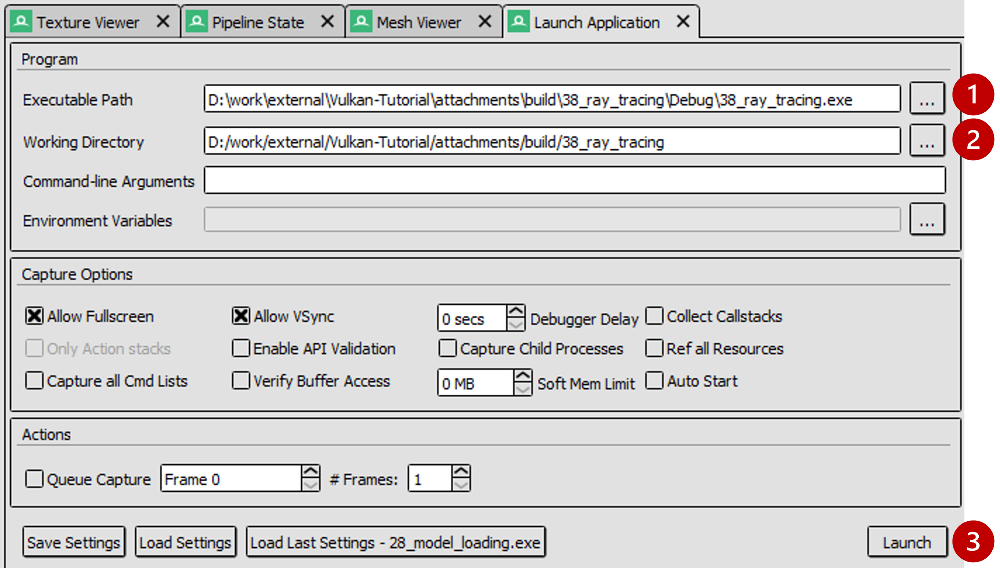

= Dynamic Rendering

*Objective*: Ensure the base project uses *dynamic rendering* and understand how to verify it using RenderDoc.

In dynamic rendering, we no longer create a VkRenderPass or VkFrameBuffer; instead we begin rendering with `vkCmdBeginRenderingKHR`, specifying attachments on-the-fly. This makes our code more flexible (no need to predeclare subpasses) and is now the "modern" way to render in Vulkan.

== Task 1: Check the setup for dynamic rendering

In the provided code base, locate the initialization of the graphics pipeline:

[,c{pp}]
----
/* TASK01: Check the setup for dynamic rendering
 *
 * This new struct replaces what previously was the render pass in the pipeline creation.
 * Note how this structure is now linked in .pNext below, and .renderPass is not used.
 */
vk::PipelineRenderingCreateInfo pipelineRenderingCreateInfo{
    .colorAttachmentCount = 1,
    .pColorAttachmentFormats = &swapChainImageFormat,
    .depthAttachmentFormat = depthFormat
};

vk::GraphicsPipelineCreateInfo pipelineInfo{
    .pNext = &pipelineRenderingCreateInfo,
    .stageCount = 2,
    .pStages = shaderStages,
    .pVertexInputState = &vertexInputInfo,
    .pInputAssemblyState = &inputAssembly,
    .pViewportState = &viewportState,
    .pRasterizationState = &rasterizer,
    .pMultisampleState = &multisampling,
    .pDepthStencilState = &depthStencil,
    .pColorBlendState = &colorBlending,
    .pDynamicState = &dynamicState,
    .layout = pipelineLayout,
    .renderPass = nullptr
};

graphicsPipeline = vk::raii::Pipeline(device, nullptr, pipelineInfo);
----

And later on, the command buffer recording where we begin rendering:

[,c{pp}]
----
/* TASK01: Check the setup for dynamic rendering
 *
 * With dynamic rendering, we specify the image view and load/store operations directly
 * in the vk::RenderingAttachmentInfo structure.
 * This approach eliminates the need for explicit render pass and framebuffer objects,
 * simplifying the code and providing flexibility to change attachments at runtime.
 */

vk::RenderingAttachmentInfo colorAttachmentInfo = {
    .imageView = swapChainImageViews[imageIndex],
    .imageLayout = vk::ImageLayout::eColorAttachmentOptimal,
    .loadOp = vk::AttachmentLoadOp::eClear,
    .storeOp = vk::AttachmentStoreOp::eStore,
    .clearValue = clearColor
};

vk::RenderingAttachmentInfo depthAttachmentInfo = {
    .imageView = depthImageView,
    .imageLayout = vk::ImageLayout::eDepthStencilAttachmentOptimal,
    .loadOp = vk::AttachmentLoadOp::eClear,
    .storeOp = vk::AttachmentStoreOp::eDontCare,
    .clearValue = clearDepth
};

// The vk::RenderingInfo structure combines these attachments with other rendering parameters.
vk::RenderingInfo renderingInfo = {
    .renderArea = { .offset = { 0, 0 }, .extent = swapChainExtent },
    .layerCount = 1,
    .colorAttachmentCount = 1,
    .pColorAttachments = &colorAttachmentInfo,
    .pDepthAttachment = &depthAttachmentInfo
};

// Note: .beginRendering replaces the previous .beginRenderPass call.
commandBuffers[frameIndex].beginRendering(renderingInfo);
----

For more context, refer to the previous tutorial link:../../03_Drawing_a_triangle/02_Graphics_pipeline_basics/03_Render_passes.adoc[chapter].

=== Dynamic rendering with RenderDoc

Use RenderDoc to launch the application and capture a frame:

. Specify executable path: `Vulkan-Tutorial\attachments\build\38_ray_tracing\Debug\38_ray_tracing.exe`.
. Specify working directory: `Vulkan-Tutorial\attachments\build\38_ray_tracing`.
. Launch the application.

In the Event Browser, you should see the calls that confirm that dynamic rendering is set up correctly:

. `vkCmdBeginRenderingKHR` and `vkCmdEndRenderingKHR`.
. `VkRenderingInfoKHR` replacing the old render pass/framebuffer concept.
. Color (and depth) attachments set via `VkRenderingAttachmentInfo`.

image::../../../images/38_TASK01_renderdoc_events.png[]

In RenderDoc's Texture Viewer, you can inspect the color and depth attachments at various points:

image::../../../images/38_TASK01_renderdoc_color.gif[]

NOTE: Dynamic rendering reduces CPU overhead and, with the `VK_KHR_dynamic_rendering_local_read` extension, lets you do subpass-style tile-local reads without full render passes. This is great for techniques like deferred shading on tilers, where reading from a previous pass's attachment can be done on-tile without extra memory bandwidth. While we won't implement a deferred renderer here, be aware of this benefit for mobile.

After this step, you should be comfortable that dynamic rendering is set up correctly. We can now move on to ray tracing features.

== Navigation
- Previous: xref:./00_Overview.adoc[Overview]
- Next: xref:./02_Acceleration_structures.adoc[Acceleration structures]
