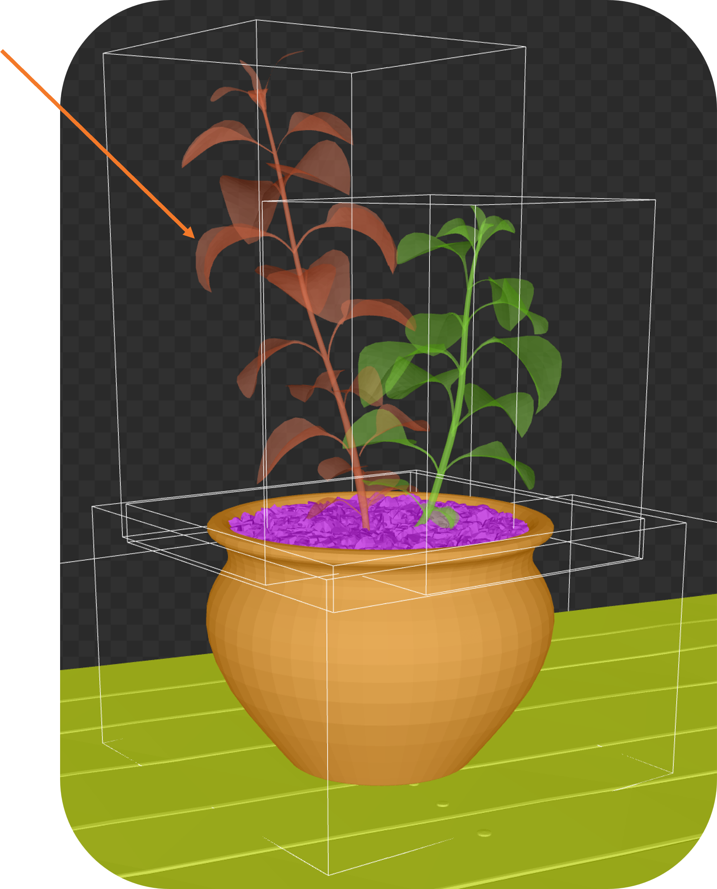
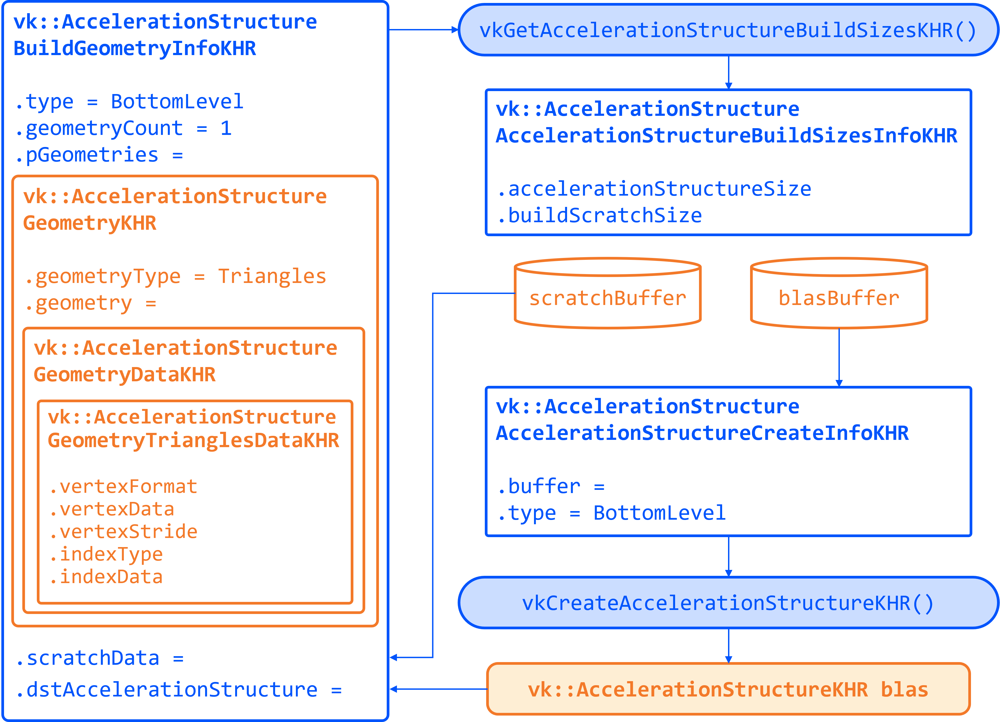
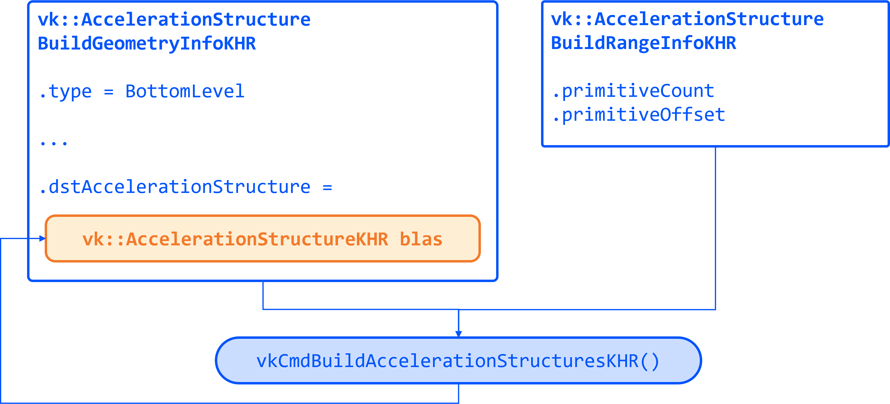
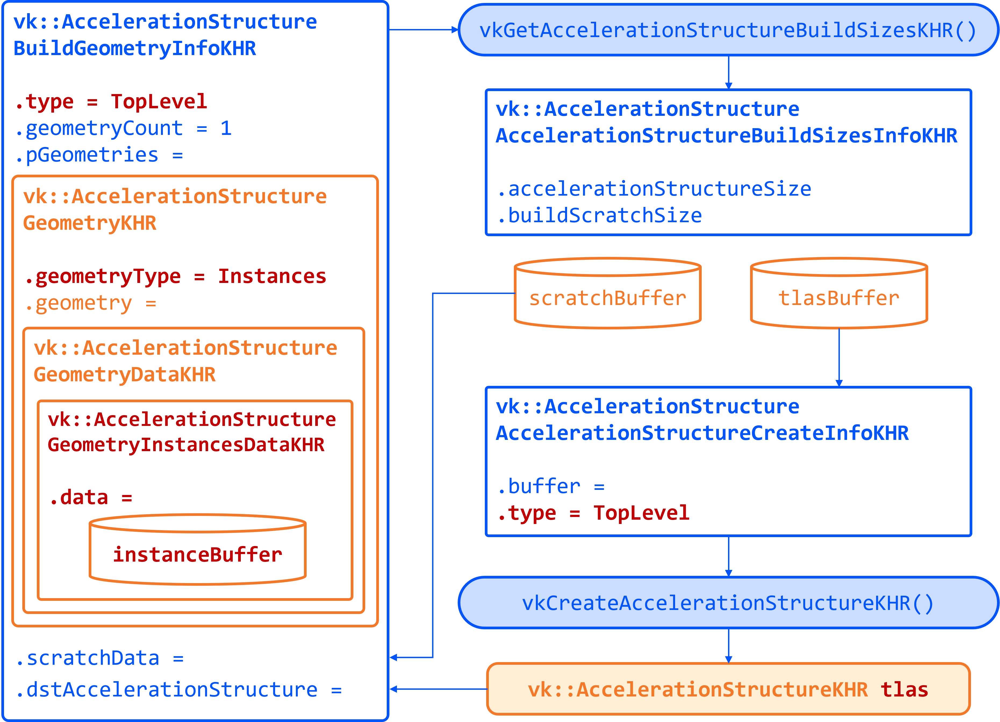

= Acceleration Structures (BLAS/TLAS)

*Objective*: Create *Bottom-Level Acceleration Structures* (BLAS) for the model's geometry, and a *Top-Level Acceleration Structure* (TLAS) to instance those BLASes.
Bind the TLAS to the shader so we can use Ray Queries.

When casting a ray in a scene, we need an optimized structure that quickly identifies which triangle the ray hits. GPUs use acceleration structures that group geometry into bounding boxes, allowing large parts of the scene to be skipped. The ray traversal proceeds down a tree, efficiently narrowing down to the intersected triangle.
The exact implementation is GPU-dependent and opaque to the user.

Our scene is a simple 3D model (a plant on a table) loaded from an OBJ file. The provided code already loads the model's vertices, indices, normals, and textures into buffers.
It separates the model into submeshes, each with its own material.

A BLAS holds the geometry (triangles) for one mesh or object.
A TLAS holds instances of BLASes (with transforms) to form the full scene.
We'll create one BLAS per distinct mesh/material and one TLAS that references them.
The ray query will use the TLAS.
In Vulkan, building an AS involves a few steps: describe geometry, query build sizes, allocate buffers, create the AS handle, then issue a build command.

== Task 2: Create a BLAS for each submesh

Go to the definition of `createAccelerationStructures`. Here we will first create the BLASes for each submesh in the model. The code already has a loop iterating over `submeshes`, which contains the geometry data.

First, we need to describe the geometry of the BLAS. The `vk::AccelerationStructureGeometryKHR` struct is used for this purpose:

[,c{pp}]
----
// Prepare the geometry data
auto trianglesData = vk::AccelerationStructureGeometryTrianglesDataKHR{
    .vertexFormat = vk::Format::eR32G32B32Sfloat,
    .vertexData = vertexAddr,
    .vertexStride = sizeof(Vertex),
    .maxVertex = submesh.maxVertex,
    .indexType = vk::IndexType::eUint32,
    .indexData = indexAddr + submesh.indexOffset * sizeof(uint32_t)
};

vk::AccelerationStructureGeometryDataKHR geometryData(trianglesData);

vk::AccelerationStructureGeometryKHR blasGeometry{
    .geometryType = vk::GeometryTypeKHR::eTriangles,
    .geometry = geometryData,
    .flags = vk::GeometryFlagBitsKHR::eOpaque
};
----

This is then recorded in the build info structure:

[,c{pp}]
----
vk::AccelerationStructureBuildGeometryInfoKHR blasBuildGeometryInfo{
    .type = vk::AccelerationStructureTypeKHR::eBottomLevel,
    .mode = vk::BuildAccelerationStructureModeKHR::eBuild,
    .geometryCount = 1,
    .pGeometries = &blasGeometry,
};
----

Next, we need to query the memory requirements for the BLAS:

[,c{pp}]
----
// TASK02: Query the memory sizes that will be needed for this BLAS
vk::AccelerationStructureBuildSizesInfoKHR blasBuildSizes =
    device.getAccelerationStructureBuildSizesKHR(
        vk::AccelerationStructureBuildTypeKHR::eDevice,
        blasBuildGeometryInfo,
        { primitiveCount }
);
----

This helper function uses `vkGetAccelerationStructureBuildSizesKHR()` and returns the memory sizes needed for the BLAS. We need to allocate:

. A buffer for the BLAS itself.
. Another buffer for the scratch space used during the build process.

We can then create these buffers and store them in persistent arrays as they will be needed later.

We also need to create the BLAS handle itself, which is done with `vk::AccelerationStructureCreateInfoKHR` and this device function helper that uses `vkCreateAccelerationStructureKHR()`. The handle is stored in a vector for later use (remember that we need one for each submesh):

[,c{pp}]
----
// TASK02: Create and store the BLAS handle
vk::AccelerationStructureCreateInfoKHR blasCreateInfo{
    .buffer = blasBuffers[i],
    .offset = 0,
    .size = blasBuildSizes.accelerationStructureSize,
    .type = vk::AccelerationStructureTypeKHR::eBottomLevel,
};

blasHandles.emplace_back(device.createAccelerationStructureKHR(blasCreateInfo));

// Save the BLAS handle in the build info structure
blasBuildGeometryInfo.dstAccelerationStructure = blasHandles[i];
----

The following diagram summarizes all the structures and buffers we have created so far:

To put it all together, we need to submit a command buffer to build the BLAS on the GPU. This is done with `vkCmdBuildAccelerationStructuresKHR()`, which takes the build info and a range. The range adds flexibility to build multiple geometries in one go, but here we only have one geometry per BLAS so it is kept simple:

[,c{pp}]
----
// TASK02: Prepare the build range for the BLAS
vk::AccelerationStructureBuildRangeInfoKHR blasRangeInfo{
    .primitiveCount = primitiveCount,
    .primitiveOffset = 0,
    .firstVertex = firstVertex,
    .transformOffset = 0
};
----

Finally, prepare and submit a command buffer, which saves a valid handle for the bottom level acceleration structure:

[,c{pp}]
----
// TASK02: Build the BLAS
auto cmd = beginSingleTimeCommands();
cmd->buildAccelerationStructuresKHR({ blasBuildGeometryInfo }, { &blasRangeInfo });
endSingleTimeCommands(*cmd);
----

Now you have a BLAS for each model in the scene. Next we need to put them all together into a single TLAS which will then be consumed by our fragment shader.

== Task 3: Create a TLAS with instances of the BLASes

Now that we have the BLASes, we need to create a TLAS that references them. The TLAS will hold instances of the BLASes, allowing us to place them in the scene with transformations (position, rotation, scale).

We can create an instance in the same submesh loop where we created the BLASes. For each submesh, we will create an instance that references the corresponding BLAS handle. The `vk::AccelerationStructureInstanceKHR` struct is used for this purpose:

[,c{pp}]
----
// TASK03: Create a BLAS instance for the TLAS
vk::AccelerationStructureDeviceAddressInfoKHR addrInfo{
    .accelerationStructure = *blasHandles[i]
};
vk::DeviceAddress blasDeviceAddr = device.getAccelerationStructureAddressKHR(addrInfo);

vk::AccelerationStructureInstanceKHR instance{
    .transform = tm,
    .mask = 0xFF,
    .accelerationStructureReference = blasDeviceAddr
};

instances.push_back(instance);
----

Note how we needed to get the device address of the BLAS using `vkGetAccelerationStructureDeviceAddressKHR()`. We also set the transform matrix as the identity matrix for now, we will revisit this later in the lab.

Now that all instances are stored in a vector, we need to prepare the instance data for the TLAS. This involves creating a buffer that holds the instance data.

Using a very similar approach as for the BLAS, we need to prepare the data for the TLAS build, query buffer sizes, allocate buffers, create the TLAS handle, and issue a build command. The diagram below highlights the main changes needed for the TLAS:

To prepare the geometry data for the TLAS we will use `vk::GeometryTypeKHR::eInstances` to indicate that we are building a TLAS from instances of BLASes:

[,c{pp}]
----
// TASK03: Prepare the geometry (instance) data
auto instancesData = vk::AccelerationStructureGeometryInstancesDataKHR{
    .arrayOfPointers = vk::False,
    .data = instanceAddr
};

vk::AccelerationStructureGeometryDataKHR geometryData(instancesData);

vk::AccelerationStructureGeometryKHR tlasGeometry{
    .geometryType = vk::GeometryTypeKHR::eInstances,
    .geometry = geometryData
};
----

This is then recorded in the build info structure:

[,c{pp}]
----
vk::AccelerationStructureBuildGeometryInfoKHR tlasBuildGeometryInfo{
    .type = vk::AccelerationStructureTypeKHR::eTopLevel,
    .mode = vk::BuildAccelerationStructureModeKHR::eBuild,
    .geometryCount = 1,
    .pGeometries = &tlasGeometry
};
----

Next, we need to query the memory requirements for the TLAS:

[,c{pp}]
----
// TASK03: Query the memory sizes that will be needed for this TLAS
vk::AccelerationStructureBuildSizesInfoKHR tlasBuildSizes =
    device.getAccelerationStructureBuildSizesKHR(
        vk::AccelerationStructureBuildTypeKHR::eDevice,
        tlasBuildGeometryInfo,
        { primitiveCount }
);
----

And again we create the necessary buffers.

To create the TLAS handle, we use `vkCreateAccelerationStructureKHR()` as before:

[,c{pp}]
----
// TASK03: Create and store the TLAS handle
vk::AccelerationStructureCreateInfoKHR tlasCreateInfo{
    .buffer = tlasBuffer,
    .offset = 0,
    .size = tlasBuildSizes.accelerationStructureSize,
    .type = vk::AccelerationStructureTypeKHR::eTopLevel,
};

tlas = device.createAccelerationStructureKHR(tlasCreateInfo);

// Save the TLAS handle in the build info structure
tlasBuildGeometryInfo.dstAccelerationStructure = tlas;
----

And one more time, we need to prepare the build range for the TLAS. This is similar to the BLAS, but now we use the instance count. Then we can submit the command buffer to build the TLAS:

[,c{pp}]
----
 // TASK03: Prepare the build range for the TLAS
 vk::AccelerationStructureBuildRangeInfoKHR tlasRangeInfo{
     .primitiveCount = primitiveCount,
     .primitiveOffset = 0,
     .firstVertex = 0,
     .transformOffset = 0
 };

// TASK03: Build the TLAS
auto cmd = beginSingleTimeCommands();
cmd->buildAccelerationStructuresKHR({ tlasBuildGeometryInfo }, { &tlasRangeInfo });
endSingleTimeCommands(*cmd);
----

Done! You have now created a TLAS that references all the BLASes for the submeshes in the model. The TLAS is ready to be used in ray queries in the fragment shader.

== Task 4: Bind the acceleration structure to the shader

To make the acceleration structure available in the shader, we need to add a descriptor set binding for the TLAS. This is done in the `createDescriptorSetLayout()` function (you may ignore the higher bindings for now):

[,c{pp}]
----
// TASK04: The acceleration structure uses binding 1
std::array global_bindings = {
    vk::DescriptorSetLayoutBinding( 0, vk::DescriptorType::eUniformBuffer, 1, vk::ShaderStageFlagBits::eVertex | vk::ShaderStageFlagBits::eFragment, nullptr),
    vk::DescriptorSetLayoutBinding( 1, vk::DescriptorType::eAccelerationStructureKHR, 1, vk::ShaderStageFlagBits::eFragment, nullptr),
    vk::DescriptorSetLayoutBinding( 2, vk::DescriptorType::eStorageBuffer, 1, vk::ShaderStageFlagBits::eFragment, nullptr),
    vk::DescriptorSetLayoutBinding( 3, vk::DescriptorType::eStorageBuffer, 1, vk::ShaderStageFlagBits::eFragment, nullptr),
    vk::DescriptorSetLayoutBinding( 4, vk::DescriptorType::eStorageBuffer, 1, vk::ShaderStageFlagBits::eFragment, nullptr)
};
----

Next, we need to update the descriptor set to bind the TLAS. This is done in the `updateDescriptorSets()` function:

[,c{pp}]
----
vk::WriteDescriptorSetAccelerationStructureKHR asInfo{
    .accelerationStructureCount = 1,
    .pAccelerationStructures = {&*tlas}
};

vk::WriteDescriptorSet asWrite{
    .pNext = &asInfo,
    .dstSet = globalDescriptorSets[i],
    .dstBinding = 1,
    .dstArrayElement = 0,
    .descriptorCount = 1,
    .descriptorType = vk::DescriptorType::eAccelerationStructureKHR
};
----

And later on call `vkUpdateDescriptorSets()` with the TLAS included in the list:

[,c{pp}]
----
std::array<vk::WriteDescriptorSet, 4> descriptorWrites{bufferWrite, asWrite, indexBufferWrite, uvBufferWrite};

device.updateDescriptorSets(descriptorWrites, {});
----

Finally, add the corresponding attribute to the shader:

[,slang]
----
// TASK04: Acceleration structure binding
[[vk::binding(1,0)]]
RaytracingAccelerationStructure accelerationStructure;
----

Re-build and run using:

[,c{pp}]
----
#define LAB_TASK_LEVEL 4
----

You will see no visual difference, but rest assured, your Acceleration Structures are now set up and ready to be used in the fragment shader.

== Navigation
- Previous: xref:./01_Dynamic_rendering.adoc[Dynamic rendering]
- Next: xref:./03_Ray_query_shadows.adoc[Ray query shadows]