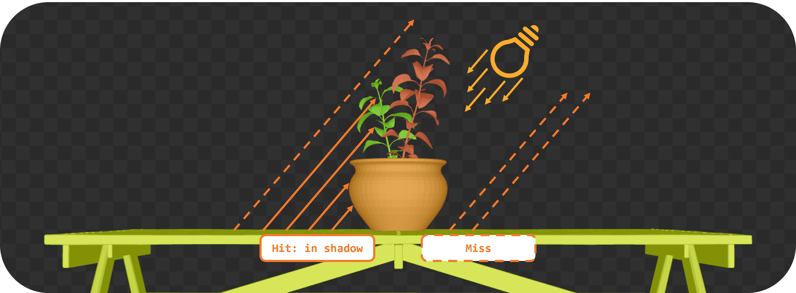

= Ray Query Shadows (Opaque Geometry)

*Objective*: Add a simple shadow test in the fragment shader using a ray query. We will cast a ray from each fragment point toward the light and darken the fragment if something is hit (hard shadow).

Congratulations: you have a valid TLAS/BLAS for the scene! Now, let's use it to cast some rays.

== Task 5: Implement ray query shadows

In the fragment shader, we will use a ray query to cast a shadow ray from the fragment position towards the light source. If the ray hits any geometry before reaching the light, we will darken the fragment color:

[,slang]
----
// TASK05: Implement ray query shadows
bool in_shadow(float3 P)
{
    bool hit = false;

    return hit;
}

[shader("fragment")]
float4 fragMain(VSOutput vertIn) : SV_TARGET {
   float4 baseColor = textures[pc.materialIndex].Sample(textureSampler, vertIn.fragTexCoord);

   float3 P = vertIn.worldPos;

   bool inShadow = in_shadow(P);

   // Darken if in shadow
   if (inShadow) {
       baseColor.rgb *= 0.2;
   }

   return baseColor;
}
----

For this, you will implement a helper `in_shadow()` function that performs the ray query. Start by defining a ray description and initializing it with the fragment position and light direction:

[,slang]
----
bool in_shadow(float3 P)
{
    // Build the shadow ray from the world position toward the light
    RayDesc shadowRayDesc;
    shadowRayDesc.Origin = P;
    shadowRayDesc.Direction = normalize(lightDir);
    shadowRayDesc.TMin = EPSILON;
    shadowRayDesc.TMax = 1e4;
----

`TMin` and `TMax` define the minimum and maximum distance the ray will travel from its origin. `EPSILON` is a small value to avoid self-intersection, and `1e4` is a large value to ensure we can hit distant objects.

Next, we will initialize a `RayQuery` object which will be used to perform the ray traversal. Note the choice of flags that we use to make it faster:

- `RAY_FLAG_SKIP_PROCEDURAL_PRIMITIVES` since this is a simple scene with triangles only.
- `RAY_FLAG_ACCEPT_FIRST_HIT_AND_END_SEARCH` to end the traversal as soon as the first opaque intersection is found, which is sufficient for shadow testing since we only need to know if anything blocks the light.

[,slang]
----
    // Initialize a ray query for shadows
    RayQuery<RAY_FLAG_SKIP_PROCEDURAL_PRIMITIVES |
             RAY_FLAG_ACCEPT_FIRST_HIT_AND_END_SEARCH> sq;
    let rayFlags = RAY_FLAG_SKIP_PROCEDURAL_PRIMITIVES |
             RAY_FLAG_ACCEPT_FIRST_HIT_AND_END_SEARCH;
----

Then we will start the ray tracing operation which combines our ray description, `RayQuery` object, and acceleration structure:

[,slang]
----
    sq.TraceRayInline(accelerationStructure, rayFlags, 0xFF, shadowRayDesc);

    sq.Proceed();
----

`Proceed()` advances the state of the `RayQuery` object to the next intersection "candidate" along the ray. Each call to `Proceed()` checks if there is another intersection to process. If so, it updates the query's internal state so that you may access information about the current candidate intersection. This allows you to implement custom logic for handling intersections, such as skipping transparent surfaces (which we will revisit later in this lab) or stopping at the first opaque hit. It is typically called within a loop to iterate through all potential intersections, but for shadows we only need the first hit:

[,slang]
----
    // If the shadow ray intersects an opaque triangle, we consider the pixel in shadow
    bool hit = (sq.CommittedStatus() == COMMITTED_TRIANGLE_HIT);

    return hit;
}
----

That's it! You have implemented a basic shadow test using ray queries. The `in_shadow()` function will return `true` if the ray hits any geometry before reaching the light, indicating that the fragment is in shadow.

Re-build and run using:

[,c{pp}]
----
#define LAB_TASK_LEVEL 5
----

You will notice that something is off:

image::../../../images/38_TASK06_shadows_static.gif[]

The object is rotating, but the shadows are static. This is because we have not yet updated the TLAS to account for the object's animation. The TLAS needs to be rebuilt whenever the object moves or animates, so let's implement that next.

== Navigation
- Previous: xref:./02_Acceleration_structures.adoc[Acceleration structures]
- Next: xref:./04_TLAS_animation.adoc[TLAS animation]
