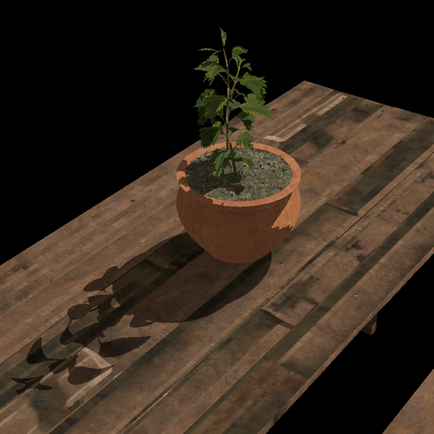
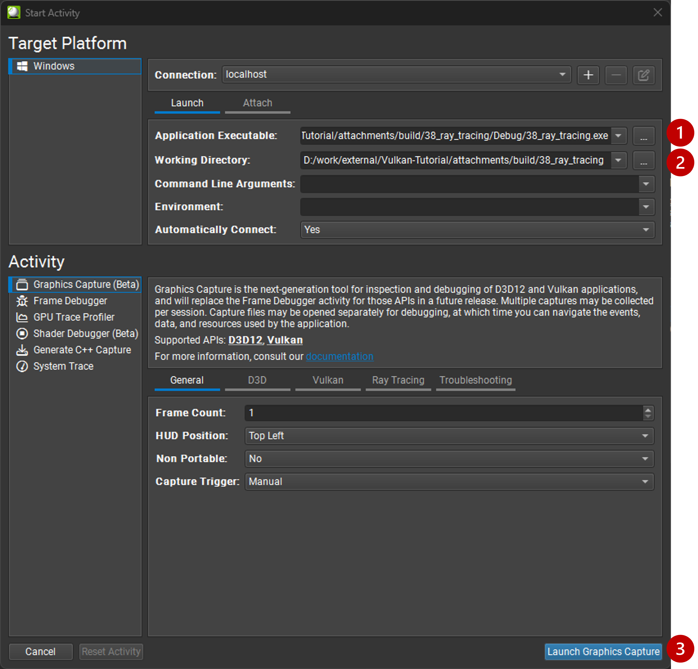
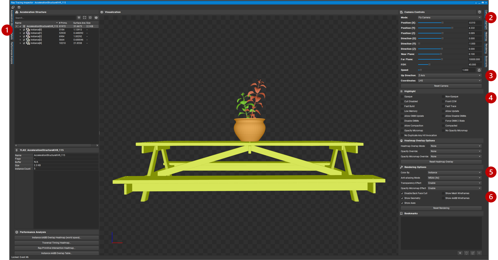
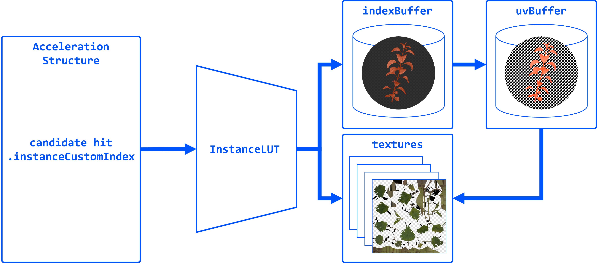
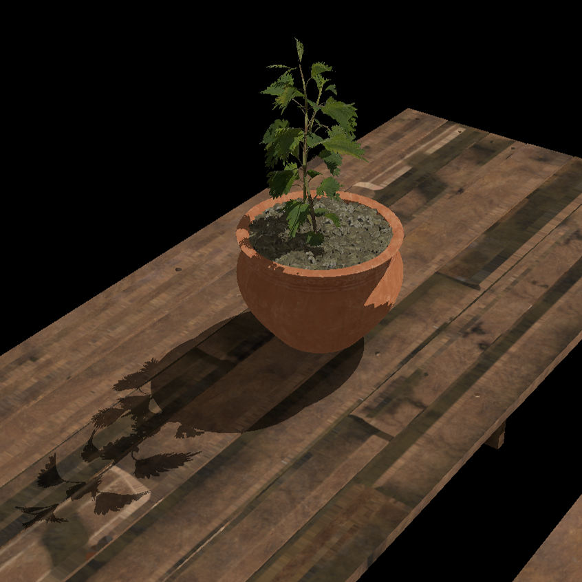

= Implementing Transparency in Shadows

*Objective*: Add support for transparent objects in the scene. We will implement a simple alpha test to discard fragments with low alpha values, and replicate this in their corresponding ray traced shadows.

So far we have treated every geometry as opaque. Note however that the leaves are rendered with a texture that uses the alpha channel to define transparency, and currently that is not taken into account, so that we have some dark pixels around the edges of the leaves:

== Task 7: Alpha-cut transparency

To implement alpha-cut transparency, we will discard fragments with low alpha values in the fragment shader. This is a common technique to handle transparent textures without needing complex blending or sorting:

[,slang]
----
   float4 baseColor = textures[pc.materialIndex].Sample(textureSampler, vertIn.fragTexCoord);

   // Alpha test
   if (baseColor.a < 0.5) discard;
----

Note that the shadows remain unchanged for now. The first thing we need to do is to only use the `eOpaque` flag if the BLAS has no alpha transparency, in `createAccelerationStructures()`:

[,c{pp}]
----
vk::AccelerationStructureGeometryKHR blasGeometry{
    .geometryType = vk::GeometryTypeKHR::eTriangles,
    .geometry = geometryData
};

blasGeometry.flags = (submesh.alphaCut) ? vk::GeometryFlagsKHR(0) : vk::GeometryFlagBitsKHR::eOpaque;
----

Re-build and run using:

[,c{pp}]
----
#define LAB_TASK_LEVEL 7
----

You will see that the shadows for the leaves are now completely missing! This is because out of all the intersection candidates, only opaque geometry triangles are automatically committed. We need to implement a way to handle transparency in the ray query shadows and conditionally commit the candidate intersection.

Before we do that, let's first inspect the acceleration structures we have built so far, to understand how they are structured and what information is available for each triangle.

== Task 8: Inspect the acceleration structures with NVIDIA Nsight Graphics

RenderDoc does not yet support inspecting Vulkan acceleration structures, but we can use *Nsight Graphics* to verify that our BLAS/TLAS are built correctly. This helps catch mistakes (e.g. wrong geometry counts, offsets) before we rely on them in shaders.

To use Nsight:

. Specify executable path: `C:\Users\nvidia\S2025_LABS\gensubcur_105\Vulkan-Tutorial\attachments\build\38_ray_tracing\Debug\38_ray_tracing.exe`.
. Specify working directory: `C:\Users\nvidia\S2025_LABS\gensubcur_105\Vulkan-Tutorial\attachments\build\38_ray_tracing`.
. Launch the application.

Then capture a frame and click on "Start Graphics Debugger":

image::../images/38_TASK04_nsight_capture.png[]

Similar to RenderDoc, you can inspect the events and find the acceleration structure build commands, which will then take us to the acceleration structure visualization tool:

. Use the search function in the Event browser to filter and find the `draw` calls.
. Select any of the draw calls, which opens the API Inspector.
. Select `FS` to find the resources bound to our fragment shader.
. Click on the acceleration structure binding (this will be our TLAS), which opens the "Ray Tracing Inspector".

image::../../../images/38_TASK04_nsight_main.png[]

In the new window, you can see the TLAS and its instances:

. You can expand each instance to see the BLAS it references, and inspect the geometry data.
. You may find the 'Orbit Camera' more comfortable for navigating the scene.
. You may need to set the "Up Direction" to "Z Axis" to match the coordinate system used in the model.
. Use filters for 'Opaque' gemoetry (as expected, the leave models will be greyed out).
. Play with different visualization options like "Color by".
. Try "Show Mesh Wireframes" and "Show AABB Wireframes".

== Task 9: Bindless resources and instance look-up table

Until now, we did not need to know what triangle our ray intersected, we only cared about whether it hit something or not. But to implement transparency, we need to know the alpha value of the texture used to shade the point on the triangle we hit. This way we can determine if we hit a transparent pixel and we need to continue the traversal, in case we hit some other opaque triangle behind it on the way towards the light.

Before introducing the ray query logic needed for this, let's first observe how the renderer binds everything we need in the shader, and implement a simple look-up table to map acceleration structure instances to their geometry and texturing data.

Note how the renderer does not bind separate material textures for each submesh. Instead, it binds a single array of textures and uses a material index to look up the texture for each submesh. We use push constants to pass the material index:

[,c{pp}]
----
        for (auto& sub : submeshes) {
            // TASK09: Bindless resources
            PushConstant pushConstant = {
                .materialIndex = sub.materialID < 0 ? 0u : static_cast<uint32_t>(sub.materialID),
            };
            commandBuffers[frameIndex].pushConstants<PushConstant>(pipelineLayout, vk::ShaderStageFlagBits::eFragment, 0, pushConstant);

            commandBuffers[frameIndex].drawIndexed(sub.indexCount, 1, sub.indexOffset, 0, 0);
        }
----

Then, in the shader, we use the material index to sample the texture array. They all share the same sampler:

[,slang]
----
[[vk::binding(0,1)]]
SamplerState textureSampler;

[[vk::binding(1,1)]]
Texture2D<float4> textures[];

struct PushConstant {
    uint materialIndex;
};
[push_constant]
PushConstant pc;

[shader("fragment")]
float4 fragMain(VSOutput vertIn) : SV_TARGET {
   float4 baseColor = textures[pc.materialIndex].Sample(textureSampler, vertIn.fragTexCoord);
----

This is a common technique called "bindless resources", which allows us to reduce the number of descriptor sets and bindings needed, and makes it easier to manage materials in a scene with many objects. It requires the descriptor indexing extension, which is core to Vulkan since 1.2.

We cannot use push constants in our ray traversal, because our ray may hit any geometry in the scene, not the one we are shading now. We can however tag each acceleration structure instance with a custom index, and later use this index with a look-up table (LUT) to find the geometry and texture for the hit instance.

In `createAccelerationStructures()`, as we iterate over the model submeshes, we need to add a new field to our `AccelerationStructureInstanceKHR` struct, to hold an unique index for each submesh:

[,c{pp}]
----
vk::AccelerationStructureInstanceKHR instance{
    .transform = identity,
    .mask = 0xFF,
    .accelerationStructureReference = blasDeviceAddr
};

instances.push_back(instance);

instances[i].instanceCustomIndex = static_cast<uint32_t>(i);
----

If you run the application now and capture it with Nsight Graphics, you will be able to color by "Instance Custom Index" to see the indices assigned to each instance, whereas before they were all the same:

image::../../../images/38_TASK09_instance_custom_index.png[]

Then, populate a vector of LUT entries. Using the same submesh index, we need to store the material ID and the index buffer offset for each submesh:

[,c{pp}]
----
// TASK09: store the instance look-up table entry
instanceLUTs.push_back({ static_cast<uint32_t>(submesh.materialID), submesh.indexOffset });
----

The rest of the code related to creating the LUT buffer can be found in `createDescriptorSets()` and `createInstanceLUTBuffer()`. Note that the corresponding binding was already defined in the shader:

[,slang]
----
// TASK09: Instance look-up table
struct InstanceLUT {
    uint materialID;
    uint indexBufferOffset;
};
[[vk::binding(4,0)]]
StructuredBuffer<InstanceLUT> instanceLUTBuffer;
----

Now we will see how we can use these resources with ray query to handle transparent intersections.

== Task 10: Ray query with alpha test

Remember how `Proceed()` advances the state of the `RayQuery` object to the next intersection candidate along the ray? This is where we will implement our alpha test logic. We will check the alpha value of the texture used for shading the triangle we hit, and if it is below a certain threshold, we will continue the traversal to find the next opaque triangle. Once we find it, we 'commit' it, and the traversal will end.

First, replace the call with a loop, and retrieve the necessary attributes from the candidate hit. We will then pass these over to a helper function, `intersection_uv`, which will retrieve the texture coordinates for the point we hit within the triangle:

[,slang]
----
    while (sq.Proceed())
    {
        uint instanceID = sq.CandidateRayInstanceCustomIndex();
        uint primIndex = sq.CandidatePrimitiveIndex();

        float2 uv = intersection_uv(instanceID, primIndex, sq.CandidateTriangleBarycentrics());
    }
----

Here is the definition of this helper function:

[,slang]
----
float2 intersection_uv(uint instanceID, uint primIndex, float2 barycentrics) {
    uint indexOffset = instanceLUTBuffer[NonUniformResourceIndex(instanceID)].indexBufferOffset;

    uint i0 = indexBuffer[indexOffset + (primIndex * 3 + 0)];
    uint i1 = indexBuffer[indexOffset + (primIndex * 3 + 1)];
    uint i2 = indexBuffer[indexOffset + (primIndex * 3 + 2)];

    float2 uv0 = uvBuffer[i0];
    float2 uv1 = uvBuffer[i1];
    float2 uv2 = uvBuffer[i2];

    float w0 = 1.0 - barycentrics.x - barycentrics.y;
    float w1 = barycentrics.x;
    float w2 = barycentrics.y;

    return w0 * uv0 + w1 * uv1 + w2 * uv2;
}
----

. `instanceID` allows us to retrieve `indexBufferOffset` and `materialID` from the instance LUT.
. `indexBufferOffset` is used to find the index buffer for the instance. Note that the index buffer contains the indices for all the models in the scene, so we need to narrow it down to the hit model (e.g. leaves).
. `primIndex` is the index of the triangle within the instance's portion of the index buffer.
. `NonUniformResourceIndex()` indicates that a resource index may vary across different shader invocations within a single draw or dispatch call, preventing unwanted compiler optimizations.

Once we have narrowed the hit down to a specific triangle within the model, we can retrieve the texture coordinates for it in the `uvBuffer`, which contains the UV coordinates for all vertices in the scene.

Finally, it interpolates the texture coordinates for the hit triangle based on the barycentric coordinates of the intersection.

We can then use these UV coordinates to sample the texture and retrieve the alpha value:

[,slang]
----
        uint materialID = instanceLUTBuffer[NonUniformResourceIndex(instanceID)].materialID;
        float4 intersection_color = textures[NonUniformResourceIndex(materialID)].SampleLevel(textureSampler, uv, 0);
----

And based on the alpha value, we can decide whether to continue tracing or commit the hit:

[,slang]
----
        if (intersection_color.a < 0.5) {
            // If the triangle is transparent, we continue to trace
            // to find the next opaque triangle.
        } else {
            // If we hit an opaque triangle, we stop tracing.
            sq.CommitNonOpaqueTriangleHit();
        }
----

The full `Proceed()` loop should look like this:

[,slang]
----
    while (sq.Proceed())
    {
        uint instanceID = sq.CandidateRayInstanceCustomIndex();
        uint primIndex = sq.CandidatePrimitiveIndex();

        float2 uv = intersection_uv(instanceID, primIndex, sq.CandidateTriangleBarycentrics());

        uint materialID = instanceLUTBuffer[NonUniformResourceIndex(instanceID)].materialID;
        float4 intersection_color = textures[NonUniformResourceIndex(materialID)].SampleLevel(textureSampler, uv, 0);

        if (intersection_color.a < 0.5) {
            // If the triangle is transparent, we continue to trace
            // to find the next opaque triangle.
        } else {
            // If we hit an opaque triangle, we stop tracing.
            sq.CommitNonOpaqueTriangleHit();
        }
    }
----

Note that opaque hits are committed automatically, and never enter the loop.

Re-build and run using:

[,c{pp}]
----
#define LAB_TASK_LEVEL 10
----

At this point, you have robust shadows with transparency via ray queries! This is a significant feature, something that would be difficult with traditional shadow mapping for fine alpha details:

With everything set in place to support transparency in shadows, implementing other effects like reflections is very straightforward!

== Navigation
- Previous: xref:./04_TLAS_animation.adoc[TLAS animation]
- Next: xref:./06_Reflections.adoc[Reflections]

