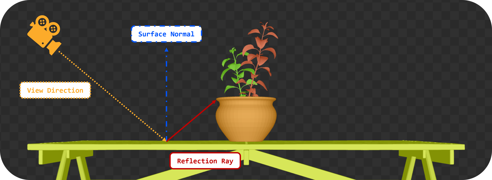
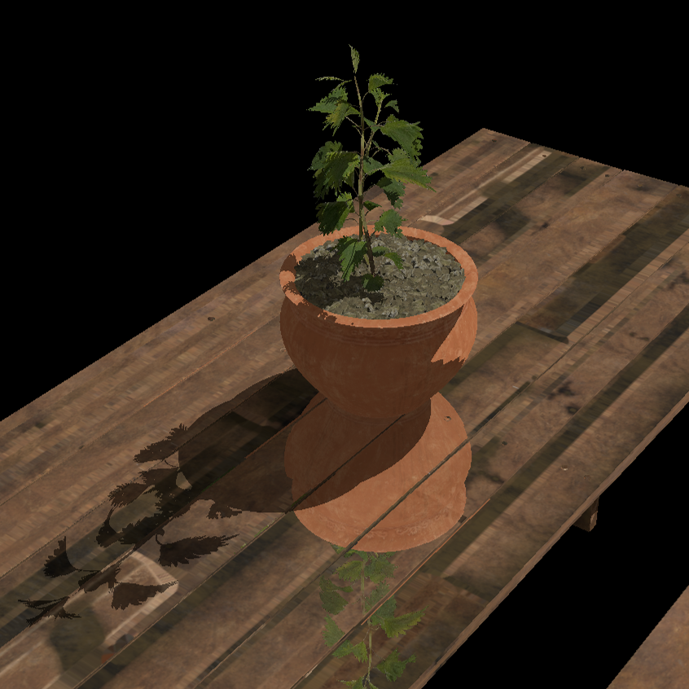

= Ray Query Reflections

*Objective*: We will cast a ray in the mirror-reflection direction from the fragment to see what it hits, simulating reflective materials (like a mirror or shiny surface).

Reflections are implemented similarly to shadow rays, but we cast a ray from the shaded point along the mirror direction and sample the hit surface color.

== Task 11: Implement ray query reflections

First, we will use push constants to pass the reflective material flag to the fragment shader. This will allow us to determine if the current material is reflective or not.

Let's pretend that it is been a rainy day, and the table is covered in water, so it reflects the environment.

We need to update the `PushConstant` struct to include a `reflective` flag, both in the renderer:

[,c{pp}]
----
struct PushConstant {
    uint32_t materialIndex;
    uint32_t reflective;
};
----

And in the shader:

[,slang]
----
struct PushConstant {
    uint materialIndex;
    uint reflective;
};
[push_constant]
PushConstant pc;
----

And update the values that we assign to it before issuing the draw call:

[,c{pp}]
----
PushConstant pushConstant = {
    .materialIndex = sub.materialID < 0 ? 0u : static_cast<uint32_t>(sub.materialID),
    .reflective = sub.reflective
};
commandBuffers[frameIndex].pushConstants<PushConstant>(pipelineLayout, vk::ShaderStageFlagBits::eFragment, 0, pushConstant);

commandBuffers[frameIndex].drawIndexed(sub.indexCount, 1, sub.indexOffset, 0, 0);
----

We will then retrieve this in the fragment shader, before we apply the shadow effect, to call a helper function that will modify the fragment color in-place, based on the reflection ray query:

[,slang]
----
   float3 P = vertIn.worldPos;
   float3 N = vertIn.fragNormal;

   if (pc.reflective > 0) {
       apply_reflection(P, N, baseColor);
   }

   bool inShadow = in_shadow(P);
----

The implementation of the `apply_reflection()` function will be similar to the `in_shadow()` function. The `Proceed()` loops is no longer optional, as we do not only need to check for any intersection, we need the full color of the closest hit triangle to apply the reflection effect.

Note how it requires the normal direction (`N`). This is because reflections are a function of the surface normal and the view direction `V`. The reflection direction `R` is calculated easily with the built-in `reflect()` function:

[,slang]
----
void apply_reflection(float3 P, float3 N, inout float4 baseColor) {
    // Build the reflections ray
    float3 V = normalize(ubo.cameraPos - P);
    float3 R = reflect(-V, N);
----

We then define the ray description, similar to how we did for shadows:

[,slang]
----
    RayDesc reflectionRayDesc;
    reflectionRayDesc.Origin = P;
    reflectionRayDesc.Direction = R;
    reflectionRayDesc.TMin = EPSILON;
    reflectionRayDesc.TMax = 1e4;
----

And initialize the `RayQuery` object. In this case however, we cannot use the `RAY_FLAG_ACCEPT_FIRST_HIT_AND_END_SEARCH` flag, because we need to retrieve the full color of the closest triangle, not just any triangle:

[,slang]
----
    // Initialize a ray query for reflections
    RayQuery<RAY_FLAG_SKIP_PROCEDURAL_PRIMITIVES> rq;
    let rayFlags = RAY_FLAG_SKIP_PROCEDURAL_PRIMITIVES;
----

We can now launch our reflection ray:

[,slang]
----
    rq.TraceRayInline(accelerationStructure, rayFlags, 0xFF, reflectionRayDesc);
----

The `Proceed()` loop is exactly the same:

[,slang]
----
    while (rq.Proceed())
    {
        uint instanceID = rq.CandidateRayInstanceCustomIndex();
        uint primIndex = rq.CandidatePrimitiveIndex();

        float2 uv = intersection_uv(instanceID, primIndex, rq.CandidateTriangleBarycentrics());

        uint materialID = instanceLUTBuffer[NonUniformResourceIndex(instanceID)].materialID;
        float4 intersection_color = textures[NonUniformResourceIndex(materialID)].SampleLevel(textureSampler, uv, 0);

        if (intersection_color.a < 0.5) {
            // If the triangle is transparent, we continue to trace
            // to find the next opaque triangle.
        } else {
            // If we hit an opaque triangle, we stop tracing.
            rq.CommitNonOpaqueTriangleHit();
        }
    }

    bool hit = (rq.CommittedStatus() == COMMITTED_TRIANGLE_HIT);
----

The only additional logic we need is to retrieve the color of the hit triangle and apply it to the base color of the fragment. Note how the logic is almost the same as in the loop, but this time we use the `Committed` version of the functions, rather than `Candidate`:

[,slang]
----
    if (hit)
    {
        uint instanceID = rq.CommittedRayInstanceCustomIndex();
        uint primIndex = rq.CommittedPrimitiveIndex();

        float2 uv = intersection_uv(instanceID, primIndex, rq.CommittedTriangleBarycentrics());

        uint materialID = instanceLUTBuffer[NonUniformResourceIndex(instanceID)].materialID;
        float4 intersectionColor = textures[NonUniformResourceIndex(materialID)].SampleLevel(textureSampler, uv, 0);

        baseColor.rgb = lerp(baseColor.rgb, intersectionColor.rgb, 0.7);
    }
----

TIP: As an exercise, you could extend this function to sample a skybox if the ray misses all the geometry in the scene and there is no committed triangle hit.

Re-build and run using:

[,c{pp}]
----
#define LAB_TASK_LEVEL 11
----

With all this in place, you should now see some shiny reflections on the table:

== Navigation
- Previous: xref:./05_Shadow_transparency.adoc[Shadow transparency]
- Next: xref:./07_Conclusion.adoc[Conclusion]
